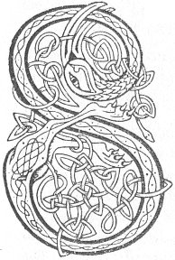

  
[Intangible Textual Heritage](../../../index) 
[Legends/Sagas](../../index)  [Celtic](../index)  [Carmina
Gadelica](../cg)  [Index](index)  [Previous](cg1074)  [Next](cg1076) 

------------------------------------------------------------------------

[Buy this Book at
Amazon.com](https://www.amazon.com/exec/obidos/ASIN/B0027P88YQ/internetsacredte)

------------------------------------------------------------------------

  
*Carmina Gadelica, Volume 1*, by Alexander Carmicheal, \[1900\], at
Intangible Textual Heritage

------------------------------------------------------------------------

<table data-border="0">
<colgroup>
<col style="width: 50%" />
<col style="width: 50%" />
</colgroup>
<tbody>
<tr class="odd">
<td data-valign="top" width="327">
p. 174
</td>
<td data-valign="top" width="327">
p. 175
</td>
</tr>
<tr class="even">
<td data-valign="top" width="327"><h3 id="sloinntireachd-bhride" data-align="center">SLOINNTIREACHD BHRIDE</h3></td>
<td data-valign="top" width="327"><h3 id="genealogy-of-bride" data-align="center">GENEALOGY OF BRIDE</h3></td>
</tr>
</tbody>
</table>

 

<table data-border="0">
<colgroup>
<col style="width: 25%" />
<col style="width: 25%" />
<col style="width: 25%" />
<col style="width: 25%" />
</colgroup>
<tbody>
<tr class="odd">
<td data-valign="top">
 
</td>
<td data-valign="top">
p. 174
</td>
<td data-valign="top">
 
</td>
<td data-valign="top">
p. 175
</td>
</tr>
<tr class="even">
<td data-valign="top">
 
</td>
<td data-valign="top">
SLOINNEADH na Ban-naomh Bride, 
Lasair dhealrach oir, muime chorr Chriosda. 
Bride nighinn Dughaill duinn, 
Mhic Aoidh, mhic Airt, nitric Cuinn, 
Mhic Crearair, mhic Cis, mhic Carmaig, mhic Carruinn.

Gach la agus gach oidhche 
Ni mi sloinntireachd air Bride, 
Cha mharbhar mi, cha spuillear mi, 
Cha charcar mi, cha chiurar mi, 
Cha mhu dh’ fhagas Criosd an dearmad mi.

Cha loisg teine, grian, no gealach mi, 
Cha bhath luin, li, no sala mi, 
Cha reub saighid sithich, no sibhich mi, 
Is mi fo chomaraig mo Naomh Muire 
Is i mo chaomh mhuime Bride.
</td>
<td data-valign="top">
 
</td>
<td data-valign="top">
THE genealogy of the holy maiden Bride, 
Radiant flame of gold, noble foster-mother of Christ, 
Bride the daughter of Dugall the brown, 
Son of Aodh, son of Art, son of Conn, 
Son of Crearar, son of Cis, son of Carina, son of Carruin.

Every day and every night 
That I say the genealogy of Bride, 
I shall not be killed, I shall not be harried, 
I shall not be put in cell, I shall not be, wounded, 
Neither shall Christ leave me in forgetfulness.

No fire, no sun, no moon shall burn me, 
No lake, no water, nor sea shall drown mc, 
No arrow of fairy nor dart of fay shall wound me, 
And I under the protection of my Holy Mary, 
And my gentle foster-mother is my beloved Bride.
</td>
</tr>
</tbody>
</table>

 

------------------------------------------------------------------------

[Next: 71. Bride The Aid-Woman. Bride Ban-Chobhair](cg1076)
