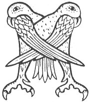

  
[Intangible Textual Heritage](../../../index) 
[Legends/Sagas](../../index)  [Celtic](../index)  [Carmina
Gadelica](../cg)  [Index](index)  [Previous](cg1080)  [Next](cg1082) 

------------------------------------------------------------------------

[Buy this Book at
Amazon.com](https://www.amazon.com/exec/obidos/ASIN/B0027P88YQ/internetsacredte)

------------------------------------------------------------------------

  
*Carmina Gadelica, Volume 1*, by Alexander Carmicheal, \[1900\], at
Intangible Textual Heritage

------------------------------------------------------------------------

 

<table data-border="0">
<colgroup>
<col style="width: 50%" />
<col style="width: 50%" />
</colgroup>
<tbody>
<tr class="odd">
<td data-valign="top" width="327">
p. 192
</td>
<td data-valign="top" width="327">
p. 193
</td>
</tr>
<tr class="even">
<td data-valign="top" width="327"><h3 id="laoidh-an-triall" data-align="center">LAOIDH AN TRIALL</h3></td>
<td data-valign="top" width="327"><h3 id="hymn-of-the-procession" data-align="center">HYMN OF THE PROCESSION</h3></td>
</tr>
</tbody>
</table>

 

<table data-border="0">
<colgroup>
<col style="width: 25%" />
<col style="width: 25%" />
<col style="width: 25%" />
<col style="width: 25%" />
</colgroup>
<tbody>
<tr class="odd">
<td data-valign="top">
 
</td>
<td data-valign="top">
p. 192
</td>
<td data-valign="top">
 
</td>
<td data-valign="top">
p. 193
</td>
</tr>
<tr class="even">
<td data-valign="top">
 
</td>
<td data-valign="top">
MHICHEIL mhil nan steud geala, 
Choisinn cios air Dragon fala, 
Ghaol Dia ’s pian Mhic Muire, 
Sgaoil do sgiath oirnn, dion sinn uile, 
     Sgaoil do sgiath oirnn, dion sinn uile.

Mhoire ghradhach! Mhathair Uain ghil, 
Cobhair oirnne ghlan Oigh na h-uaisleachd, 
Bhride bhuaidheach, bhuachaille nan treud, 
Cum ar cuallach, cuartaich sinn le cheil, 
     Cum ar cuallach, cuartaich sinn le cheil.

A Chaluim-chille, chairdeil, chaoimh, 
An ainm Athar, is Mic, is Spiorad Naoimh, 
Trid na Trithinn, trid na Triaid 
Comaraig sinn fein, gleidh ar triall, 
     Comaraig sinn fein, gleidh ar triall.

Athair! a Mhic! a Spioraid Naoimh! 
Biodh an Trithinn leinn a la ’s a dh’ oidhche, 
’S air machair loim no air roinn nam beann 
Bidh an Trithinn leinn ’s bidh a lamh mu ’r ceann, 
     Bidh an Trithinn leinn ’s bidh a lamh mu ’r ceann!

IASGAIREAN BHARRAIDH-- 
Athair! a Mhic! a Spioraid Naoimh! 
Bi-sa, Thrithinn, leinn a la ’s a dh’ oidhche, 
’S air chul nan tonn no air thaobh nam beann 
Bidh ar Mathair leinn ’s bidh a lamh fo ’r ceann, 
’S air chul nan tonn no air thaobh nam beann 
     Bidh ar Mathair leinn ’s bidh a lamh fo ’r ceann!
</td>
<td data-valign="top">
 
</td>
<td data-valign="top">
VALIANT Michael of the white steeds, 
Who subdued the Dragon of blood, 
For love of God, for pains of Mary's Son, 
Spread thy wing over us, shield us all, 
     Spread thy wing over us, shield us all.

Mary beloved! Mother of the White Lamb, 
Shield, oh shield us, pure Virgin of nobleness, 
And Bride the beauteous, shepherdess of the flocks. 
Safeguard thou our cattle, surround us together, 
     Safeguard thou our cattle, surround us together.

And Columba, beneficent, benign, 
In name of Father, and of Son, and of Spirit Holy, 
Through the Three-in-One, through the Trinity, 
Encompass thou ourselves, shield our procession, 
     Encompass thou ourselves, shield our procession.

O Father! O Son! O Spirit Holy! 
Be the Triune with us day and night, 
On the machair plain or on the mountain ridge 
Be the Triune with us and His arm around our head, 
     Be the Triune with us and His arm around our head.

BARRA FISHERMEN-- 
O Father! O Son! O Spirit Holy! 
Be thou, Three-One, with us day and night, 
And on the back of the wave as on the mountain side 
Our Mother shall be with us with her arm under our head. 
And on the back of the wave as on the mountain side 
     Our Mother shall be with us with her arm under our head.
</td>
</tr>
</tbody>
</table>

 

 

------------------------------------------------------------------------

[Next: 76. The Feast Day of Mary. La Feill Moire](cg1082)
