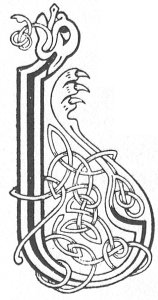

  
[Intangible Textual Heritage](../../../index.md) 
[Legends/Sagas](../../index)  [Celtic](../index.md)  [Carmina
Gadelica](../cg)  [Index](index)  [Previous](cg1081)  [Next](cg1083.md) 

------------------------------------------------------------------------

[Buy this Book at
Amazon.com](https://www.amazon.com/exec/obidos/ASIN/B0027P88YQ/internetsacredte.md)

------------------------------------------------------------------------

  
*Carmina Gadelica, Volume 1*, by Alexander Carmicheal, \[1900\], at
Intangible Textual Heritage

------------------------------------------------------------------------

 

<table data-border="0">
<colgroup>
<col style="width: 50%" />
<col style="width: 50%" />
</colgroup>
<tbody>
<tr class="odd">
<td data-valign="top" width="327">
p. 194
</td>
<td data-valign="top" width="327">
p. 195
</td>
</tr>
<tr class="even">
<td data-valign="top" width="327"><h3 id="la-feill-moire-76" data-align="center">LA FEILL MOIRE [76]</h3></td>
<td data-valign="top" width="327"><h3 id="the-feast-day-of-mary" data-align="center">THE FEAST DAY OF MARY</h3></td>
</tr>
</tbody>
</table>

 

THE Feast Day of Mary the Great is the 15th day of August. Early in the
morning of this day the people go into their fields and pluck ears of
corn, generally here, to make the 'Moilean Moire.' These ears are laid
on a rock exposed to the sun, to dry. When dry, they are husked in the
hand, winnowed in a fan, ground in a quern, kneaded on a sheep-skin, and
formed into a bannock, which is called 'Moilean Moire,' the fatling of
Mary. The bannock is toasted before a fire of fagots of rowan, or some
other sacred wood. Then the husbandman breaks the bannock and gives a
bit to his wife and to each of his children, in order according to their
ages, and the family raise the 'Iolach Mhoire Mhathar,' the Paean of
Mary Mother who promised p. 195 to shield
them, and who did and will shield them from scath till the day of death.
While singing thus, the family walk sunwise round the fire, the father
leading, the mother following, and the children following according to
age.

After going round the fire, the man puts the embers of the fagot-fire,
with bits of old iron, into a pot, which he carries sunwise round the
outside of his house, sometimes round his steadings and his fields, and
his flocks gathered in for the purpose. He is followed without as within
by his household, all singing the praise of Mary Mother the while.

The scene is striking and picturesque, the family being arrayed in their
brightest and singing their best.

 

<table data-border="0">
<colgroup>
<col style="width: 25%" />
<col style="width: 25%" />
<col style="width: 25%" />
<col style="width: 25%" />
</colgroup>
<tbody>
<tr class="odd">
<td data-valign="top">
 
</td>
<td data-valign="top">
p. 194
</td>
<td data-valign="top">
 
</td>
<td data-valign="top">
p. 195
</td>
</tr>
<tr class="even">
<td data-valign="top">
 
</td>
<td data-valign="top">
LA feill Moire cubhr, 
Mathair Buachaille nan treud, 
Bhuain mi beum dhe’n toradh ur, 
Chruadhaich mi e caon ri grein, 
Shuath mi e gu geur dhe ’n rusg 
     Le mo bhasa fein.

Mheil mi e air brath Di-aoine, 
Dh’ fhuin mi e air cra na caoire, 
Bhruich mi e ri aine caorain, 
S’ phairtich mi e’n dail mo dhaoine.

Chaidh mi deiseil m’ ardrach, 
An ainm Mhoire Mhathar, 
A gheall mo ghleidheadh, 
A rinn mo ghleidheadh, 
A ni mo ghleidheadh, 
Ann an sith, ann an ni, 
Ann am fireantas cridh,
</td>
<td data-valign="top">
 
</td>
<td data-valign="top">
ON the feast day of Mary the fragrant, 
Mother of the Shepherd of the flocks, 
I cut me a handful of the new corn, 
I dried it gently in the sun, 
I rubbed it sharply from the husk 
     With mine own palms.

I ground it in a quern on Friday, 
I baked it on a fan of sheep-skin, 
I toasted it to a fire of rowan, 
And I shared it round my people.

I went sunways round my dwelling, 
In name of the Mary Mother, 
Who promised to preserve me, 
Who did preserve me, 
And who will preserve me, 
In peace, in flocks, 
In righteousness of heart,
</td>
</tr>
<tr class="odd">
<td data-valign="top">
 
</td>
<td data-valign="top">
p. 196
</td>
<td data-valign="top">
 
</td>
<td data-valign="top">
p. 197
</td>
</tr>
<tr class="even">
<td data-valign="top">
 
</td>
<td data-valign="top">
Ann an gniomh, ann an gradh, 
Ann am brigh, ann am baigh, 
Air sgath do Phais. 
A Chriosd a ghrais 
Gu la mo bhais 
Gu brath nach treig mi! 
     O gu la mo bhais 
     Gu brath nach treig mi!
</td>
<td data-valign="top">
 
</td>
<td data-valign="top">
In labour, in love, 
In wisdom, in mercy, 
For the sake of Thy Passion. 
Thou Christ of grace 
Who till the day of my death 
Wilt never forsake me! 
     Oh, till the day of my death 
     Wilt never forsake me!
</td>
</tr>
</tbody>
</table>

------------------------------------------------------------------------

[Next: 77 (notes). Michael, the Victorious. Micheal Nam Buaidh](cg1083.md)
