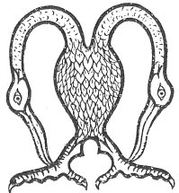

  
[Intangible Textual Heritage](../../../index.md) 
[Legends/Sagas](../../index)  [Celtic](../index.md)  [Carmina
Gadelica](../cg)  [Index](index)  [Previous](cg1083)  [Next](cg1085.md) 

------------------------------------------------------------------------

[Buy this Book at
Amazon.com](https://www.amazon.com/exec/obidos/ASIN/B0027P88YQ/internetsacredte.md)

------------------------------------------------------------------------

  
*Carmina Gadelica, Volume 1*, by Alexander Carmicheal, \[1900\], at
Intangible Textual Heritage

------------------------------------------------------------------------

 

<table data-border="0">
<colgroup>
<col style="width: 50%" />
<col style="width: 50%" />
</colgroup>
<tbody>
<tr class="odd">
<td data-valign="top" width="327">
p. 208
</td>
<td data-valign="top" width="327">
p. 209
</td>
</tr>
<tr class="even">
<td data-valign="top" width="327"><h3 id="micheal-nam-buadh" data-align="center">MICHEAL NAM BUADH</h3></td>
<td data-valign="top" width="327"><h3 id="michael-the-victorious" data-align="center">MICHAEL, THE VICTORIOUS</h3></td>
</tr>
</tbody>
</table>

 

<table data-border="0">
<colgroup>
<col style="width: 25%" />
<col style="width: 25%" />
<col style="width: 25%" />
<col style="width: 25%" />
</colgroup>
<tbody>
<tr class="odd">
<td data-valign="top">
 
</td>
<td data-valign="top">
p. 208
</td>
<td data-valign="top">
 
</td>
<td data-valign="top">
p. 209
</td>
</tr>
<tr class="even">
<td data-valign="top">
 
</td>
<td data-valign="top">
MHICHEIL nam buadh, 
Char tam fo d’ dhion, 
A Mhicheil nan steud geal, 
’S nan leug lanna liomh, 
Fhir bhuadhaich an dreagain, 
Bi fein ri mo chul, 
Fhir-chuartach nan speura, 
Fhir-feachd Righ nan dul, 
     A Mhicheil nam buadh, 
     M’ uaill agus m’ 
     A Mhicheil nam buadh, 
     Suamhnas mo shul.
</td>
<td data-valign="top">
 
</td>
<td data-valign="top">
THOU Michael the victorious, 
I make my circuit under thy shield, 
Thou Michael of the white steed, 
And of the bright brilliant blades, 
Conqueror of the dragon, 
Be thou at my back, 
Thou ranger of the heavens, 
Thou warrior of the King of all, 
     O Michael the victorious, 
     My pride and my guide, 
     O Michael the victorious, 
     The glory of mine eye.
</td>
</tr>
<tr class="odd">
<td data-valign="top">
 
</td>
<td data-valign="top">
p. 210
</td>
<td data-valign="top">
 
</td>
<td data-valign="top">
p. 211
</td>
</tr>
<tr class="even">
<td data-valign="top">
 
</td>
<td data-valign="top">
Deanam an cuarta 
An cluanas mo naomh, 
Air machair, air cluan domh, 
Air fuar-bheanna fraoch; 
Ged shiubhlam an cuan 
’S an cruaidh cruinne-ce 
Cha deifir domh gu sior 
’S mi fo dhidionn do sgeith; 
     A Mhicheal nam buadh, 
     M’ ailleagan ere, 
     A Mhicheil nam buadh, 
     Buachaille De.

Tri Naomh na Gloire 
Bhith ’n comhnuidh rium reidh, 
Ri n’ eachraidh, ri m’ lochraidh, 
Ri cioba cloimh an treud. 
Am barr ta fas air raona 
No caonachadh an raoid, 
Air machair no air mointeach, 
An toit, an torr, no an cruach. 
     Gach ni tha’n aird no’n iosal, 
     Gach insridh agus buar, 
     ’S le Trithinn naomh na gloire, 
     Agus Micheal corr nam buadh.
</td>
<td data-valign="top">
 
</td>
<td data-valign="top">
I make my circuit 
In the fellowship of my saint, 
On the machair, on the meadow, 
On the cold heathery hill; 
Though I should travel ocean 
And the hard globe of the world 
No harm can e’er befall me 
’Neath the shelter of thy shield; 
     O Michael the victorious, 
     Jewel of my heart, 
     O Michael the victorious, 
     God's shepherd thou art.

Be the sacred Three of Glory 
Aye at peace with me, 
With my horses, with my cattle, 
With my woolly sheep in flocks. 
With the crops growing in the field 
Or ripening in the sheaf, 
On the machair, on the moor, 
In cole, in heap, or stack. 
     Every thing on high or low, 
     Every furnishing and flock, 
     Belong to the holy Triune of glory, 
     And to Michael the victorious.
</td>
</tr>
</tbody>
</table>

 

------------------------------------------------------------------------

[Next: 78. The Blessing of the 'Strūan'. An Beannachadh Strūain](cg1085.md)
