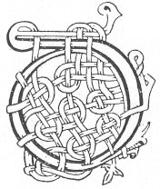

  
[Intangible Textual Heritage](../../../index.md) 
[Legends/Sagas](../../index)  [Celtic](../index.md)  [Carmina
Gadelica](../cg)  [Index](index)  [Previous](cg1085)  [Next](cg1087.md) 

------------------------------------------------------------------------

[Buy this Book at
Amazon.com](https://www.amazon.com/exec/obidos/ASIN/B0027P88YQ/internetsacredte.md)

------------------------------------------------------------------------

  
*Carmina Gadelica, Volume 1*, by Alexander Carmicheal, \[1900\], at
Intangible Textual Heritage

------------------------------------------------------------------------

 

<table data-border="0">
<colgroup>
<col style="width: 50%" />
<col style="width: 50%" />
</colgroup>
<tbody>
<tr class="odd">
<td data-valign="top" width="327">
p. 216
</td>
<td data-valign="top" width="327">
p. 217
</td>
</tr>
<tr class="even">
<td data-valign="top" width="327"><h3 id="duan-an-domhnuich-79" data-align="center">DUAN AN DOMHNUICH [79]</h3></td>
<td data-valign="top" width="327"><h3 id="the-poem-of-the-lords-day" data-align="center">THE POEM OF THE LORD'S DAY</h3></td>
</tr>
</tbody>
</table>

 

THIS poem was obtained from Janet Currie,
Staonabrig, South Uist, a descendant of the Mac Mhuirichs (corrupted
into Currie) of Staoligearry, the famous poet-historians to the
Clanranalds. She was a tall, strong, dark-haired, ruddy-complexioned
woman, with a clear, sonorous voice. Her p.
217 language was remarkably fluent and copious, though many of
her words and phrases, being obsolete, were unintelligible to the
stranger. I took down versions of the poem from several other persons,
but they are all more or less corrupt and obscure. Poems similar to this
can be traced back to the eighth century.

 

<table data-border="0">
<colgroup>
<col style="width: 25%" />
<col style="width: 25%" />
<col style="width: 25%" />
<col style="width: 25%" />
</colgroup>
<tbody>
<tr class="odd">
<td data-valign="top">
 
</td>
<td data-valign="top">
p. 216
</td>
<td data-valign="top">
 
</td>
<td data-valign="top">
p. 217
</td>
</tr>
<tr class="even">
<td data-valign="top">
 
</td>
<td data-valign="top">
DUAN an Domhnuich, a Dhe ghil, 
Firinn fo neart Chriosd a chomhnuidh.

Di-domhnuich rugadh Muire, 
Mathair Chriosd an or-fhuilt bhuidhe, 
Di-domhnuich rugadh Criosda 
     Mar onair dhaoine.

Di-domhnuich, an seachdamh latha, 
Dh’ orduich Dia gu fois a ghabhail, 
Gu cumail na beath-maireannaich, 
Gun feum a thoir a damh no duine, 
No a creubh mar dheonaich Muire, 
Gun sniamh snath sioda no strol, 
Gun fuaigheal, gun ghreiseadh ni’s mo, 
Gun churachd, gun chliathadh, gun bhuain, 
Gun iomaradh, gun iomairt, gun iasgaireachd, 
Gun dol a mach dh’ an t-sliabh sheilg, 
Gun snaitheadh deilgne Di-domhnuich, 
Gun chartadh taighe, gun bhualadh, 
Gun atha, gun mhuileann Di-domhnuich.

Ge be chumadh an Domhnuch, 
Bu chomhnard da-san ’s bu bhuan, 
Bho dhol fotha greine Di-Sathuirn 
Gu eirigh greine Di-luain.
</td>
<td data-valign="top">
 
</td>
<td data-valign="top">
THE poem of the Lord's Day, O bright God, 
Truth under the strength of Christ always.

On the Lord's Day Mary was born, 
Mother of Christ of golden yellow hair, 
On the Lord's Day Christ was born 
     As an honour to men.

The Lord's Day, the seventh day, 
God ordained to take rest, 
To keep the life everlasting, 
Without taking use of ox or man, 
Or of creature as Mary desired, 
Without spinning thread of silk or of satin, 
Without sewing, without embroidery either, 
Without sowing, without harrowing, without reaping, 
Without rowing, without games, without fishing, 
Without going out to the hunting hill, 
Without trimming arrows on the Lord's Day, 
Without cleaning byre, without threshing corn, 
Without kiln, without mill on the Lord's Day.

Whosoever would keep the Lord's Day, 
Even would it be to him and lasting, 
From setting of sun on Saturday 
Till rising of sun on Monday.
</td>
</tr>
<tr class="odd">
<td data-valign="top">
 
</td>
<td data-valign="top">
p. 218
</td>
<td data-valign="top">
 
</td>
<td data-valign="top">
p. 219
</td>
</tr>
<tr class="even">
<td data-valign="top">
 
</td>
<td data-valign="top">
Gheobhadh e feich ga chionn, 
Toradh an deigh nan crann, 
Iasg air abhuinn fior ghlan sala, 
Sar iasg an ionnar gach abhuinn.

Uisg an Domhnuich blath mar mhil, 
Ge be dh’ oladh e mar dhibh 
Gheobhadh e solas ga chion 
Bho gach dolas a bhiodh na char.

Gul an Domhnuich gu ra-luath, 
Bean ga dheanadh an an-uair; 
Guileadh i gu moch Di-luain, 
Ach na guileadh i uair ’s an Domhnuch.

Fiodh an Domhnuich gu ra-luath, 
Anns an linge mar is truagh, 
Ge d’ thuiteadh a cheann na ghual, 
Bhiodh e gu Di-luain na chadal. 
Mu thrath-nona Di-luain, 
Eiridh am fiodh gu ra-luath, 
’S air an dile mhor a muigh 
Greas air sgeula mo chuimire. 
Gun chnuasachd uan, meile, meinne no minsich 
Nach buineadh dh’ an Righ anns a bhlagh. 
Is ann a nist bu choir a losgadh, 
Gun eisdeachd ri gleadhraich nan gall, 
No ri dall sgeileireachd choitchinn.

Gart a ghleidheadh air cnoc ard, 
Leigh a thoir gu galar garga, 
Bo chur gu tarbh treun na tana, 
Falbh le beothach gu cuthaidh,
</td>
<td data-valign="top">
 
</td>
<td data-valign="top">
He would obtain recompense therefrom, 
Produce after the ploughs, 
Fish on the pure salt-water stream, 
Fish excelling in every river confluence.

The water of the Lord's Day mild as honey, 
Whoso would partake of it as drink 
Would obtain health in consequence 
From every disease afflicting him.

The weeping of the Lord's Day is out of place, 
A woman doing it is untimely; 
Let her weep betimes on Monday, 
But not weep once on the Lord's Day.

The wood of the Lord's Day is too soon. 
In the pool it is pitiful, 
Though its head should fall in char, 
It would till Monday be dormant. 
About noon on the Monday, 
The wood will arise very quickly, 
And by the great flood without 
Hasten the story of my trouble. 
Without any searching for lamb, sheep, kid or goat 
That would not belong to the King in the cause. 
It is now it ought to be burnt, 
Without listening to the clamour of the stranger, 
Nor to the blind babbling of the public.

To keep corn on a high hillock, 
To bring physician to a violent disease, 
To send a cow to the potent bull of the herd, 
To go with a beast to a cattle-fold,
</td>
</tr>
<tr class="odd">
<td data-valign="top">
 
</td>
<td data-valign="top">
p. 220
</td>
<td data-valign="top">
 
</td>
<td data-valign="top">
p. 221
</td>
</tr>
<tr class="even">
<td data-valign="top">
 
</td>
<td data-valign="top">
Fada no fagasg anns a cheum, 
Feumaidh gach creatair umhail. 
Eathar a leigeil fo breid-shiuil bho thir, 
Bho thir gu duthaich a h-aineoil.

Ge be mheoraicheadh mo dhuan 
’S a ghabhadh e gach oidhche Luan, 
Bhiodh rath Mhicheil air a cheann, 
’S a chaoidh cha bu teann da irionn.
</td>
<td data-valign="top">
 
</td>
<td data-valign="top">
Far or near be the distance, 
Every creature needs attention. 
To allow a boat under her sail from land, 
From land to the country of her unacquaintance.

Whoso would meditate my lay, 
And say it every Monday eve, 
The luck of Michael would be on his head, 
And never would he see perdition.
</td>
</tr>
<tr class="odd">
<td data-valign="top">
 
</td>
<td data-valign="top">
 

DOIGHEAN EILE--

Abhuinn sleibh fior bhlasda, 
A sior ialadh gu Iordan, 
Is ra mhath chum i a cain, 
     Di-domhnuich ge lan a tuil.

Cha ruith braon ge glan a h-uisge, 
An inne na Mara Ruaidh.

Fiodh an Domhnuich nis, mo nuar! 
An inne na Mara Ruaidh 
Ged thuiteadh an ruadh-cheann deth 
     Bhiodh e gu Di-luain na chadal.

Na fagairt mi ni air mo dheigh, 
Greis thoir air sgeula mo chumraidh.
</td>
<td data-valign="top">
 
</td>
<td data-valign="top">
 

ALTERNATIVE VERSIONS--

Hill river is very palatable, 
Ever meandering to Jordan, 
Right well it retained its tribute 
     On the Lord's Day though great its flood.

No drop, though pure be its water, 
Shall run in the channel of the Red Sea.

The wood of the Lord's Day now, alas! 
In the channel of the Red Sea, 
Though the red head should fall off 
     It would be till Monday asleep.

Let me not leave aught behind, 
To talk a while of the redemption.
</td>
</tr>
</tbody>
</table>

 

------------------------------------------------------------------------

[Next: 80. Hymn Of The Sunday. Duan An Domhnaich](cg1087.md)
