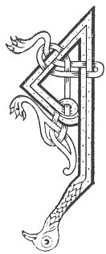

  
[Intangible Textual Heritage](../../../index.md) 
[Legends/Sagas](../../index)  [Celtic](../index.md)  [Carmina
Gadelica](../cg)  [Index](index)  [Previous](cg1086)  [Next](cg1088.md) 

------------------------------------------------------------------------

[Buy this Book at
Amazon.com](https://www.amazon.com/exec/obidos/ASIN/B0027P88YQ/internetsacredte.md)

------------------------------------------------------------------------

  
*Carmina Gadelica, Volume 1*, by Alexander Carmicheal, \[1900\], at
Intangible Textual Heritage

------------------------------------------------------------------------

 

<table data-border="0">
<colgroup>
<col style="width: 50%" />
<col style="width: 50%" />
</colgroup>
<tbody>
<tr class="odd">
<td data-valign="top" width="327">
p. 222
</td>
<td data-valign="top" width="327">
p. 223
</td>
</tr>
<tr class="even">
<td data-valign="top" width="327"><h3 id="duan-an-domhnaich-80" data-align="center">DUAN AN DOMHNAICH [80]</h3></td>
<td data-valign="top" width="327"><h3 id="hymn-of-the-sunday" data-align="center">HYMN OF THE SUNDAY</h3></td>
</tr>
</tbody>
</table>

 

 

<table data-border="0">
<colgroup>
<col style="width: 25%" />
<col style="width: 25%" />
<col style="width: 25%" />
<col style="width: 25%" />
</colgroup>
<tbody>
<tr class="odd">
<td data-valign="top">
 
</td>
<td data-valign="top">
p. 222
</td>
<td data-valign="top">
 
</td>
<td data-valign="top">
p. 223
</td>
</tr>
<tr class="even">
<td data-valign="top">
 
</td>
<td data-valign="top">
AN Domhnach naomha do Dhe 
Tabhair do chre dh’ an chinne-daon, 
Do t’ athair is do d’ mhathair chaomh, 
Thar gach aon ’s gach ni ’s an t-saoghal.

Na dean sainn air mhor no bheag, 
Na dean tair air tais no truaigh, 
Fiamh an uilc a d’ choir na leig, 
Na tabhair ’s na toill masladh uair.

Na deich fana thug Dia duit, 
Tuig gun dail iad agus dearbh, 
Creid direach an Righ nan dul, 
Cuir air chul uidh thoir a dhealbh.

Bi dileas da d’ thighearna-cinn, 
Bi dileas da d’ righ ’s gach eang, 
Bi dileas duit fein a ris, 
Dileas da d’ Ard Righ thar gach dreang.

Na tabhair toi’eum do neach air bith, 
An earail toi’eum a thoir ort fein, 
’S ged shiubhladh tu cuan is cith, 
Lean cas-cheum Aon-unga Dhe.
</td>
<td data-valign="top">
 
</td>
<td data-valign="top">
ON the holy Sunday of thy God 
Give thou thine heart to all mankind, 
To thy father and thy mother loving, 
Beyond any person or thing in the world.

Do not covet large or small, 
Do not despise weakling or poor, 
Semblance of evil allow not near thee, 
Never give nor earn thou shame.

The ten commands God gave thee, 
Understand them early and prove, 
Believe direct in the King of the elements, 
Put behind thee ikon-worship.

Be faithful to thine over-lord, 
Be true to thy king in every need, 
Be true to thine own self besides, 
True to thy High-King above all obstacles.

Do not thou malign any man, 
Lest thou thyself maligned shouldst be, 
And shouldst thou travel ocean and earth, 
Follow the very step of God's Anointed.
</td>
</tr>
</tbody>
</table>

 

 

------------------------------------------------------------------------

[Next: 81. Poem of the Flood. Duan Na Dilinn](cg1088.md)
