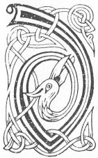

  
[Intangible Textual Heritage](../../../index) 
[Legends/Sagas](../../index)  [Celtic](../index)  [Carmina
Gadelica](../cg)  [Index](index)  [Previous](cg1087)  [Next](cg1089) 

------------------------------------------------------------------------

[Buy this Book at
Amazon.com](https://www.amazon.com/exec/obidos/ASIN/B0027P88YQ/internetsacredte)

------------------------------------------------------------------------

  
*Carmina Gadelica, Volume 1*, by Alexander Carmicheal, \[1900\], at
Intangible Textual Heritage

------------------------------------------------------------------------

<table data-border="0">
<colgroup>
<col style="width: 50%" />
<col style="width: 50%" />
</colgroup>
<tbody>
<tr class="odd">
<td data-valign="top" width="327">
p. 224
</td>
<td data-valign="top" width="327">
p. 225
</td>
</tr>
<tr class="even">
<td data-valign="top" width="327"><h3 id="duan-na-dilinn-81" data-align="center">DUAN NA DILINN [81]</h3></td>
<td data-valign="top" width="327"><h3 id="poem-of-the-flood" data-align="center">POEM OF THE FLOOD</h3></td>
</tr>
</tbody>
</table>

 

<table data-border="0">
<colgroup>
<col style="width: 25%" />
<col style="width: 25%" />
<col style="width: 25%" />
<col style="width: 25%" />
</colgroup>
<tbody>
<tr class="odd">
<td data-valign="top">
 
</td>
<td data-valign="top">
p. 224
</td>
<td data-valign="top">
 
</td>
<td data-valign="top">
p. 225
</td>
</tr>
<tr class="even">
<td data-valign="top">
 
</td>
<td data-valign="top">
DI-LUAIN thig an doireann trom, 
A shileas am bith eutrom, 
Bithidh sinn umhail gach greis, 
     Gach uile na dh’ eisdeas.

Di-mairt thig an t-sian eile, 
Cradh chridheach, cruaidh pheinneach, 
A shileas na gruaidheana glana, 
     Frasa fala fiona.

Di-ciadain a sheideas gaoth, 
Sguaba lom air shrath is raon, 
Dortadh oiteag barra theann, 
     Beithir bheur ’s reubadh bheann.

Di-ardaoin a shileas an cith, 
Chuireas daoine ’n an dalla ruith, 
Na ’s luaithe na ’n duil air an fhiodh, 
     Mar bharr mhic-Muir air bhalla-chrith.

Di-haoine thig an coinneal dubh, 
Is eitiche thainig fo’n t-saoghal; 
Fagar an sluagh braon am beachd, 
     Fiar agus iasg fo’n aon leac.

Di-sathuirne thig am muir mor, 
Ag iomairt air alt aibhne; 
Bithidh gach uile mar a shnodh 
     Ag altachadh gu sliabh slighinn.
</td>
<td data-valign="top">
 
</td>
<td data-valign="top">
ON Monday will come the great storm 
Which the airy firmament will pour, 
We shall be obedient the while, 
     All who will hearken.

On Tuesday will come the other element, 
Heart paining, hard piercing, 
Wringing from pure pale cheeks 
     Blood, like showers of wine.

On Wednesday will blow the wind, 
Sweeping bare strath and plain, 
Showering gusts of galling grief, 
     Thunder bursts and rending hills.

On Thursday will pour the shower, 
Driving people into blind flight, 
Faster than the foliage on the trees, 
     Like the leaves of Mary's plant in terror trembling.

On Friday will come the dool cloud of darkness, 
The direst dread that ever came over the world, 
Leaving multitudes bereft of reason, 
     Grass and fish beneath the same flagstone.

On Saturday will come the great sea, 
Rushing like a mighty river; 
All will be at their best 
     Hastening to a hill of safety.
</td>
</tr>
<tr class="odd">
<td data-valign="top">
 
</td>
<td data-valign="top">
p. 226
</td>
<td data-valign="top">
 
</td>
<td data-valign="top">
p. 227
</td>
</tr>
<tr class="even">
<td data-valign="top">
 
</td>
<td data-valign="top">
Di-domhnaich a dh’ eireas mo Righ, 
Lan feirge agus iminidh, 
Ag eisdeachd ri searbh ghloir gach fir, 
     Crois dhearg air gach guala dheis.
</td>
<td data-valign="top">
 
</td>
<td data-valign="top">
On Sunday will arise my King, 
Full of ire and tribulation, 
Listening to the bitter talk of each man, 
     A red cross on each right shoulder.
</td>
</tr>
</tbody>
</table>

 

------------------------------------------------------------------------

[Next: Header](cg1089)
