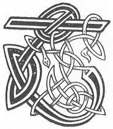

  
[Intangible Textual Heritage](../../../index.md) 
[Legends/Sagas](../../index)  [Celtic](../index.md)  [Carmina
Gadelica](../cg)  [Index](index)  [Previous](cg1089)  [Next](cg1091.md) 

------------------------------------------------------------------------

[Buy this Book at
Amazon.com](https://www.amazon.com/exec/obidos/ASIN/B0027P88YQ/internetsacredte.md)

------------------------------------------------------------------------

  
*Carmina Gadelica, Volume 1*, by Alexander Carmicheal, \[1900\], at
Intangible Textual Heritage

------------------------------------------------------------------------

<table data-border="0">
<colgroup>
<col style="width: 50%" />
<col style="width: 50%" />
</colgroup>
<tbody>
<tr class="odd">
<td data-valign="top" width="327">
p. 230
</td>
<td data-valign="top" width="327">
p. 231
</td>
</tr>
<tr class="even">
<td data-valign="top" width="327"><h3 id="beannachadh-beothachaidh-82" data-align="center">BEANNACHADH BEOTHACHAIDH [82]</h3></td>
<td data-valign="top" width="327"><h3 id="blessing-of-the-kindling" data-align="center">BLESSING OF THE KINDLING</h3></td>
</tr>
</tbody>
</table>

 

THE kindling of the fire is a work full of interest
to the housewife. When 'lifting' the fire in the morning the woman
prays, in an undertone, that the fire may be blessed to her and to her
household, and to the glory p. 231 of God who
gave it. The people look upon fire as a miracle of Divine power provided
for their good--to warm their bodies when they are cold, to cook their
food when they are hungry, and to remind them that they too, like the
fire, need constant renewal mentally and physically.

 

<table data-border="0">
<colgroup>
<col style="width: 25%" />
<col style="width: 25%" />
<col style="width: 25%" />
<col style="width: 25%" />
</colgroup>
<tbody>
<tr class="odd">
<td data-valign="top">
 
</td>
<td data-valign="top">
p. 230
</td>
<td data-valign="top">
 
</td>
<td data-valign="top">
p. 231
</td>
</tr>
<tr class="even">
<td data-valign="top">
 
</td>
<td data-valign="top">
TOGAIDH mi mo theine an diugh, 
An lathair ainghlean naomha neimh, 
An lathair Airil is ailde cruth, 
An lathair Uiril nan uile sgeimh, 
Gun ghnu, gun tnu, gun fharmad. 
Gun ghiomh, gun gheimh roimh neach fo’n ghrein, 
Ach Naomh Mhac De da m’ thearmad. 
     Gun ghnu, gun tnu, gun fharmad, 
     Gun ghiomh, gun gheimh, roimh neach fo’n ghrein, 
     Ach Naomh Mhac De da m’ thearmad.

Dhe fadaidh fein na m’ chridhe steach, 
Aingheal ghraidh do m’ choimhearsnach, 
Do m’ namh, do m’ dhamh, do m’ chairde, 
Do ’n t-saoidh, do ’n daoidh, do ’n traille. 
A Mhic na Moire min-ghile, 
Bho ’n ni is isde crannchaire, 
Gu ruig an t-Ainm is airde. 
     A Mhic na Moire min-ghile, 
     Bho ’n ni is isde crannchaire, 
     Gu ruig an t-Ainm is airde.
</td>
<td data-valign="top">
 
</td>
<td data-valign="top">
I WILL kindle my fire this morning 
In presence of the holy angels of heaven, 
In presence of Ariel of the loveliest form, 
In presence of Uriel of the myriad charms, 
Without malice, without jealousy, without envy, 
Without fear, without terror of any one under the sun, 
But the Holy Son of God to shield me. 
     Without malice, without jealousy, without envy, 
     Without fear, without terror of any one under the sun, 
     But the Holy Son of God to shield me.

God, kindle Thou in my heart within 
A flame of love to my neighbour, 
To my foe, to my friend, to my kindred all, 
To the brave, to the knave, to the thrall, 
O Son of the loveliest Mary, 
From the lowliest thing that liveth, 
To the Name that is highest of all. 
     O Son of the loveliest Mary, 
     From the lowliest thing that liveth, 
     To the Name that is highest of all.
</td>
</tr>
</tbody>
</table>

 

 

------------------------------------------------------------------------

[Next: 83. Kindling The Fire. Togail An Teine](cg1091.md)
