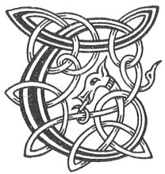

  
[Intangible Textual Heritage](../../../index) 
[Legends/Sagas](../../index)  [Celtic](../index)  [Carmina
Gadelica](../cg)  [Index](index)  [Previous](cg1090)  [Next](cg1092) 

------------------------------------------------------------------------

[Buy this Book at
Amazon.com](https://www.amazon.com/exec/obidos/ASIN/B0027P88YQ/internetsacredte)

------------------------------------------------------------------------

  
*Carmina Gadelica, Volume 1*, by Alexander Carmicheal, \[1900\], at
Intangible Textual Heritage

------------------------------------------------------------------------

 

<table data-border="0">
<colgroup>
<col style="width: 50%" />
<col style="width: 50%" />
</colgroup>
<tbody>
<tr class="odd">
<td data-valign="top" width="327">
p. 232
</td>
<td data-valign="top" width="327">
p. 233
</td>
</tr>
<tr class="even">
<td data-valign="top" width="327"><h3 id="togail-an-teine-83" data-align="center">TOGAIL AN TEINE [83]</h3></td>
<td data-valign="top" width="327"><h3 id="kindling-the-fire" data-align="center">KINDLING THE FIRE</h3></td>
</tr>
</tbody>
</table>

 

<table data-border="0">
<colgroup>
<col style="width: 25%" />
<col style="width: 25%" />
<col style="width: 25%" />
<col style="width: 25%" />
</colgroup>
<tbody>
<tr class="odd">
<td data-valign="top">
 
</td>
<td data-valign="top">
p. 232
</td>
<td data-valign="top">
 
</td>
<td data-valign="top">
p. 233
</td>
</tr>
<tr class="even">
<td data-valign="top">
 
</td>
<td data-valign="top">
TOGAIDH mis an tula 
Mar a thogadh Muire. 
Cairn Bhride ’s Mhuire 
Air an tula ’s air an lar, 
’S air an fhardaich uile.

Co iad ri luim an lair? 
Eoin, Peadail agus Pail. 
Co iad ri bruaich mo leap? 
Bride bhuidheach ’s a Dalt. 
Co iad ri fath mo shuain? 
Muire ghraidh-gheal ’s a h-Uan. 
Co siud a tha ’n am theann? 
Righ na grein e fein a th’ ann, 
Co siud ri cul mo chinn? 
Mac nan dul gun tus, gun linn.
</td>
<td data-valign="top">
 
</td>
<td data-valign="top">
I WILL raise the hearth-fire 
As Mary would. 
The encirclement of Bride and of Mary 
On the fire, and on the floor, 
And on the household all.

Who are they on the bare floor? 
John and Peter and Paul. 
Who are they by my bed? 
The lovely Bride and her Fosterling. 
Who are those watching over my sleep? 
The fair loving Mary and her Lamb. 
Who is that anear me? 
The King of the sun, He himself it is. 
Who is that at the back of my head? 
The Son of Life without beginning, without time.
</td>
</tr>
</tbody>
</table>

 

 

------------------------------------------------------------------------

[Next: 84. Smooring the Fire. Smaladh An Teine](cg1092)
