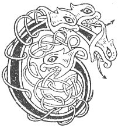

  
[Intangible Textual Heritage](../../../index.md) 
[Legends/Sagas](../../index)  [Celtic](../index.md)  [Carmina
Gadelica](../cg)  [Index](index)  [Previous](cg1092)  [Next](cg1094.md) 

------------------------------------------------------------------------

[Buy this Book at
Amazon.com](https://www.amazon.com/exec/obidos/ASIN/B0027P88YQ/internetsacredte.md)

------------------------------------------------------------------------

  
*Carmina Gadelica, Volume 1*, by Alexander Carmicheal, \[1900\], at
Intangible Textual Heritage

------------------------------------------------------------------------

 

<table data-border="0">
<colgroup>
<col style="width: 50%" />
<col style="width: 50%" />
</colgroup>
<tbody>
<tr class="odd">
<td data-valign="top" width="327">
p. 236
</td>
<td data-valign="top" width="327">
p. 237
</td>
</tr>
<tr class="even">
<td data-valign="top" width="327"><h3 id="smaladh-an-teine-85" data-align="center">SMALADH AN TEINE [85]</h3></td>
<td data-valign="top" width="327"><h3 id="smooring-the-fire" data-align="center">SMOORING THE FIRE</h3></td>
</tr>
</tbody>
</table>

 

<table data-border="0">
<colgroup>
<col style="width: 25%" />
<col style="width: 25%" />
<col style="width: 25%" />
<col style="width: 25%" />
</colgroup>
<tbody>
<tr class="odd">
<td data-valign="top">
 
</td>
<td data-valign="top">
p. 236
</td>
<td data-valign="top">
 
</td>
<td data-valign="top">
p. 237
</td>
</tr>
<tr class="even">
<td data-valign="top">
 
</td>
<td data-valign="top">
CAIRIDH mi an tula, 
Mar a chaireadh Muire, 
Claim Bhride ’s Mhuire, 
Car an tula ’s car an lair, 
’S car an ardraich uile.

Co iad air lian a muigh? 
Micheal grian-gheal mo luin. 
Co iad air meadhon lair? 
Eoin, Peadail, agus Pail. 
Co iad ri bial mo stoc? 
Moire ghrian-gheal ’s a Mac.

Bial Dia dh’ orduich, 
Aingheal Dia bhoinich, 
Aingheal geal an car an tealla, 
Gon tig la geal gu beola. 
Aingheal geal an car an tealla, 
Gon tig la geal gu beola.
</td>
<td data-valign="top">
 
</td>
<td data-valign="top">
I WILL build the hearth, 
As Mary would build it. 
The encompassment of Bride and of Mary, 
Guarding the hearth, guarding the floor, 
Guarding the household all.

Who are they on the lawn without? 
Michael the sun-radiant of my trust. 
Who are they on the middle of the floor? 
John and Peter and Paul. 
Who are they by the front of my bed? 
Sun-bright Mary and her Son.

The mouth of God ordained, 
The angel of God proclaimed, 
An angel white in charge of the hearth 
Till white day shall come to the embers. 
An angel white in charge of the hearth 
Till white day shall come to the embers.
</td>
</tr>
</tbody>
</table>

 

 

------------------------------------------------------------------------

[Next: 88. Blessing of the Smooring. Beannachd Smalaidh](cg1094.md)
