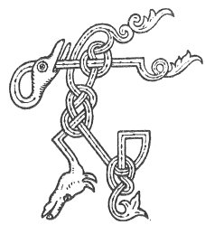

  
[Intangible Textual Heritage](../../../index.md) 
[Legends/Sagas](../../index)  [Celtic](../index.md)  [Carmina
Gadelica](../cg)  [Index](index)  [Previous](cg1093)  [Next](cg1095.md) 

------------------------------------------------------------------------

[Buy this Book at
Amazon.com](https://www.amazon.com/exec/obidos/ASIN/B0027P88YQ/internetsacredte.md)

------------------------------------------------------------------------

  
*Carmina Gadelica, Volume 1*, by Alexander Carmicheal, \[1900\], at
Intangible Textual Heritage

------------------------------------------------------------------------

 

<table data-border="0">
<colgroup>
<col style="width: 50%" />
<col style="width: 50%" />
</colgroup>
<tbody>
<tr class="odd">
<td data-valign="top" width="327">
p. 238
</td>
<td data-valign="top" width="327">
p. 239
</td>
</tr>
<tr class="even">
<td data-valign="top" width="327"><h3 id="beannachd-smalaidh-88" data-align="center">BEANNACHD SMALAIDH [88]</h3></td>
<td data-valign="top" width="327"><h3 id="blessing-of-the-smooring" data-align="center">BLESSING OF THE SMOORING</h3></td>
</tr>
</tbody>
</table>

 

<table data-border="0">
<colgroup>
<col style="width: 25%" />
<col style="width: 25%" />
<col style="width: 25%" />
<col style="width: 25%" />
</colgroup>
<tbody>
<tr class="odd">
<td data-valign="top">
 
</td>
<td data-valign="top">
p. 238
</td>
<td data-valign="top">
 
</td>
<td data-valign="top">
p. 239
</td>
</tr>
<tr class="even">
<td data-valign="top">
 
</td>
<td data-valign="top">
THA mi smaladh an teine, 
Mar a smaladh Mac Moire; 
Gu mu slan dh’ an taigh ’s dh’ an teine, 
     Gu mu slan dh’ an chuideachd uile.

Co siud shios air an lar? 
Eoin agus Peadail agus Pal. 
Co air am bheil an fhaire nochd? 
     Air Moire mhin-gheal ’s air a Mac.

Beul De a thubhradh, 
Aingheal De a labhradh, 
Aingheal an dorus an taighe, 
D’ar comhnadh ’s d’ar gleidheadh 
     Gu ’n tig la geal am maireach.

O! ainghlean Aon Naomha Dhe 
Da mo chaimhleachadh fein a nochd, 
O! ainghlean Aon Unga Dhe, 
Da mo chaim bho bheud ’s bho lochd, 
     Da mo chaim bho bheud a nochd.
</td>
<td data-valign="top">
 
</td>
<td data-valign="top">
I AM smooring the fire 
As the Son of Mary would smoor; 
Blest be the house, blest be the fire, 
     Blest be the people all.

Who are those down on the floor? 
John and Peter and Paul. 
On whom is the vigil to-night? 
     On the fair gentle Mary and on her Son.

The mouth of God said, 
The angel of God spake, 
An angel in the door of the house, 
To guard and to keep us all 
     Till comes daylight to-morrow.

Oh! may the angels of the Holy One of God 
Environ me all this night, 
Oh! may the angels of the Anointed One of God 
Encompass me from harm and from evil, 
     Oh! encompass me from harm this night.

 
</td>
</tr>
</tbody>
</table>

 

------------------------------------------------------------------------

[Next: 87. Smooring Blessing Beannachadh Smalaidh](cg1095.md)
