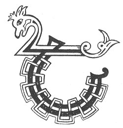

  
[Intangible Textual Heritage](../../../index) 
[Legends/Sagas](../../index)  [Celtic](../index)  [Carmina
Gadelica](../cg)  [Index](index)  [Previous](cg1095)  [Next](cg1097) 

------------------------------------------------------------------------

[Buy this Book at
Amazon.com](https://www.amazon.com/exec/obidos/ASIN/B0027P88YQ/internetsacredte)

------------------------------------------------------------------------

  
*Carmina Gadelica, Volume 1*, by Alexander Carmicheal, \[1900\], at
Intangible Textual Heritage

------------------------------------------------------------------------

 

<table data-border="0">
<colgroup>
<col style="width: 50%" />
<col style="width: 50%" />
</colgroup>
<tbody>
<tr class="odd">
<td data-valign="top" width="327">
p. 242
</td>
<td data-valign="top" width="327">
p. 243
</td>
</tr>
<tr class="even">
<td data-valign="top" width="327"><h3 id="an-coisrigeadh-sioil-88" data-align="center">AN COISRIGEADH SIOIL [88]</h3></td>
<td data-valign="top" width="327"><h3 id="the-consecration-of-the-seed" data-align="center">THE CONSECRATION OF THE SEED</h3></td>
</tr>
</tbody>
</table>

 

THE preparation of the seed-corn is of great importance to the people,
who bestow much care on this work. Many ceremonies and proverbs are
applied to seedtime and harvest.

The corn is prepared at certain seasons of the year, which are seldom
deviated from. The rye is threshed to allow 'gaoth bhog nan Duldachd,'
the soft wind of November and December, to winnow the seed; the oats to
allow 'gaoth fhuar nam Faoilleach,' the cold winds of January and
February, to winnow the seed; and the bere to allow 'gaoth gheur nam
Mart,' the sharp winds p. 243 of March and
April, to winnow the seed. All these preparations are made to assist
Nature in the coming Spring. Three days before being sown the seed is
sprinkled with clear cold water, in the name of Father, and of Son, and
of Spirit, the person sprinkling the seed walking sunwise the while.

The ritual is picturesque, and is performed with great care and
solemnity and, like many of these ceremonies, is a combination of
Paganism and Christianity. The moistening of the seed has the effect of
hastening its growth when committed to the ground, which is generally
begun on a Friday, that day being auspicious for all operations not
necessitating the use of iron.

 

<table data-border="0">
<colgroup>
<col style="width: 25%" />
<col style="width: 25%" />
<col style="width: 25%" />
<col style="width: 25%" />
</colgroup>
<tbody>
<tr class="odd">
<td data-valign="top">
 
</td>
<td data-valign="top">
p. 242
</td>
<td data-valign="top">
 
</td>
<td data-valign="top">
p. 243
</td>
</tr>
<tr class="even">
<td data-valign="top">
 
</td>
<td data-valign="top">
THEID mi mach a chur an t-sioil, 
An ainm an Ti a thug da fas, 
Cuirim m’ aghaidh anns a ghaoith, 
Is tilgim baslach caon an aird. 
Ma thuiteas silc air lic luim, 
Cha bhi fuinn aige gu fas; 
Mheud ’s a thuiteas anns an uir, 
Bheir an druchd dha a bhi lan.

Di-aoine la nam buadh, 
Thig dealt a nuas a chur failt 
Air gach por a bha ’n an suain, 
Bho na thainig fuachd gun bhaigh; 
Friamhaichidh gach por ’s an uir, 
Mar a mhiannaich Righ nan dul, 
Thig an fochann leis an druchd, 
Gheobh e beatha bho ’n ghaoith chiuin.

Thig mi mu ’n cuairt le m’ cheum, 
Theid mi deiseil leis a ghrein, 
An ainm Airil ’s nan aingeal naodh, 
An ainm Ghabril ’s nan ostal caomh.
</td>
<td data-valign="top">
 
</td>
<td data-valign="top">
I WILL go out to sow the seed, 
In name of Him who gave it growth; 
I will place my front in the wind, 
And throw a gracious handful on high. 
Should a grain fall on a bare rock, 
It shall have no soil in which to grow; 
As much as falls into the earth, 
The dew will make it to be full.

Friday, day auspicious, 
The dew will come down to welcome 
Every seed that lay in sleep 
Since the coming of cold without mercy; 
Every seed will take root in the earth, 
As the King of the elements desired, 
The braird will come forth with the dew, 
It will inhale life from the soft wind.

I will come round with my step, 
I will go rightways with the sun, 
In name of Ariel and the angels nine, 
In name of Gabriel and the Apostles kind.
</td>
</tr>
<tr class="odd">
<td data-valign="top">
 
</td>
<td data-valign="top">
p. 244
</td>
<td data-valign="top">
 
</td>
<td data-valign="top">
p. 245
</td>
</tr>
<tr class="even">
<td data-valign="top">
 
</td>
<td data-valign="top">
Athair is Mac is Spiorad Naomh, 
Bhi toir fas is toradh maoth 
Do gach cail a ta ’n am raon, 
Gon tar an latha caon.

La Fheill Micheil, la nam buadh, 
Cuiridh mi mo chorran cuart 
Bun an arbhair mar bu dual, 
Togam an ceud bheum gu luath; 
Cuirim e tri char mu ’n cuart 
Mo cheann, ’s mo rann ga luadh, 
Mo chulaibh ris an airde tuath; 
’S mo ghnuis ri grein ghil nam buadh.

Tilgim am beum fada bhuam, 
Duinim mo dha shuil da uair, 
Ma thuiteas e na aon dual 
Bithidh mo chruachan biochar buan; 
Cha tig Cailleach ri an-uair 
Dh’ iarraidh bonnach boise bhuainn, 
Duair thig gaillionn garbh na gruaim 
Cha bhi gainne oirnn no cruas.
</td>
<td data-valign="top">
 
</td>
<td data-valign="top">
Father, Son, and Spirit Holy, 
Be giving growth and kindly substance 
To every thing that is in my ground, 
Till the day of gladness shall come.

The Feast day of Michael, day beneficent, 
I will put my sickle round about 
The root of my corn as was wont; 
I will lift the first cut quickly; 
I will put it three turns round 
My head, saying my rune the while, 
My back to the airt of the north; 
My face to the fair sun of power.

I shall throw the handful far from me, 
I shall close my two eyes twice, 
Should it fall in one bunch 
My stacks will be productive and lasting; 
No Carlin will come with bad times 
To ask a palm bannock from us, 
What time rough storms come with frowns 
Nor stint nor hardship shall be on us.
</td>
</tr>
</tbody>
</table>

 

------------------------------------------------------------------------

[Next: 89. Reaping Blessing. Beannachadh Buana](cg1097)
