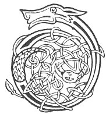

  
[Intangible Textual Heritage](../../../index.md) 
[Legends/Sagas](../../index)  [Celtic](../index.md)  [Carmina
Gadelica](../cg)  [Index](index)  [Previous](cg1096)  [Next](cg1098.md) 

------------------------------------------------------------------------

[Buy this Book at
Amazon.com](https://www.amazon.com/exec/obidos/ASIN/B0027P88YQ/internetsacredte.md)

------------------------------------------------------------------------

  
*Carmina Gadelica, Volume 1*, by Alexander Carmicheal, \[1900\], at
Intangible Textual Heritage

------------------------------------------------------------------------

 

<table data-border="0">
<colgroup>
<col style="width: 50%" />
<col style="width: 50%" />
</colgroup>
<tbody>
<tr class="odd">
<td data-valign="top" width="327">
p. 246
</td>
<td data-valign="top" width="327">
p. 247
</td>
</tr>
<tr class="even">
<td data-valign="top" width="327"><h3 id="beannachadh-buana-89" data-align="center">BEANNACHADH BUANA [89]</h3></td>
<td data-valign="top" width="327"><h3 id="reaping-blessing" data-align="center">REAPING BLESSING</h3></td>
</tr>
</tbody>
</table>

 

THE day the people began to reap the corn was a day of commotion and
ceremonial in the townland. The whole family repaired to the field
dressed in their best attire to hail the God of the harvest.

Laying his bonnet on the ground, the father of the family took up his
sickle, and facing the sun, he cut a handful of corn. Putting the
handful of corn three times sunwise round his head, the man raised the
'Iolach Buana,' reaping salutation. The whole family took up the strain
and praised the God of the harvest, who gave them p.
247 corn and bread, food and flocks, wool and clothing, health
and strength, and peace and plenty.

When the reaping was finished the people had a trial called 'cur nan
corran,' casting the sickles, and 'deuchain chorran,' trial of hooks.
This consisted, among other things, of throwing the sickles high up in
the air, and observing how they came down, how each struck the earth,
and how it lay on the ground. From these observations the people augured
who was to remain single and who was to be married, who was to be sick
and who was to die, before the next reaping came round.

 

<table data-border="0">
<colgroup>
<col style="width: 25%" />
<col style="width: 25%" />
<col style="width: 25%" />
<col style="width: 25%" />
</colgroup>
<tbody>
<tr class="odd">
<td data-valign="top">
 
</td>
<td data-valign="top">
p. 246
</td>
<td data-valign="top">
 
</td>
<td data-valign="top">
p. 247
</td>
</tr>
<tr class="even">
<td data-valign="top">
 
</td>
<td data-valign="top">
DHE beannaich fein mo bhuain, 
Gach imir, cluan, agus raon, 
Gach corran cama, cuimir, cruaidh, 
Gach dias is dual a theid ’s an raoid, 
     Gach dias is dual a theid ’s an raoid.

Beannaich gach murn agus mac, 
Gach mnaoi agus miuchainn maoth, 
Tiuir iad fo sgiath do neairt, 
Is tearmaid ann an teach nan naomh, 
     Tearmaid ann an teach nan naomh.

Cuimrich gach mins, ciob, is uan, 
Gach ni, agus mearc, is maon, 
Cuartaich fein an treuid ’s am buar, 
Is cuallaich a chon buailidh chaon, 
     Cuallaich a chon buailidh chaon.

Air sgath Mhicheil mhil nam feachd, 
Mhoire chneas-ghil leac nam buadh, 
Bhride mhin-ghil ciabh nan cleachd, 
Chaluim-chille nam feart ’s nan tuam, 
     Chaluim-chille nam feart ’s nan tuam.
</td>
<td data-valign="top">
 
</td>
<td data-valign="top">
GOD, bless Thou Thyself my reaping, 
Each ridge, and plain, and field, 
Each sickle curved, shapely, hard, 
Each ear and handful in the sheaf, 
     Each ear and handful in the sheaf.

Bless each maiden and youth, 
Each woman and tender youngling, 
Safeguard them beneath Thy shield of strength, 
And guard them in the house of the saints, 
     Guard them in the house of the saints.

Encompass each goat, sheep and lamb, 
Each cow and horse, and store, 
Surround Thou the Rocks and herds, 
And tend them to a kindly fold, 
     Tend them to a kindly fold.

For the sake of Michael head of hosts, 
Of Mary fair-skinned branch of grace, 
Of Bride smooth-white of ringleted locks, 
Of Columba of the graves and tombs, 
     Columba of the graves and tombs.
</td>
</tr>
</tbody>
</table>

 

------------------------------------------------------------------------

[Next: 90. Reaping Blessing. Beannachadh Buana](cg1098.md)
