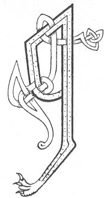

  
[Intangible Textual Heritage](../../../index) 
[Legends/Sagas](../../index)  [Celtic](../index)  [Carmina
Gadelica](../cg)  [Index](index)  [Previous](cg1098)  [Next](cg1100) 

------------------------------------------------------------------------

[Buy this Book at
Amazon.com](https://www.amazon.com/exec/obidos/ASIN/B0027P88YQ/internetsacredte)

------------------------------------------------------------------------

  
*Carmina Gadelica, Volume 1*, by Alexander Carmicheal, \[1900\], at
Intangible Textual Heritage

------------------------------------------------------------------------

<table data-border="0">
<colgroup>
<col style="width: 50%" />
<col style="width: 50%" />
</colgroup>
<tbody>
<tr class="odd">
<td data-valign="top" width="327">
p. 250
</td>
<td data-valign="top" width="327">
p. 251
</td>
</tr>
<tr class="even">
<td data-valign="top" width="327"><h3 id="beannachadh-fuiriridh-91" data-align="center">BEANNACHADH FUIRIRIDH [91]</h3></td>
<td data-valign="top" width="327"><h3 id="the-blessing-of-the-parching" data-align="center">THE BLESSING OF THE PARCHING</h3></td>
</tr>
</tbody>
</table>

WHEN it is necessary to provide a small quantity of
meal hastily, ears of corn are plucked and placed in a net made of the
tough roots of the yellow bedstraw, bent, or quicken grass, and hung
above a slow smokeless fire. The bag is taken down now and again to turn
the ears of corn. This net, however, can only be used for bere or
barley; rye and oats, p. 251being more
detachable, require the use of a pot or 'tarran' to dry them. This mode
of drying corn is called 'fuirireadh,' parching, and the corn
'fuirireach,' parched. The meal ground from the grain is called 'min
fhuiriridh,' parched meal. Bread made of meal thus prepared has a strong
peaty flavour much relished by the people.

 

<table data-border="0">
<colgroup>
<col style="width: 25%" />
<col style="width: 25%" />
<col style="width: 25%" />
<col style="width: 25%" />
</colgroup>
<tbody>
<tr class="odd">
<td data-valign="top">
 
</td>
<td data-valign="top">
p. 250
</td>
<td data-valign="top">
 
</td>
<td data-valign="top">
p. 251
</td>
</tr>
<tr class="even">
<td data-valign="top">
 
</td>
<td data-valign="top">
A LASAIR leith, chaol, chrom, 
Tighinn a toll mhullach nam fod, 
A lasair leumrach, leathann, theith, 
Na teid le do chleid da m’ choir.

Gabhail reidh, sheimh, shuairce, 
Tighinn mu ’n cuart mo thetheann, 
Teine cubhr, caon, cuana, 
Nach dean scour, no smuar, no reubann.

Teasaich, cruadhaich mo shiol miamh, 
Chon biadh dha mo leanu-beag, 
An ainm Chriosda, Righ nan sian, 
Thug duinn iodh, is iadh, is beannachd leis, 
     An ainm Chriosda, Righ nan sian, 
     Thug duinn iodh, is iadh, is beannachd leis.
</td>
<td data-valign="top">
 
</td>
<td data-valign="top">
THOU flame grey, slender, curved, 
Coming from the top pore of the peat, 
Thou flame of leaps, breadth, heat, 
Come not nigh me with thy quips.

A burning steady, gentle, generous, 
Coming round about my quicken roots, 
A fire fragrant, fair, and peaceful, 
Nor causes dust, nor grief, nor havoc.

Heat, parch my fat seed, 
For food for my little child, 
In name of Christ, King of the elements, 
Who gave us corn and bread and blessing withal, 
     In name of Christ, King of the elements, 
     Who gave us corn and bread and blessing withal.
</td>
</tr>
</tbody>
</table>

 

 

------------------------------------------------------------------------

[Next: 92 (notes). The Quern Blessing. Beannachadh Brathain](cg1100)
