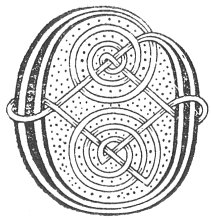

  
[Intangible Textual Heritage](../../../index) 
[Legends/Sagas](../../index)  [Celtic](../index)  [Carmina
Gadelica](../cg)  [Index](index)  [Previous](cg1100)  [Next](cg1102) 

------------------------------------------------------------------------

[Buy this Book at
Amazon.com](https://www.amazon.com/exec/obidos/ASIN/B0027P88YQ/internetsacredte)

------------------------------------------------------------------------

  
*Carmina Gadelica, Volume 1*, by Alexander Carmicheal, \[1900\], at
Intangible Textual Heritage

------------------------------------------------------------------------

 

<table data-border="0">
<colgroup>
<col style="width: 50%" />
<col style="width: 50%" />
</colgroup>
<tbody>
<tr class="odd">
<td data-valign="top" width="327">
p. 254
</td>
<td data-valign="top" width="327">
p. 255
</td>
</tr>
<tr class="even">
<td data-valign="top" width="327"><h3 id="beannachadh-brathain" data-align="center">BEANNACHADH BRATHAIN</h3></td>
<td data-valign="top" width="327"><h3 id="the-quern-blessing" data-align="center">THE QUERN BLESSING</h3></td>
</tr>
</tbody>
</table>

 

<table data-border="0">
<colgroup>
<col style="width: 25%" />
<col style="width: 25%" />
<col style="width: 25%" />
<col style="width: 25%" />
</colgroup>
<tbody>
<tr class="odd">
<td data-valign="top">
 
</td>
<td data-valign="top">
p. 254
</td>
<td data-valign="top">
 
</td>
<td data-valign="top">
p. 255
</td>
</tr>
<tr class="even">
<td data-valign="top">
 
</td>
<td data-valign="top">
OIDHCH Inid 
Bi feoil againn, 
’S bu choir ’uinn sin 
Bu choir ’uinn sin.

Leth-cheann circe, 
’S da ghreim eorna, 
’S bu leoir ’uinn sin 
Bu leoir ’uinn sin.

Bi bin againn, 
Bi beoir againn, 
Bi fion againn, 
Bi roic againn. 
Meilc is marrum, 
Mil is bainne, 
Sile fallain, 
Meall dheth sin, 
Meall dheth sin.

Bi cruit againn, 
Bi clar againn, 
Bi dus againn, 
Bi das againn; 
Bi saltair ghrinn, 
Nan teuda binn, 
’S hi fairchil, righ’nn 
Nan dan againn, 
Nan dan againn.
</td>
<td data-valign="top">
 
</td>
<td data-valign="top">
ON Ash Eve 
We shall have flesh, 
We should have that 
We should have that.

The cheek of hen, 
Two bits of barley, 
That were enough 
That were enough.

We shall have mead, 
We shall have spruce, 
We shall have wine, 
We shall have feast. 
We shall have sweetness and milk produce, 
Honey and milk, 
Wholesome ambrosia, 
Abundance of that, 
Abundance of that.

We shall have harp, (small?) 
We shall have harp, (pedal?) 
We shall have lute, 
We shall have horn. 
We shall have sweet psaltery 
Of the melodious strings 
And the regal lyre, 
Of the songs we shall have, 
Of the songs we shall have.
</td>
</tr>
<tr class="odd">
<td data-valign="top">
 
</td>
<td data-valign="top">
p. 256
</td>
<td data-valign="top">
 
</td>
<td data-valign="top">
p. 257
</td>
</tr>
<tr class="even">
<td data-valign="top">
 
</td>
<td data-valign="top">
Bi Bride bhithe, bhana, leinn, 
Bi Moire mhine mhathar, leinn. 
Bi Micheal mil 
Nan lanna liobh, 
’S bi Righ nan righ, 
’S bi Iosa Criosd 
’S bith Spiorad sith 
Nan grasa leinn, 
Nan grasa leinn.
</td>
<td data-valign="top">
 
</td>
<td data-valign="top">
The calm fair Bride will be with us, 
The gentle Mary mother will be with us. 
Michael the chief 
Of glancing glaves, 
And the King of kings 
And Jesus Christ, 
And the Spirit of peace 
And of grace will be with us, 
Of grace will be with us.
</td>
</tr>
</tbody>
</table>

 

 

------------------------------------------------------------------------

[Next: 93. Milking Croon. Cronan Bleoghain](cg1102)
