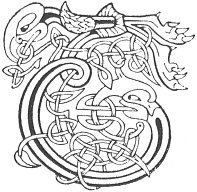

  
[Intangible Textual Heritage](../../../index) 
[Legends/Sagas](../../index)  [Celtic](../index)  [Carmina
Gadelica](../cg)  [Index](index)  [Previous](cg1101)  [Next](cg1103) 

------------------------------------------------------------------------

[Buy this Book at
Amazon.com](https://www.amazon.com/exec/obidos/ASIN/B0027P88YQ/internetsacredte)

------------------------------------------------------------------------

  
*Carmina Gadelica, Volume 1*, by Alexander Carmicheal, \[1900\], at
Intangible Textual Heritage

------------------------------------------------------------------------

<table data-border="0">
<colgroup>
<col style="width: 50%" />
<col style="width: 50%" />
</colgroup>
<tbody>
<tr class="odd">
<td data-valign="top" width="327">
p. 258
</td>
<td data-valign="top" width="327">
p. 259
</td>
</tr>
<tr class="even">
<td data-valign="top" width="327"><h3 id="cronan-bleoghain-93" data-align="center">CRONAN BLEOGHAIN [93]</h3></td>
<td data-valign="top" width="327"><h3 id="milking-croon" data-align="center">MILKING CROON</h3></td>
</tr>
</tbody>
</table>

 

THE milking songs of the people are numerous and
varied. They are sung to pretty airs, to please the cows and to induce
them to give their milk, The cows become accustomed to these lilts and
will not give their milk without them, nor, occasionally, without their
favourite airs being sung to them. This fondness of Highland cows for
music induces owners of large herds to secure milkmaids possessed of
good voices and some 'go.' It is interesting and animating to see three
or four comely girls among a fold of sixty, eighty, or a hundred
picturesque Highland cows on meadow or mountain slope. The moaning and
heaving of the p. 259 sea afar, the swish of
the wave on the shore, the carolling of the lark in the sky, the
unbroken song of the mavis on the rock, the broken melody of the merle
in the brake, the lowing of the kine without, the response of the calves
within the fold, the singing of the milkmaids in unison with the
movement of their hands, and of the soft sound of the snowy milk falling
into the pail, the gilding of hill and dale, the glowing of the distant
ocean beyond, as the sun sinks into the sea of golden glory, constitute
a scene which the observer would not, if he could, forget.

 

<table data-border="0">
<colgroup>
<col style="width: 25%" />
<col style="width: 25%" />
<col style="width: 25%" />
<col style="width: 25%" />
</colgroup>
<tbody>
<tr class="odd">
<td data-valign="top">
 
</td>
<td data-valign="top">
p. 258
</td>
<td data-valign="top">
 
</td>
<td data-valign="top">
p. 259
</td>
</tr>
<tr class="even">
<td data-valign="top">
 
</td>
<td data-valign="top">
THIG, a Bhreannain, o’n a chuan, 
Thig, a Thorrainn, buadh nam fear, 
Thig, a Mhicheil, mhil a nuas 
’S dilinn domh-sa bua mo ghean. 
   Ho m’ aghan, ho m’ agh gaoil, 
   Ho m’ aghan, ho m’ agh gaoil, 
   M’ aghan gradhach, bo gach airidh, 
   Sgath an Ard Righ gabh ri d’ laogh.

Thig, a Chaluim chaoimh, o’n chro, 
Thig, a Bhride mhor nam buar, 
Thig, a Mhoire mhin, o’n neol, 
’S dilinn domh-sa bo mo luaidh. 
     Ho m’ aghan, ho m’ agh gaoil.

Thig am fearan o’n a choill, 
Thig an traill a druim nan stuagh, 
Thig an sionn cha ’n ann am foill, 
A chur aoibh air bo nam buadh. 
     Ho m’ aghan, ho m’ agh gaoil.
</td>
<td data-valign="top">
 
</td>
<td data-valign="top">
COME, Brendan, from the ocean, 
Come, Ternan, most potent of men, 
Come, Michael valiant, down 
And propitiate to me the cow of my joy. 
   Ho my heifer, ho heifer of my love, 
   Ho my heifer, ho heifer of my love. 
   My beloved heifer, choice cow of every spieling, 
   For the sake of the High King take to thy calf.

Come, beloved Colum of the fold, 
Come, great Bride of the flocks, 
Come, fair Mary from the cloud, 
And propitiate to me the cow of my love. 
     Ho my heifer, ho heifer of my love.

The stock-dove will come from the wood, 
The tusk will come from the wave, 
The fox will come but not with wiles, 
To hail my cow of virtues. 
     Ho my heifer, ho heifer of my love.
</td>
</tr>
</tbody>
</table>

 

------------------------------------------------------------------------

[Next: 94. Milking Croon. Cronan Bleoghain](cg1103)
