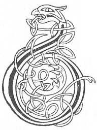

  
[Intangible Textual Heritage](../../../index.md) 
[Legends/Sagas](../../index)  [Celtic](../index.md)  [Carmina
Gadelica](../cg)  [Index](index)  [Previous](cg1103)  [Next](cg1105.md) 

------------------------------------------------------------------------

[Buy this Book at
Amazon.com](https://www.amazon.com/exec/obidos/ASIN/B0027P88YQ/internetsacredte.md)

------------------------------------------------------------------------

  
*Carmina Gadelica, Volume 1*, by Alexander Carmicheal, \[1900\], at
Intangible Textual Heritage

------------------------------------------------------------------------

 

<table data-border="0">
<colgroup>
<col style="width: 50%" />
<col style="width: 50%" />
</colgroup>
<tbody>
<tr class="odd">
<td data-valign="top" width="327">
p. 262
</td>
<td data-valign="top" width="327">
p. 263
</td>
</tr>
<tr class="even">
<td data-valign="top" width="327"><h3 id="beannachadh-bleoghain-95" data-align="center">BEANNACHADH BLEOGHAIN [95]</h3></td>
<td data-valign="top" width="327"><h3 id="milking-blessing" data-align="center">MILKING BLESSING</h3></td>
</tr>
</tbody>
</table>

 

<table data-border="0">
<colgroup>
<col style="width: 25%" />
<col style="width: 25%" />
<col style="width: 25%" />
<col style="width: 25%" />
</colgroup>
<tbody>
<tr class="odd">
<td data-valign="top">
 
</td>
<td data-valign="top">
p. 262
</td>
<td data-valign="top">
 
</td>
<td data-valign="top">
p. 263
</td>
</tr>
<tr class="even">
<td data-valign="top">
 
</td>
<td data-valign="top">
BHEIR Calum-cille dhi-se piseach, 
Bheir Coibhi cinneil dhi-se fiar, 
Bheir m’ aghan ballaidh dhomh-s’ am bainne 
’S a laogh bainionn air a bial. 
      Ho! m’ aghan, m’ aghan, m’ aghan, 
      Ho! m’ aghan, caon, ciuin, 
      M’ aghan caomh, caomh, gradhaidh, 
           Gur e gaol do mhathar thu.

Seall thu ’n druis ud thall a froineadh, 
’S an druis eil air loin nan smiar, 
Is ionann sin is m’ aghan goirridh, 
’S a laogh boirionn air a bial. 
     Ho! m’ aghan,--

Bheir Bride bhith nan cire geala, 
Li na h-eal am aghan gaoil, 
’S bheir Muire mhin nam mire meala, 
Dhi-se ceal nan cearca-fraoich, 
     Ho! m’ aghan,--
</td>
<td data-valign="top">
 
</td>
<td data-valign="top">
COLUMBA will give to her progeny, 
Coivi the propitious, will give to her grass, 
My speckled heifer will give me her milk, 
And her female calf before her. 
      Ho my heifer! heifer! heifer! 
      Ho my heifer! kindly, calm, 
      My heifer gentle, gentle, beloved, 
           Thou art the love of thy mother.

Seest yonder thriving bramble bush 
And the other bush glossy with brambles, 
Such like is my fox-coloured heifer, 
And her female calf before her. 
              Ho my heifer!--

The calm Bride of the white combs 
Will give to my loved heifer the lustre of the swan, 
While the loving Mary, of the combs of honey. 
Will give to her the mottle of the heather hen. 
              Ho my heifer!--
</td>
</tr>
</tbody>
</table>

 

------------------------------------------------------------------------

[Next: 96. Ho Hoiligean, Ho My Heifers. Ho Hoiligean, Ho M’
Aighean](cg1105.md)
