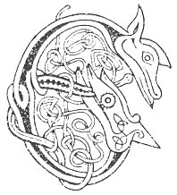

  
[Intangible Textual Heritage](../../../index.md) 
[Legends/Sagas](../../index)  [Celtic](../index.md)  [Carmina
Gadelica](../cg)  [Index](index)  [Previous](cg1104)  [Next](cg1106.md) 

------------------------------------------------------------------------

[Buy this Book at
Amazon.com](https://www.amazon.com/exec/obidos/ASIN/B0027P88YQ/internetsacredte.md)

------------------------------------------------------------------------

  
*Carmina Gadelica, Volume 1*, by Alexander Carmicheal, \[1900\], at
Intangible Textual Heritage

------------------------------------------------------------------------

 

<table data-border="0">
<colgroup>
<col style="width: 50%" />
<col style="width: 50%" />
</colgroup>
<tbody>
<tr class="odd">
<td data-valign="top" width="327">
p. 264
</td>
<td data-valign="top" width="327">
p. 265
</td>
</tr>
<tr class="even">
<td data-valign="top" width="327"><h3 id="ho-hoiligean-ho-m-aighean-96" data-align="center">HO HOILIGEAN, HO M’ AIGHEAN [96]</h3></td>
<td data-valign="top" width="327"><h3 id="ho-hoiligean-ho-my-heifers" data-align="center">HO HOILIGEAN, HO MY HEIFERS</h3></td>
</tr>
</tbody>
</table>

 

<table data-border="0">
<colgroup>
<col style="width: 25%" />
<col style="width: 25%" />
<col style="width: 25%" />
<col style="width: 25%" />
</colgroup>
<tbody>
<tr class="odd">
<td data-valign="top">
 
</td>
<td data-valign="top">
p. 264
</td>
<td data-valign="top">
 
</td>
<td data-valign="top">
p. 265
</td>
</tr>
<tr class="even">
<td data-valign="top">
 
</td>
<td data-valign="top">
EUDAIL thu ’s thu dh’an chrodh mhara, 
Chra chluasach, bheum chluasach, bheannach; 
Chrathadh fual air cruach do sheanar, 
’S cha tar thu uam-s’ a Luan no Sha’urn. 
      Ho hoiligean, ho m’ aighean! 
      Ho hoiligean, ho m’ aighean! 
      Ho hoiligean, ho m’ aighean! 
      Mo lochruidh chaomh gach taobh an abhuinn.

Eudail thu ’s thu chrodh na tire. 
Bheir thu marrum, bheir thu mis dhomh; 
Bheir thu bainne barr na ciob dhomh, 
’S cha b’ e glaisle ghlas an t-siobain. 
      Ho hoiligean, ho m’ aighean!

Eudail thu ’s thu chrodh an t-saoghail, 
Bheir thu bainne barr an fhraoich dhomh; 
Cha bhainne glas air bhlas a chaorain, 
Ach bainne meal ’s e air gheal na faoileig. 
      Ho hoiligean, ho m’ aighean!

Bheir Bride bhinn dhut linn is ograidh, 
Bheir Moire mhin dhut li dha d’ chomhdach, 
Bheir Michael liobha dhut ri dha d’ sheoladh, 
’S bheir Iosda Criosda dhut sith is solas. 
      Ho hoiligean, ho m’ aighean!
</td>
<td data-valign="top">
 
</td>
<td data-valign="top">
MY treasure thou, and thou art of the sea kine, 
Red eared, notch eared, high horned; 
Urine was sprinkled on the rump of thy grandsire, 
And thou shalt not win from me on Monday nor Saturday. 
      Ho hoiligean, ho my heifers! 
      Ho hoiligean, ho my heifers! 
      Ho hoiligean, ho my heifers! 
      My kindly kine on each side of the stream.

My treasure thou, and thou art of the land trine, 
Thou wilt give me milk produce, thou wilt give me dainty; 
Thou wilt give me milk from the top of the club-moss, 
And not the grey water of the sand-drift. 
      Ho hoiligean, ho my heifers!

My treasure thou, and thou art of the world's kine, 
Thou wilt give me milk from the heather tops; 
Not grey milk of the taste of the rowan berries,. 
But honey milk and white as the sea-gull. 
      Ho hoiligean, ho my heifers!

The melodious Bride will give thee offspring and young, 
The lovely Mary will give thee colour to cover thee, 
The lustrous Michael will give thee a star to guide thee, 
And Christ Jesu will give thee peace and joy. 
      Ho hoiligean, ho my heifers!
</td>
</tr>
</tbody>
</table>

 

------------------------------------------------------------------------

[Next: 97. Ho, My Heifer! Ho M’ Aghan!](cg1106.md)
