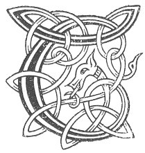

  
[Intangible Textual Heritage](../../../index.md) 
[Legends/Sagas](../../index)  [Celtic](../index.md)  [Carmina
Gadelica](../cg)  [Index](index)  [Previous](cg1106)  [Next](cg1108.md) 

------------------------------------------------------------------------

[Buy this Book at
Amazon.com](https://www.amazon.com/exec/obidos/ASIN/B0027P88YQ/internetsacredte.md)

------------------------------------------------------------------------

  
*Carmina Gadelica, Volume 1*, by Alexander Carmicheal, \[1900\], at
Intangible Textual Heritage

------------------------------------------------------------------------

 

<table data-border="0">
<colgroup>
<col style="width: 50%" />
<col style="width: 50%" />
</colgroup>
<tbody>
<tr class="odd">
<td data-valign="top" width="327">
p. 268
</td>
<td data-valign="top" width="327">
p. 269
</td>
</tr>
<tr class="even">
<td data-valign="top" width="327"><h3 id="thoir-am-bainne-98" data-align="center">THOIR AM BAINNE [98]</h3></td>
<td data-valign="top" width="327"><h3 id="give-thy-milk" data-align="center">GIVE THY MILK</h3></td>
</tr>
</tbody>
</table>

 

<table data-border="0">
<colgroup>
<col style="width: 25%" />
<col style="width: 25%" />
<col style="width: 25%" />
<col style="width: 25%" />
</colgroup>
<tbody>
<tr class="odd">
<td data-valign="top">
 
</td>
<td data-valign="top">
p. 268
</td>
<td data-valign="top">
 
</td>
<td data-valign="top">
p. 269
</td>
</tr>
<tr class="even">
<td data-valign="top">
 
</td>
<td data-valign="top">
THOIR am bainne, bho dhonn, 
Ce ’n conn ma ’n ceillinn? 
Laogh na ba ud braigh na beinge, 
’S laogh mo ghraidh-sa air graisich eile. 
     O! ho! graisich eile.

     Thoir am bainne, bho dhonn, 
     Moir am bainne, bho dhonn, 
     Thoir am bainne, bho dhonn, 
          Trom steilleach.

Ach gheobh mo ghaol-sa laoighean cais-fhionn, 
Is buarach caon a theid caomh ma casan; 
Cha bhuarach gaoisid, fraoich, no asgairt, 
Ach buarach dhaor a bheir daoin a Sasgunn. 
     O! ho! a Sasgunn.

’S gheobh mo righinn-sa finn na maise 
Buarach min a theid sliom ma casan; 
Cha bhuarach cioba, lioin, no asgairt, 
Ach buarach shiod thig a nios a Sasgunn. 
     O! ho! a Sasgunn.

’S gheobh mo chiall-sa fiar is fasga, 
’S gheobh i aonach, fraoch, is machair, 
’S gheobh i mislean, ciob, is fasbhuain, 
’S gheobh i am fion thig ’o shian nan cas-bheann. 
     O! ho! nan cas-bheann.
</td>
<td data-valign="top">
 
</td>
<td data-valign="top">
GIVE thy milk, brown cow, 
For what reason should I conceal? 
The [skin of the] calf of yonder cow on the partition, 
While the calf of my love is on another grange. 
     Oh! ho! another grange.

     Give thy milk, brown cow, 
     Give thy milk, brown cow, 
     Give thy milk, brown cow, 
          Heavily flowing.

My beloved shall get white-bellied calves, 
And a fetter fine that shall go kindly round her legs; 
No fetter of hair, nor of heather, nor of lint refuse, 
But a dear fetter that men bring from Saxon land. 
     Oh! ho! from Saxon land.

And my queen maiden of beauty shall get 
A fetter smooth to go softly round her legs; 
No fetter of cord, nor of lint, nor lint refuse, 
But a fetter of silk up from Saxon land. 
     Oh! ho! from Saxon land.

My beloved shall get grass and shelter, 
She shall get hill, heath, and plain, 
She shall get meadow-grass, club-rush, and stubble, 
And she shall get the wine that comes from the elements of the steep bens. 
     Oh! ho! the steep bens.
</td>
</tr>
</tbody>
</table>

 

------------------------------------------------------------------------

[Next: 99. Milking Song. Cronan Bleoghan](cg1108.md)
