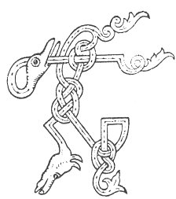

  
[Intangible Textual Heritage](../../../index.md) 
[Legends/Sagas](../../index)  [Celtic](../index.md)  [Carmina
Gadelica](../cg)  [Index](index)  [Previous](cg1107)  [Next](cg1109.md) 

------------------------------------------------------------------------

[Buy this Book at
Amazon.com](https://www.amazon.com/exec/obidos/ASIN/B0027P88YQ/internetsacredte.md)

------------------------------------------------------------------------

  
*Carmina Gadelica, Volume 1*, by Alexander Carmicheal, \[1900\], at
Intangible Textual Heritage

------------------------------------------------------------------------

 

<table data-border="0">
<colgroup>
<col style="width: 50%" />
<col style="width: 50%" />
</colgroup>
<tbody>
<tr class="odd">
<td data-valign="top" width="327">
p. 270
</td>
<td data-valign="top" width="327">
p. 271
</td>
</tr>
<tr class="even">
<td data-valign="top" width="327"><h3 id="cronan-bleoghan-99" data-align="center">CRONAN BLEOGHAN [99]</h3></td>
<td data-valign="top" width="327"><h3 id="milking-song" data-align="center">MILKING SONG</h3></td>
</tr>
</tbody>
</table>

 

<table data-border="0">
<colgroup>
<col style="width: 25%" />
<col style="width: 25%" />
<col style="width: 25%" />
<col style="width: 25%" />
</colgroup>
<tbody>
<tr class="odd">
<td data-valign="top">
 
</td>
<td data-valign="top">
p. 270
</td>
<td data-valign="top">
 
</td>
<td data-valign="top">
p. 271
</td>
</tr>
<tr class="even">
<td data-valign="top">
 
</td>
<td data-valign="top">
THIG, a Mhuire, ’s bligh a bho, 
Thig, a Bhride, ’s comraig i, 
  Thig, a Chaluim-chille chaoimh, 
    ’S iadh do dha laimh mu m’ bhoin. 
      Ho m’ aghan, ho m’ agh gaoil, 
      Ho m’ aghan, ho m’ agh gaoil, 
      Ho m’ aghan, ho m’ agh gaoil, 
      M’ aghan cri, coir, gradhach, 
        An sgath an Ard Righ gabh ri d’ laogh.

Thig, a Mhuire, dh’ fhios mo bho, 
Thig, a Bhride mhor na loin, 
Thig, a bhanachaig Iosda Criosda, 
  ’S cur do lamh a nios fo m’ bhoin. 
    Ho m’ aghan, ho m’ agh gaoil.

Bo lurach dhubh, bo na h-airidh, 
Bo a bha-theach, mathair laogh, 
Luban siomain air crodh na tire, 
  Buarach shiod air m’ aighean gaoil. 
    Ho m’ aghan, ho m’ agh gaoil.

Mo bho dhubh, mo bho dhubh, 
Is ionann galar dhomh-s’ is dhuit, 
Thus a caoidh do luran laoigh, 
  Mise mo mhac gaoil fo ’n mhuir, 
    M’aon mhac gaoil fo ’n mhuir.
</td>
<td data-valign="top">
 
</td>
<td data-valign="top">
COME, Mary, and milk my cow, 
Come, Bride, and encompass her, 
Come, Columba the benign, 
  And twine thine arms around my. cow. 
    Ho my heifer, ho my gentle heifer, 
    Ho my heifer, ho my gentle heifer, 
    Ho my heifer, ho my gentle heifer, 
    My heifer dear, generous and kind, 
      For the sake of the High King take to thy calf.

Come, Mary Virgin, to my cow, 
Come, great Bride, the beauteous, 
Come, thou milkmaid of Jesus Christ, 
  And place thine arms beneath my cow. 
    Ho my heifer, ho my gentle heifer.

Lovely black cow, pride of the <a href="errata.htm#3">sheiling</a>, 
First cow of the byre, choice mother of calves, 
Wisps of straw round the cows of the townland, 
  A shackle of silk on my heifer beloved. 
    Ho my heifer, ho my gentle heifer.

My black cow, my black cow, 
A like sorrow afflicts me and thee, 
Thou grieving for thy lovely calf, 
  I for my beloved son under the sea, 
    My beloved only son under the sea.
</td>
</tr>
</tbody>
</table>

 

------------------------------------------------------------------------

[Next: 100. Herding Blessing. Beannachadh Buachailleachd](cg1109.md)
