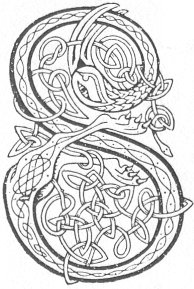

  
[Intangible Textual Heritage](../../../index) 
[Legends/Sagas](../../index)  [Celtic](../index)  [Carmina
Gadelica](../cg)  [Index](index)  [Previous](cg1110)  [Next](cg1112) 

------------------------------------------------------------------------

[Buy this Book at
Amazon.com](https://www.amazon.com/exec/obidos/ASIN/B0027P88YQ/internetsacredte)

------------------------------------------------------------------------

  
*Carmina Gadelica, Volume 1*, by Alexander Carmicheal, \[1900\], at
Intangible Textual Heritage

------------------------------------------------------------------------

<table data-border="0">
<colgroup>
<col style="width: 50%" />
<col style="width: 50%" />
</colgroup>
<tbody>
<tr class="odd">
<td data-valign="top" width="327">
p. 276
</td>
<td data-valign="top" width="327">
p. 277
</td>
</tr>
<tr class="even">
<td data-valign="top" width="327"><h3 id="beannachadh-buachailleachd-102" data-align="center">BEANNACHADH BUACHAILLEACHD [102]</h3></td>
<td data-valign="top" width="327"><h3 id="herding-blessing" data-align="center">HERDING BLESSING</h3></td>
</tr>
</tbody>
</table>

 

<table data-border="0">
<colgroup>
<col style="width: 25%" />
<col style="width: 25%" />
<col style="width: 25%" />
<col style="width: 25%" />
</colgroup>
<tbody>
<tr class="odd">
<td data-valign="top">
 
</td>
<td data-valign="top">
p. 276
</td>
<td data-valign="top">
 
</td>
<td data-valign="top">
p. 277
</td>
</tr>
<tr class="even">
<td data-valign="top">
 
</td>
<td data-valign="top">
SIUBHAL beinne, siubhal baile, 
Siubhal featha fada, farsuinn, 
Buachailleachd Mhic De mu’r casaibh, 
Buan is reidh gun teid sibh dachaidh, 
   Buachailleachd Mhic De mu’r casaibh, 
   Buan is reidh gun teid sibh dachaidh.

Comraig Charmaig is Chaluim-chille 
Bhith d’ ar tearmad a falbh ’s a tilleadh, 
Agus banachaig nam basa mine, 
Bride nan or chiabh donn, 
   Agus banachaig nam basa mine, 
   Bride nan or chiabh donn.
</td>
<td data-valign="top">
 
</td>
<td data-valign="top">
TRAVELLING moorland, travelling townland, 
Travelling mossland long and wide, 
Be the herding of God the Son about your feet, 
Safe and whole may ye home return, 
   Be the herding of God the Son about your feet, 
   Safe and whole may ye home return.

The sanctuary of Carmac and of Columba 
Be protecting you going and coining, 
And of the milkmaid of the soft palms, 
Bride of the clustering hair golden brown, 
   And of the milkmaid of the soft palms, 
   Bride of the clustering hair golden brown.
</td>
</tr>
</tbody>
</table>

 

------------------------------------------------------------------------

[Next: 103. The Protection of the Cattle. Comraig Nam Ba.](cg1112)
