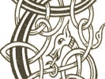
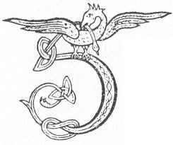

  
[Intangible Textual Heritage](../../../index.md) 
[Legends/Sagas](../../index)  [Celtic](../index.md)  [Carmina
Gadelica](../cg)  [Index](index)  [Previous](cg1112)  [Next](cg1114.md) 

------------------------------------------------------------------------

[Buy this Book at
Amazon.com](https://www.amazon.com/exec/obidos/ASIN/B0027P88YQ/internetsacredte.md)

------------------------------------------------------------------------

  
*Carmina Gadelica, Volume 1*, by Alexander Carmicheal, \[1900\], at
Intangible Textual Heritage

------------------------------------------------------------------------

 

<table data-border="0">
<colgroup>
<col style="width: 50%" />
<col style="width: 50%" />
</colgroup>
<tbody>
<tr class="odd">
<td data-valign="top" width="327">
p. 280
</td>
<td data-valign="top" width="327">
p. 281
</td>
</tr>
<tr class="even">
<td data-valign="top" width="327"><h3 id="gleidheadh-treuid-104" data-align="center">GLEIDHEADH TREUID [104]</h3></td>
<td data-valign="top" width="327"><h3 id="guarding-the-flocks" data-align="center">GUARDING THE FLOCKS</h3></td>
</tr>
</tbody>
</table>

 

<table data-border="0">
<colgroup>
<col style="width: 25%" />
<col style="width: 25%" />
<col style="width: 25%" />
<col style="width: 25%" />
</colgroup>
<tbody>
<tr class="odd">
<td data-valign="top">
 
</td>
<td data-valign="top">
p. 280
</td>
<td data-valign="top">
 
</td>
<td data-valign="top">
p. 281
</td>
</tr>
<tr class="even">
<td data-valign="top">
 
</td>
<td data-valign="top">
GUN gleidheadh Moire min an ciob, 
Gun gleidheadh Bride bith an ciob, 
Gun gleidheadh Calum-cille an ciob, 
Gun gleidheadh Maol-ribhe an ciob, 
Gun gleidheadh Carmag an ciob, 
O'n mhi-chu ’s o’n mharhh-chu.

Gun gleidheadh Odhran an crodh, 
Gun gleidheadh Maodhan an crodh, 
Gun gleidheadh Donnan an crodh, 
Gun gleidheadh Moluag an crodh, 
Gun gleidheadh Maolruan an crodh, 
Am boglach ’s an crualach.

Gun gleidheadh Spiorad foir an treud, 
Gun gleidheadh Mac Moir Oigh an treud, 
Gun gleidheadh Ti na gloir an treud, 
Gun gleidheadh an Teoir an treud, 
Bho reubain ’s bho mhearchall, 
    Bho reubain ’s bho mhearchall.
</td>
<td data-valign="top">
 
</td>
<td data-valign="top">
MAY Mary the mild keep the sheep, 
May Bride the calm keep the sheep, 
May Columba keep the sheep, 
May Maolruba keep the sheep, 
May Carmac keep the sheep, 
From the fox and the wolf.

May Oran keep the kine, 
May Modan keep the kine, 
May Dorman keep the kine, 
May Moluag keep the kine, 
May Maolruan keep the kine, 
On soft land and hard land.

May the Spirit of peace preserve the flocks, 
May the Son of Mary Virgin preserve the flocks, 
May the God of glory preserve the flocks, 
May the Three preserve the flocks, 
From wounding and from death-loss, 
    From wounding and from death-loss.
</td>
</tr>
</tbody>
</table>

 

------------------------------------------------------------------------

[Next: 105. A Herding Croon. Cronan Cuallaich](cg1114.md)
