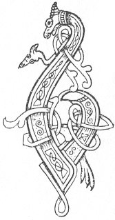

  
[Intangible Textual Heritage](../../../index.md) 
[Legends/Sagas](../../index)  [Celtic](../index.md)  [Carmina
Gadelica](../cg)  [Index](index)  [Previous](cg1115)  [Next](cg1117.md) 

------------------------------------------------------------------------

[Buy this Book at
Amazon.com](https://www.amazon.com/exec/obidos/ASIN/B0027P88YQ/internetsacredte.md)

------------------------------------------------------------------------

  
*Carmina Gadelica, Volume 1*, by Alexander Carmicheal, \[1900\], at
Intangible Textual Heritage

------------------------------------------------------------------------

 

<table data-border="0">
<colgroup>
<col style="width: 50%" />
<col style="width: 50%" />
</colgroup>
<tbody>
<tr class="odd">
<td data-valign="top" width="327">
p. 288
</td>
<td data-valign="top" width="327">
p. 289
</td>
</tr>
<tr class="even">
<td data-valign="top" width="327"><h3 id="comharrachadh-nan-uan-107" data-align="center">COMHARRACHADH NAN UAN [107]</h3></td>
<td data-valign="top" width="327"><h3 id="marking-the-lambs" data-align="center">MARKING THE LAMBS</h3></td>
</tr>
</tbody>
</table>

 

THE marking of the lambs is done on Thursday, being St Columba's Day.
Upon no account would the people mark their lambs on Friday, or in any
manner draw blood on that day. Nor till lately would they use iron in
any form on Friday.

A blacksmith in Benbecula, a Protestant, an excellent man and an
admirable tradesman, never opened his smithy on Friday. He maintained
that 'that was the least he could do to honour his Master.'

When the lambs are marked, the people collect the bits taken out of
their ears, and carefully bury them beyond the reach of beast or bird.
They say that a plant, which they call 'gearradh-chluasach,' literally
ear-cuts, ear-clips, grows from them. This plant is generally found
growing where a carcase has been buried, and when ripe, it is cut, tied
up in a bunch, and suspended from the 'casan ceanghail,' couple above
the door of the lamb-cot, and dedicated to

 

<table data-border="0">
<colgroup>
<col style="width: 33%" />
<col style="width: 33%" />
<col style="width: 33%" />
</colgroup>
<tbody>
<tr class="odd">
<td data-valign="top">
'Moire mhin-gheal nan grasa buan, 
Air shealbh chaorach air ghaol uan.'
</td>
<td data-valign="top">
 
</td>
<td data-valign="top">
The fair-white Mary of lasting graces, 
For luck of sheep and love of lambs.
</td>
</tr>
</tbody>
</table>

 

The marks made on the ears of sheep and lambs are varied and descriptive
in name, as:--'barr,' 'beum,' 'cluigean,' 'cliopan,' p. 289 'cliopadh,' 'crocan,' 'corran,' 'duile,'
'meaghlan,' 'meangan,' 'sgolta,' 'slios,' 'snathad,' 'sulag,' 'toll.'
These marks and their modifications are said to number over 250 in the
island of Benbecula, in the island of North Uist over 480, and in the
island of South Uist over 500. The people know all these marks and
modifications at a glance.

When a man marries, it is considered a good omen of the union when the
marks on his own sheep and those on the sheep brought him by his wife
are nearly alike, and the necessary change easily effected.

 

<table data-border="0">
<colgroup>
<col style="width: 33%" />
<col style="width: 33%" />
<col style="width: 33%" />
</colgroup>
<tbody>
<tr class="odd">
<td data-valign="top">'IARRATAS NA CAOIRE BIGE.

Na lom mo cheann, 
’S na loisg mo chnamhan.'
</td>
<td data-valign="top">
 
</td>
<td data-valign="top">THE REQUEST OF THE LITTLE SHEEP.

Do not clip my head, 
And do not burn my bones.
</td>
</tr>
</tbody>
</table>

 

The small native sheep have a long tuft of wool
called 'sguman' coming down the face. They are hardy, picturesque little
animals, almost wholly free from the innumerable diseases which the
larger but softer breeds of sheep have brought in their train. The sheep
is regarded with a veneration which is not extended to the cow or other
animals.

 

<table data-border="0">
<colgroup>
<col style="width: 25%" />
<col style="width: 25%" />
<col style="width: 25%" />
<col style="width: 25%" />
</colgroup>
<tbody>
<tr class="odd">
<td data-valign="top">
 
</td>
<td data-valign="top">
p. 288
</td>
<td data-valign="top">
 
</td>
<td data-valign="top">
p. 289
</td>
</tr>
<tr class="even">
<td data-valign="top">
 
</td>
<td data-valign="top">
BIDH mo sgian ur, geur, glan, gun mheirg, 
Mo bhreacan fo m’ ghlun le mo luirich dheirg, 
Cuiream deiseil mo chleibh an ceud bheum gu sealbh, 
An ath fhear na dheigh leis a ghrein mar ni falbh.

Uan firionn gun ghaoid, air aon dath, gun chearb, 
Leig a mach ris an raon, fhuil chraobhach na tearb, 
Ma mhaireas a chraobh air an fhraoch le barr dearg, 
Bith mo shealbhan gun ghaoid fad ’s nach caochail mi ’n t-ainm.

An Triuir ta shuas an Cathair nam buadh, 
Bhi buachailleachd mo threuid is mo bhuair, 
’G an iomachair ri teas, ri gaillinn ’s ri fuachd, 
Le beannachd nam buadh ’g an saodadh a nuas 
Bho ’n tulaich ud shuas gu airidh.
</td>
<td data-valign="top">
 
</td>
<td data-valign="top">
MY knife will be new, keen, clean, without stain, 
My plaid beneath my knee with my red robe, 
I will put sunwise round my breast the first cut for luck, 
The next one after that with the sun as it moves.

A male lamb without blemish, of one colour, without defect, 
Allow thou out on the plain, nor his flowing blood check, 
If the froth remains on the heather with red top, 
My flock will be without flaw as long as I change not the name.

The Three who are above in the City of glory, 
Be shepherding my flock and my kine, 
Tending them duly in heat, in storm, and in cold, 
With the blessing of power driving them down 
From yonder height to the sheiling fold.
</td>
</tr>
<tr class="odd">
<td data-valign="top">
 
</td>
<td data-valign="top">
p. 290
</td>
<td data-valign="top">
 
</td>
<td data-valign="top">
p. 291
</td>
</tr>
<tr class="even">
<td data-valign="top">
 
</td>
<td data-valign="top">
Ainm Airil is ailne snuadh, 
Ainm Ghabril fadh an Uain, 
Ainm Raphael flath nam buadh, 
’G an cuartach is ’g an tearnadh.

Ainm Mhuiril is Mhuire Oigh, 
Ainm Pheadail agus Phoil, 
Ainm Sheumais agus Eoin, 
Gach aingheal ’s ostal air an toir, 
’G an gleidheadh beo le ’n alach, 
    ’G an gleidheadh beo le ’n alach.
</td>
<td data-valign="top">
 
</td>
<td data-valign="top">
The name of Ariel of beauteous bloom, 
The name of Gabriel herald of the Lamb, 
The name of Raphael prince of power, 
Surrounding them and saving them.

The name of Muriel and of Mary Virgin, 
The name of Peter and of Paul, 
The name of James and of John, 
Each angel and apostle on their track, 
Keeping them alive and their progeny, 
    Keeping them alive and their progeny.
</td>
</tr>
</tbody>
</table>

 

 

------------------------------------------------------------------------

[Next: 108. The Clipping Blessing. Am Beannachd Lombaidh](cg1117.md)
