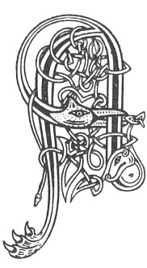

  
[Intangible Textual Heritage](../../../index) 
[Legends/Sagas](../../index)  [Celtic](../index)  [Carmina
Gadelica](../cg)  [Index](index)  [Previous](cg1119)  [Next](cg1121) 

------------------------------------------------------------------------

[Buy this Book at
Amazon.com](https://www.amazon.com/exec/obidos/ASIN/B0027P88YQ/internetsacredte)

------------------------------------------------------------------------

  
*Carmina Gadelica, Volume 1*, by Alexander Carmicheal, \[1900\], at
Intangible Textual Heritage

------------------------------------------------------------------------

 

<table data-border="0">
<colgroup>
<col style="width: 50%" />
<col style="width: 50%" />
</colgroup>
<tbody>
<tr class="odd">
<td data-valign="top" width="327">
p. 302
</td>
<td data-valign="top" width="327">
p. 303
</td>
</tr>
<tr class="even">
<td data-valign="top" width="327"><h3 id="suidheachadh-na-h-iomairt-111" data-align="center">SUIDHEACHADH NA H-IOMAIRT [111]</h3></td>
<td data-valign="top" width="327"><h3 id="setting-the-iomairt" data-align="center">SETTING THE IOMAIRT</h3></td>
</tr>
</tbody>
</table>

 

'IMIRT,' 'iomairt,' 'iumairt,' 'umairt' is cloth striped lengthwise, not
crosswise. While the warp of the 'iomairt' is composed of stripes of
various colours, the weft is confined to one--generally light blue, dark
blue, or black. This cloth was confined to women's use, in the
'earasaid,' the 'tonnag,' the 'guaileachan,' and the petticoat. Setting
the 'iomairt,' like setting p. 303 other
warp, and setting the eggs, and many other operations of the people, was
done on Thursday, that being the day of St Columba. Framing the web is a
work of much anxiety to the housewife, and she and her maidens are up
very early to put the thread in order.

The thread of the 'iomairt,' like that of the tartan, was very fine,
hard-spun and double twisted, rendering the cloth extremely durable.

 

<table data-border="0">
<colgroup>
<col style="width: 25%" />
<col style="width: 25%" />
<col style="width: 25%" />
<col style="width: 25%" />
</colgroup>
<tbody>
<tr class="odd">
<td data-valign="top">
 
</td>
<td data-valign="top">
p. 302
</td>
<td data-valign="top">
 
</td>
<td data-valign="top">
p. 303
</td>
</tr>
<tr class="even">
<td data-valign="top">
 
</td>
<td data-valign="top">
AN dubh mu’n gheal, 
An geal mu’n dubh, 
An t-uain am meadhon an deirg, 
An dearg am meadhon an duibh,

A n dubh am meadhon an deirg, 
An dearg am meadhon a ghil, 
An geal am meadhon an uaine, 
An t-uaine am meadhon a ghil.

An geal am meadhon a ghuirm, 
An gorm am meadhon na sgarlaid, 
    *       *       *       * 
    *       *       *       *

An sgarlaid ris a ghorm, 
An gorm ris an sgarlaid, 
An sgarlaid ris an dubh, 
An dubh ris an sgarlaid.

Snathla ri da shnathla 
Do dha dhath, 
Da shnathla dhubh, 
Ri aon snathla geal.

Seachd snathla ri coig, 
Coig ri tri, 
Tri ri dha, 
Dha ri aon, 
Anns gach oir.
</td>
<td data-valign="top">
 
</td>
<td data-valign="top">
THE black by the white, 
The white by the black, 
The green in the middle of the red, 
The red in the middle of the black.

The black in the middle of the red, 
The red in the middle of the white, 
The white in the middle of the green, 
The green in the middle of the white.

The white in the middle of the blue, 
The blue in the middle of the scarlet, 
    *       *       *       * 
    *       *       *       *

The scarlet to the blue, 
The blue to the scarlet, 
The scarlet to the black, 
The black to the scarlet.

A thread to two threads 
Of two colours, 
Two threads of black 
To one thread of white.

Seven threads to five, 
Five to three, 
Three to two, 
Two to one, 
In each border.
</td>
</tr>
</tbody>
</table>

 

------------------------------------------------------------------------

[Next: 112. Loom Blessing. Beannachadh Garmain](cg1121)
