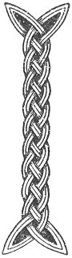

  
[Intangible Textual Heritage](../../../index.md) 
[Legends/Sagas](../../index)  [Celtic](../index.md)  [Carmina
Gadelica](../cg)  [Index](index)  [Previous](cg1122)  [Next](cg1124.md) 

------------------------------------------------------------------------

[Buy this Book at
Amazon.com](https://www.amazon.com/exec/obidos/ASIN/B0027P88YQ/internetsacredte.md)

------------------------------------------------------------------------

  
*Carmina Gadelica, Volume 1*, by Alexander Carmicheal, \[1900\], at
Intangible Textual Heritage

------------------------------------------------------------------------

 

<table data-border="0">
<colgroup>
<col style="width: 50%" />
<col style="width: 50%" />
</colgroup>
<tbody>
<tr class="odd">
<td data-valign="top" width="327">
p. 308
</td>
<td data-valign="top" width="327">
p. 309
</td>
</tr>
<tr class="even">
<td data-valign="top" width="327"><h3 id="coisrigeadh-an-aodaich" data-align="center">COISRIGEADH AN AODAICH</h3></td>
<td data-valign="top" width="327"><h3 id="the-consecration-of-the-cloth" data-align="center">THE CONSECRATION OF THE CLOTH</h3></td>
</tr>
</tbody>
</table>

 

<table data-border="0">
<colgroup>
<col style="width: 25%" />
<col style="width: 25%" />
<col style="width: 25%" />
<col style="width: 25%" />
</colgroup>
<tbody>
<tr class="odd">
<td data-valign="top">
 
</td>
<td data-valign="top">
p. 308
</td>
<td data-valign="top">
 
</td>
<td data-valign="top">
p. 309
</td>
</tr>
<tr class="even">
<td data-valign="top">
 
</td>
<td data-valign="top">
IS math a ghabhas mi mo rann, 
A teurnadh le gleann; 
    Aon rann, 
    Da rann, 
    Tri rann, 
    Ceithir rann, 
    Coig rann, 
    Sia rann, 
    Seachd rann, 
    Seachd gu lath rann 
    Seachd gu lath rann.

Nar a gonar fear an eididh, 
Nar a reubar e gu brath, 
Cian theid e ’n cath no ’n comhrag, 
Sgiath chomarach an Domhnach da, 
Can theid e ’n cath no ’n comhrag, 
Sgiath chomarach an Domhnach da.

Chan ath-aodach seo, ’s chan fhaoigh e, 
’S cha chuid cleir no sagairt e.

Biolair uaine ga buain fo 
’S air a toir do mhnai gun fhiosd; 
Lurg an fheidh an ceann an sgadain, 
’S an caol chalp a bhradain bhric.
</td>
<td data-valign="top">
 
</td>
<td data-valign="top">
WELL can I say my rune, 
Descending with the glen; 
    One rune, 
    Two runes, 
    Three runes, 
    Four runes, 
    Five runes, 
    Six runes. 
    Seven runes, 
    Seven and a half runes, 
    Seven and a half runes.

May the man of this clothing never be wounded, 
May torn he never be; 
What time he goes into battle or combat, 
May the sanctuary shield of the Lord be his. 
What time he goes into battle or combat, 
May the sanctuary shield of the Lord be his.

This is not second clothing and it is not thigged, 
Nor is it the right of sacristan or of priest.

Cresses green culled beneath a stone, 
And given to a woman in secret. 
The shank of the deer in the head of the herring, 
And in the slender tail of the speckled salmon.
</td>
</tr>
</tbody>
</table>

 

------------------------------------------------------------------------

[Next: 114. Hunting Blessing. Beannachadh Seilg](cg1124.md)
