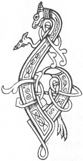

  
[Intangible Textual Heritage](../../../index.md) 
[Legends/Sagas](../../index)  [Celtic](../index.md)  [Carmina
Gadelica](../cg)  [Index](index)  [Previous](cg1123)  [Next](cg1125.md) 

------------------------------------------------------------------------

[Buy this Book at
Amazon.com](https://www.amazon.com/exec/obidos/ASIN/B0027P88YQ/internetsacredte.md)

------------------------------------------------------------------------

  
*Carmina Gadelica, Volume 1*, by Alexander Carmicheal, \[1900\], at
Intangible Textual Heritage

------------------------------------------------------------------------

 

<table data-border="0">
<colgroup>
<col style="width: 50%" />
<col style="width: 50%" />
</colgroup>
<tbody>
<tr class="odd">
<td data-valign="top" width="327">
p. 310
</td>
<td data-valign="top" width="327">
p. 311
</td>
</tr>
<tr class="even">
<td data-valign="top" width="327"><h3 id="beannachadh-seilg-114" data-align="center">BEANNACHADH SEILG [114]</h3></td>
<td data-valign="top" width="327"><h3 id="hunting-blessing" data-align="center">HUNTING BLESSING</h3></td>
</tr>
</tbody>
</table>

 

A YOUNG man was consecrated before he went out to
hunt. Oil was put on his head, a bow was placed in his hand, and he was
required to stand with bare feet on the bare grassless ground. The
dedication of the young hunter was akin to those of the 'maor,' the
judge, the chief, and the king, on installation. Many conditions were
imposed on the young man, which he was required to observe throughout
life. He was p. 311 not to take life
wantonly. He was not to kill a bird sitting, nor a beast lying down, and
he was not to kill the mother of a brood, nor the mother of a suckling.
Nor was he to kill an unfledged bird nor a suckling beast, unless it
might be the young of a bird, or of a beast, of prey. It was at all
times permissible and laudable to destroy certain clearly defined birds
and beasts of prey and evil reptiles, with their young.

 

<table data-border="0">
<colgroup>
<col style="width: 25%" />
<col style="width: 25%" />
<col style="width: 25%" />
<col style="width: 25%" />
</colgroup>
<tbody>
<tr class="odd">
<td data-valign="top">
 
</td>
<td data-valign="top">
p. 310
</td>
<td data-valign="top">
 
</td>
<td data-valign="top">
p. 311
</td>
</tr>
<tr class="even">
<td data-valign="top">
 
</td>
<td data-valign="top">
BHO m’ leasraidh ghineadh thu a mhic, 
Seolaim thu an t-iul tha ceart, 
An ainm naomh nan aon ostal deug, 
An ainm Mhic De chaidh a reubadh leat.

An ainm Sheumais, Pheadail, agus Phail, 
Eoin bhaistidh, is Eoin ostail tha shuas, 
Lucais leigh, agus Steafain a chraidh, 
Mhuiril mhin, is Mhoire mathair Uain.

An ainm Phadra naoimh nam feart, 
Agus Charmaig nan ceart ’s nan tuam, 
Chaluim chaoimh, ’s Adhamhnain nan reachd, 
Fhite bhith, is Bhride bhliochd is bhuar.

An ainm Mhicheil mil nan slogh, 
An ainm Airil og nan snuadh, 
An ainm Uiril nan ciabhan oir, 
Agus Ghabrail fadh Oigh nam buadh.

An trath a dhuineas to do shuil, 
Cha lub thu do ghlun ’s cha ghluais, 
Cha leon thu lach bhios air an t-snamh, 
Chaoidh cha chreach thu h-alach uaip.
</td>
<td data-valign="top">
 
</td>
<td data-valign="top">
FROM my loins begotten wert thou, my son, 
May I guide thee the way that is right, 
In the holy name of the apostles eleven 
In name of the Son of God torn of thee.

In name of James, and Peter, and Paul, 
John the baptist, and John the apostle above, 
Luke the physician, and Stephen the martyr, 
Muriel the fair, and Mary mother of the Lamb.

In name of Patrick holy of the deeds, 
And Carmac of the rights and tombs, 
Columba beloved, and Adamnan of laws, 
Fite calm, and Bride of the milk and kine.

In name of Michael chief of hosts, 
In name of Ariel youth of lovely hues, 
In name of Uriel of the golden locks, 
And Gabriel seer of the Virgin of grace.

The time thou shalt have closed thine eye, 
Thou shalt not bend thy knee nor move, 
Thou shalt not wound the duck that is swimming, 
Never shalt thou harry her of her young.
</td>
</tr>
<tr class="odd">
<td data-valign="top">
 
</td>
<td data-valign="top">
p. 312
</td>
<td data-valign="top">
 
</td>
<td data-valign="top">
p. 313
</td>
</tr>
<tr class="even">
<td data-valign="top">
 
</td>
<td data-valign="top">
Eala bhan a ghlugaid bhinn, 
Odhra sgaireach nan ciabh donn, 
Cha ghear thu it as an druim, 
Gu la-bhrath, air bharr nan tonn.

Air an ite bitheadh iad a ghnath 
Mu ’n cuir thu lamhaidh ri do chluais, 
Is bheir Moire mhin-gheal dhut dha gradh, 
Is bheir Bride aluinn dhut dha buar.

Chan ith thu farasg no blianach, 
No aon ian nach leag do lamh, 
Bi-sa taingeil leis an aon-fhear, 
Ge do robh a naodh air snamh.

Eala shith Bhride nan ni, 
Lacha shith Mhoire na sith.
</td>
<td data-valign="top">
 
</td>
<td data-valign="top">
The white swan of the sweet gurgle, 
The speckled dun of the brown tuft, 
Thou shalt not cut a feather from their backs, 
Till the doom-day, on the crest of the wave.

On the wing be they always 
Ere thou place missile to thine ear, 
And the fair Mary will give thee of her love, 
And the lovely Bride will give thee of her trine.

Thou shalt not eat fallen fish nor fallen flesh, 
Nor one bird that thy hand shall not bring down, 
Be thou thankful for the one, 
Though nine should be swimming.

The fairy swan of Bride of flocks, 
The fairy duck of Mary of peace.
</td>
</tr>
</tbody>
</table>

 

 

------------------------------------------------------------------------

[Next: 115. Consecrating The Chase. Coisrigeadh Na Seilg](cg1125.md)
