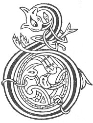

  
[Intangible Textual Heritage](../../../index) 
[Legends/Sagas](../../index)  [Celtic](../index)  [Carmina
Gadelica](../cg)  [Index](index)  [Previous](cg1125)  [Next](cg1127) 

------------------------------------------------------------------------

[Buy this Book at
Amazon.com](https://www.amazon.com/exec/obidos/ASIN/B0027P88YQ/internetsacredte)

------------------------------------------------------------------------

  
*Carmina Gadelica, Volume 1*, by Alexander Carmicheal, \[1900\], at
Intangible Textual Heritage

------------------------------------------------------------------------

 

<table data-border="0">
<colgroup>
<col style="width: 50%" />
<col style="width: 50%" />
</colgroup>
<tbody>
<tr class="odd">
<td data-valign="top" width="327">
p. 316
</td>
<td data-valign="top" width="327">
p. 317
</td>
</tr>
<tr class="even">
<td data-valign="top" width="327"><h3 id="ora-turais-116" data-align="center">ORA TURAIS [116]</h3></td>
<td data-valign="top" width="327"><h3 id="prayer-for-travelling" data-align="center">PRAYER FOR TRAVELLING</h3></td>
</tr>
</tbody>
</table>

 

THIS hymn was sung by a pilgrim in setting out on
his pilgrimage. The family and friends joined the traveller p. 317 in singing the hymn and starting the
journey, from which too frequently, for various causes, he never
returned.

 

<table data-border="0">
<colgroup>
<col style="width: 25%" />
<col style="width: 25%" />
<col style="width: 25%" />
<col style="width: 25%" />
</colgroup>
<tbody>
<tr class="odd">
<td data-valign="top">
 
</td>
<td data-valign="top">
p. 316
</td>
<td data-valign="top">
 
</td>
<td data-valign="top">
p. 317
</td>
</tr>
<tr class="even">
<td data-valign="top">
 
</td>
<td data-valign="top">
BITH a bhi na m’ bhial, 
Bladh a bhi na m’ chainn, 
Blath na siri na mo bhile, 
Gun an tig mi nail.

An gaol thug Iosa Criosda 
Bhi lionadh gach cridhe domh, 
An gaol thug Iosa Criosda 
Da m’ lionadh air an son.

Siubhal choire, siubhal choille, 
Siubhal fraoine fada, fas, 
Moire mhin-gheal sior dha m’ chobhair, 
Am Buachaill Iosa m’ dhion ’s a char. 
Moire mhin-gheal sior dha m’ chobhair, 
Am Buachaill Iosa m’ dhion ’s a chas.
</td>
<td data-valign="top">
 
</td>
<td data-valign="top">
LIFE be in my speech, 
Sense in what I say, 
The bloom of cherries on my lips, 
Till I come back again.

The love Christ Jesus gave 
Be filling every heart for me, 
The love Christ Jesus gave 
Filling me for every one.

Traversing corries, traversing forests, 
Traversing valleys long and wild. 
The fair white Mary still uphold me, 
The Shepherd Jesu be my shield, 
The fair white Mary still uphold me, 
The Shepherd Jesu be my shield.
</td>
</tr>
</tbody>
</table>

 

 

------------------------------------------------------------------------

[Next: 117. Fishing Blessing. Beannachd Iasgaich](cg1127)
