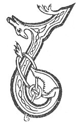

  
[Intangible Textual Heritage](../../../index.md) 
[Legends/Sagas](../../index)  [Celtic](../index.md)  [Carmina
Gadelica](../cg)  [Index](index)  [Previous](cg1126)  [Next](cg1128.md) 

------------------------------------------------------------------------

[Buy this Book at
Amazon.com](https://www.amazon.com/exec/obidos/ASIN/B0027P88YQ/internetsacredte.md)

------------------------------------------------------------------------

  
*Carmina Gadelica, Volume 1*, by Alexander Carmicheal, \[1900\], at
Intangible Textual Heritage

------------------------------------------------------------------------

 

<table data-border="0">
<colgroup>
<col style="width: 50%" />
<col style="width: 50%" />
</colgroup>
<tbody>
<tr class="odd">
<td data-valign="top" width="327">
p. 318
</td>
<td data-valign="top" width="327">
p. 319
</td>
</tr>
<tr class="even">
<td data-valign="top" width="327"><h3 id="beannachd-iasgaich-117" data-align="center">BEANNACHD IASGAICH [117]</h3></td>
<td data-valign="top" width="327"><h3 id="fishing-blessing" data-align="center">FISHING BLESSING</h3></td>
</tr>
</tbody>
</table>

 

ON Christmas Day the young men of the townland go out to fish. All the
fish they catch are sacred to the widows and the orphans and to the
poor, and are distributed among them according to their necessities.

There is a tradition among the people of the Western Isles that Christ
required Peter to row 707 strokes straight out from the shore when He
commanded him to go and procure the fish containing the tribute-money.
Following this tradition, the old men of Uist require the young men to
row 707 strokes from the land before casting their lines on Christmas
Day. And whatever fish they get are cordially given to the needy as a
tribute in the name of Christ, King of the sea, and of Peter, king of
fishermen. This is called 'dioladh deirc,' tribute-paying, 'deirce
Pheadair,' Peter's tribute, 'dioladh Pheadail,' Peter's payment, and
other terms. This tribute-paying on Christmas Day excites much emotional
interest, and all try to enhance the tribute and in various ways to
render the alms as substantial as possible.

The whiting and the haddock of the same size bear a strong resemblance
to one another. There are differences, however. The haddock has a black
spot on each side of its body above the pectoral fin, while the head of
the whiting is more elongated than that of the haddock. Children and
strangers are taught to differentiate between the two thus:--

 

<table data-border="0">
<colgroup>
<col style="width: 33%" />
<col style="width: 33%" />
<col style="width: 33%" />
</colgroup>
<tbody>
<tr class="odd">
<td data-valign="top">
'Ball dubh air an adaig, 
Gob fad air a chuideig.'
</td>
<td data-valign="top">
 
</td>
<td data-valign="top">
A black spot of the haddock, 
A long snout on the whiting.
</td>
</tr>
</tbody>
</table>

 

p. 319

The people of Uist say that the haddock was the fish in whose mouth
Peter found the tribute-money, and that the two black spots are the
marks left by Peter's fingers when he held the fish to extract the money
from its mouth. The crew of young men who get most haddocks on Christmas
Day are looked upon during the year as the real followers of the king of
fishers. There is, therefore, considerable emulation among the different
crews.

The haddock is called 'iasg Pheadail,' Peter's fish, and 'iasg Pheadair
runaich,' the fish of loving Peter; and a family of birds 'peadaireach,'
'peitirich'--Peter-like, petrels, because in their flight they seem to
be walking on the sea.

The tradition as to rowing 707 strokes is curious and interesting. The
only other similar tradition which I know is of the wars between the
Fomorians and the Milesians in Ireland. Both were invaders:--the
Milesians earlier, the Fomorians later. When the Fomorians landed in
Ireland the Milesians were already established, and the result was a
long-continued war, till both sides were exhausted and tired of the
strife. During a temporary truce it was agreed that the Fomorians should
retire to the sea and row straight out 707 strokes from land, and if
they succeeded in landing again they were to be allowed to remain and
enjoy their hard-won honours. Whether for good or for ill to Ireland,
the Fomorians effected a landing a second time, and settled in the south
and west of the island.

The Irish were Pagan at the time, and the tradition of the 707 strokes
being imposed by Christ on Peter must have been inserted in the Fomorian
tradition after Ireland became Christian.

 

<table data-border="0">
<colgroup>
<col style="width: 25%" />
<col style="width: 25%" />
<col style="width: 25%" />
<col style="width: 25%" />
</colgroup>
<tbody>
<tr class="odd">
<td data-valign="top">
 
</td>
<td data-valign="top">
p. 318
</td>
<td data-valign="top">
 
</td>
<td data-valign="top">
p. 319
</td>
</tr>
<tr class="even">
<td data-valign="top">
 
</td>
<td data-valign="top">
LA na soillse thainig oirnn, 
Rugadh Criosda leis an Oigh.

’Na ainm-san cratham am burn 
Air gach call a ta na m’ churt.

A Righ nam feart ’s nan neart tha shuas, 
Do bheannachd iasgaich dort a nuas.

Suidhim sios le ramh ’na, m’ ghlac, 
Imirim a seachd ceud ’s a seachd.
</td>
<td data-valign="top">
 
</td>
<td data-valign="top">
THE day of light has come upon us, 
Christ is born of the Virgin.

In His name I sprinkle the water 
Upon every thing within my court.

Thou King of deeds and powers above, 
Thy fishing blessing pour down on us.

I will sit me down with an oar in my grasp, 
I will row me seven hundred and seven [strokes].
</td>
</tr>
<tr class="odd">
<td data-valign="top">
 
</td>
<td data-valign="top">
p. 320
</td>
<td data-valign="top">
 
</td>
<td data-valign="top">
p. 321
</td>
</tr>
<tr class="even">
<td data-valign="top">
 
</td>
<td data-valign="top">
Tilgidh mi mo dhubhan sios, 
’S an ciad iasg a bheir mi nios,

An ainm Chriosda, Righ nan Sian, 
Gheobh an deoir e mar a mhiann.

Is righ nan iasgair, Peadair treun, 
Bheir e bheannachd dhomh na dheigh.

Airil, Gabril, agus Eoin, 
Raphail baigheil, agus Poi,

Calum-cille caomh ’s gach cas, 
’S Muire mhin-gheal leis a ghras.

Siubhlaibh leinn gu iola cuain, 
Ciuinibh dhuinne barr nan stuagh.

Righ nan righ ri crich ar cuart, 
Sineadh saoghail is sonais buan.

Crun an Righ o’n Tri tha shuas, 
Crois Chriosda d’ar dion a nuas. 
     Crun an Righ o’n Tri tha shuas, 
     Crois Chriosda d’ar dion a nuas.
</td>
<td data-valign="top">
 
</td>
<td data-valign="top">
I will cast down my hook, 
The first fish which I bring up

In the name of Christ, King of the elements, 
The poor shall have it at his wish.

And the king of fishers, the brave Peter, 
He will after it give me his blessing.

Ariel, Gabriel, and John, 
Raphael benign, and Paul,

Columba, tender in every distress, 
And Mary fair, the endowed of grace.

Encompass ye us to the fishing-bank of ocean, 
And still ye to us the crest of the waves.

Be the King of kings at the end of our course, 
Of lengthened life and of lasting happiness.

Be the crown of the King from the Three on high, 
Be the cross of Christ adown to shield us, 
     The crown of the King from the Three above, 
     The cross of Christ adown to shield us.
</td>
</tr>
</tbody>
</table>

 

------------------------------------------------------------------------

[Next: 118 (notes). The Ocean Blessing. Beannachadh Cuain](cg1128.md)
