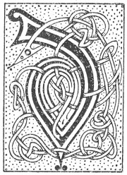

  
[Intangible Textual Heritage](../../../index.md) 
[Legends/Sagas](../../index)  [Celtic](../index.md)  [Carmina
Gadelica](../cg)  [Index](index)  [Previous](cg1129)  [Next](cg1131.md) 

------------------------------------------------------------------------

[Buy this Book at
Amazon.com](https://www.amazon.com/exec/obidos/ASIN/B0027P88YQ/internetsacredte.md)

------------------------------------------------------------------------

  
*Carmina Gadelica, Volume 1*, by Alexander Carmicheal, \[1900\], at
Intangible Textual Heritage

------------------------------------------------------------------------

 

<table data-border="0">
<colgroup>
<col style="width: 50%" />
<col style="width: 50%" />
</colgroup>
<tbody>
<tr class="odd">
<td data-valign="top" width="327">
p. 328
</td>
<td data-valign="top" width="327">
p. 329
</td>
</tr>
<tr class="even">
<td data-valign="top" width="327"><h3 id="beannachadh-cuain-119" data-align="center">BEANNACHADH CUAIN [119]</h3></td>
<td data-valign="top" width="327"><h3 id="ocean-blessing" data-align="center">OCEAN BLESSING</h3></td>
</tr>
</tbody>
</table>

 

<table data-border="0">
<colgroup>
<col style="width: 25%" />
<col style="width: 25%" />
<col style="width: 25%" />
<col style="width: 25%" />
</colgroup>
<tbody>
<tr class="odd">
<td data-valign="top">
 
</td>
<td data-valign="top">
p. 328
</td>
<td data-valign="top">
 
</td>
<td data-valign="top">
p. 329
</td>
</tr>
<tr class="even">
<td data-valign="top">
 
</td>
<td data-valign="top">
DHE, Athair uile-chumhachdaich, chaoimh, 
Ios a Mhic nan deur agus na caoidh, 
Le d’ chomh-chomhnadh, O! a Spioraid Naoimh.

Thrithinn bhi-bheo, bhi-mhoir, bhi-bhuain, 
Thug Clann Israil tri na Muir Ruaidh, 
Is Ionah gu fonn a bronn miol-mhor a’ chuain,

Thug Pol agus a chomhlain ’s an long, 
A doruinn na mara, a dolais nan tonn, 
A stoirm a bha mor, a doinne bha trom.

Duair bhruchd an tuil air Muir Ghailili, 
    *       *       *       *       * 
    *       *       *       *       *

Shun agus saor agus naomhaich sinne, 
Bi-sa, Righ nan dul, air ar stiuir ad shuidhe, 
’S treoirich an sith sinn gu ceann-crich ar n-uidhe.

Le gaotha caona, caomha, coistre, cubhr, 
Gun fhaobhadh, gun fhionnsadh, gun fhabhsadh, 
Nach deanadh gniamh fabhtach dhuinn.

Iarramaid gach sian a Dhe, 
A reir do rian ’s do bhriathra fein.
</td>
<td data-valign="top">
 
</td>
<td data-valign="top">
GOD the Father all-powerful, benign, 
Jesu the Son of tears and of sorrow, 
With thy co-assistance, O! Holy Spirit.

The Three-One, ever-living, ever-mighty, everlasting, 
Who brought the Children of Israel through the Red Sea, 
And Jonah to land from the belly of the great creature of the ocean,

Who brought Paul and his companions in the ship, 
From the torment of the sea, from the dolour of the waves, 
From the gale that was great, from the storm that was heavy.

When the storm poured on the Sea of Galilee, 
    *       *       *       *       * 
    *       *       *       *       *

Sain us and shield and sanctify us, 
Be Thou, King of the elements, seated at our helm, 
And lead us in peace to the end of our journey.

With winds mild, kindly, benign, pleasant. 
Without swirl, without whirl, without eddy, 
That would do no harmful deed to us.

We ask all things of Thee, O God, 
According to Thine own will and word.
</td>
</tr>
</tbody>
</table>

 

 

------------------------------------------------------------------------

[Next: 120. Ruler of the Elements. Riaghlair Nan Sian](cg1131.md)
