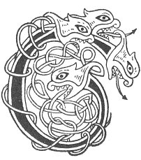

  
[Intangible Textual Heritage](../../../index.md) 
[Legends/Sagas](../../index)  [Celtic](../index.md)  [Carmina
Gadelica](../cg)  [Index](index)  [Previous](cg1130)  [Next](cg1132.md) 

------------------------------------------------------------------------

[Buy this Book at
Amazon.com](https://www.amazon.com/exec/obidos/ASIN/B0027P88YQ/internetsacredte.md)

------------------------------------------------------------------------

  
*Carmina Gadelica, Volume 1*, by Alexander Carmicheal, \[1900\], at
Intangible Textual Heritage

------------------------------------------------------------------------

 

<table data-border="0">
<colgroup>
<col style="width: 50%" />
<col style="width: 50%" />
</colgroup>
<tbody>
<tr class="odd">
<td data-valign="top" width="327">
p. 330
</td>
<td data-valign="top" width="327">
p. 331
</td>
</tr>
<tr class="even">
<td data-valign="top" width="327"><h3 id="riaghlair-nan-sian-120" data-align="center">RIAGHLAIR NAN SIAN [120]</h3></td>
<td data-valign="top" width="327"><h3 id="ruler-of-the-elements" data-align="center">RULER OF THE ELEMENTS</h3></td>
</tr>
</tbody>
</table>

 

<table data-border="0">
<colgroup>
<col style="width: 25%" />
<col style="width: 25%" />
<col style="width: 25%" />
<col style="width: 25%" />
</colgroup>
<tbody>
<tr class="odd">
<td data-valign="top">
 
</td>
<td data-valign="top">
p. 330
</td>
<td data-valign="top">
 
</td>
<td data-valign="top">
p. 331
</td>
</tr>
<tr class="even">
<td data-valign="top">
 
</td>
<td data-valign="top">
CLANN Israil is Dia da ’n gabhail, 
     Troimh ’n Mhuir Ruaidh fhuair iad rathad, 
Is ann a fhuair iad casg am pathaidh, 
     An creag nach d’ fhaodadh le saor a shnaidheadh.

Co iad air faim mo stiuir 
     Deanamh falbh da m’ iubhraich shoir? 
Peadail, Pal, is Eoin mo ruin, 
     Triuir da ’n talmaich fiu is foir.

Co ’n croil an coir mo stiuir? 
     Peadail, Poil, is Eoin Baistidh, 
Criosda na shuidh air mo stiuir, 
     Deanamh iuil da ’n ghaoith a deas.

Co da ’n criothnaich guth na gaoith? 
     Co da ’n caonaich caol is cuan? 
Iosa Criosda, Triath gach naoimh, 
     Mac Moire, Friamh nam buadh, 
     Mac Moire, Friamh nam buadh.
</td>
<td data-valign="top">
 
</td>
<td data-valign="top">
THE Children of Israel, God taking them, 
     Through the Red Sea obtained a path, 
They obtained the quenching of their thirst 
     From a rock that might not by craftsman be hewn.

Who are they on the tiller of my rudder, 
     Giving speed to my east bound barge? 
Peter and Paul and John the beloved, 
     Three to whom laud and obeisance are due.

Who are the group near to my helm? 
     Peter and Paul and John the Baptist; 
Christ is sitting on my helm, 
     Making guidance to the wind from the south.

To whom does tremble the voice of the wind? 
     To whom become tranquil strait and ocean? 
To Jesus Christ, Chief of each saint, 
     Son of Mary, Root of victory, 
     Son of Mary, Root of victory.
</td>
</tr>
</tbody>
</table>

 

------------------------------------------------------------------------

[Next: 121. Sea Prayer. Urnuigh Mhara](cg1132.md)
