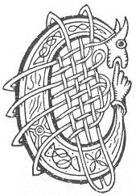

  
[Intangible Textual Heritage](../../../index) 
[Legends/Sagas](../../index)  [Celtic](../index)  [Carmina
Gadelica](../cg) 

------------------------------------------------------------------------

[Buy this Book at
Amazon.com](https://www.amazon.com/exec/obidos/ASIN/B0027P88YQ/internetsacredte)

------------------------------------------------------------------------

<table width="75%">
<colgroup>
<col style="width: 50%" />
<col style="width: 50%" />
</colgroup>
<tbody>
<tr class="odd">
<td width="50%" data-valign="TOP"></td>
<td width="50%" data-valign="CENTER"><h1 id="carmina-gadelica" data-align="CENTER">Carmina Gadelica</h1>
<h6 id="hymns-and-incantations" data-align="CENTER">Hymns and Incantations</h6>
<h2 id="ortha-nan-gaidheal" data-align="CENTER">Ortha Nan Gaidheal</h2>
<h4 id="volume-i" data-align="CENTER">Volume I</h4>
<h4 id="by-alexander-carmichael" data-align="CENTER">by Alexander Carmichael</h4>
<h4 id="section" data-align="CENTER">[1900]</h4></td>
</tr>
</tbody>
</table>

------------------------------------------------------------------------

[Contents](#contents)    [Start Reading](cg1000)    [Page
Index](pageidx)    [Text \[Zipped\]](cg1.txt.gz)

------------------------------------------------------------------------

**Volume I**    \|    [Volume II](../cg2/index)

------------------------------------------------------------------------

|                                                                                                                           |
|---------------------------------------------------------------------------------------------------------------------------|
|  |

This is volume I of Alexander Carmichael's collection of folk poetry
from the Western Isles of Scotland. Carmichael spent years collecting
folklore from the vanishing cultures of Scotland. The poems in this
volume include prayers, invocations, blessings and charms. They are a
synthesis of Christian and pre-Christian belief systems. Besides
invoking Jesus, Mary, and the saints, a number of these call on other
powers. One of these is 'Bride,' who is explained as Jesus' midwife, but
who is probably Brigid, an ancient Celtic goddess. Also mentioned
throughout are a triune deity which is equated to the Christian Trinity,
but which may also be an echo of a set of three pagan deities. The text
includes notes on seasonal observances and folk customs which are
probably likewise survivals of pre-Christian customs. All of these are
woven into the cycles of the year, and activities such as weaving,
fishing and herding. A vivid picture of life in pre-modern rural
Scotland emerges.

This etext includes all of the Gaelic text, Carmicheal's English
translations, and the beautiful initials from the first edition.

------------------------------------------------------------------------

 [Title Page](cg1000)  
[Contents](cg1001)  
[Introduction](cg1002)  

### I. Achaine: Invocations

[Header](cg1003)  
[1. Rune Before Prayer. Rann Romh Urnuigh.](cg1004)  
[2. God With Me Lying Down. Dia Liom A Laighe.](cg1005)  
[3. The Invocation of the Graces. Ora Nam Buadh](cg1006)  
[4. A General Supplication. Achanaidh Choitcheann](cg1007)  
[5. God Be With Us. Dhe Bi Maille Ruinn](cg1008)  
[6. Jesu, Thou Son of Mary. Ios, a Mhic Muire](cg1009)  
[7. Holy Father of Glory. Athair Naomha na Gloir](cg1010)  
[8. A Prayer. Uirnigh](cg1011)  
[9. Rune of the 'Muthairn.' Duan Na Muthairn](cg1012)  
[10. Bless, O Chief of Generous Chiefs. Beannaich, a Thriath Nam Flath
Fial](cg1013)  
[11. The Guiding Light of Eternity. Solus-Iuil Na
Siorruidheachd](cg1014)  
[12. A Prayer For Grace. Achanaidh Grais](cg1015)  
[13. Prayer For Protection. Achanaidh Comhnadh](cg1016)  
[14. Jesu Who Ought to be Praised. Eosai Bu Choir a Mholadh](cg1017)  
[15. The Rock of Rocks. Carraig Nan Al](cg1018)  
[16. The Lightener of the Stars. Sorchar Nan Reul](cg1019)  
[17 The Cross of the Saints and the Angels. Crois Nan Naomh Agus Nan
Aingeal](cg1020)  
[18. The Guardian Angel. An T-Aingheal Diona](cg1021)  
[19. Desires. Ruin](cg1022)  
[20. Invocation For Justice. Ora Ceartais](cg1023)  
[21. Invocation For Justice. Ora Ceartais](cg1024)  
[22. Prayer For Victory. Ora Buaidh](cg1025)  
[23. The Lustration. An Liuthail](cg1026)  
[24. Bathing Prayer. Ora Boisilidh.](cg1027)  
[25. God Guide Me. Dhe Stiuir Mi](cg1028)  
[26. Sleep Blessing. Beannachadh Cadail](cg1029)  
[27. Come I This Day. Thigeam An Diugh](cg1030)  
[28. The Soul Plaint. An Achanaidh Anama](cg1031)  
[29. Sleeping Prayer. Urnuigh Chadail](cg1032)  
[30. The Gifts of the Three. Tiubhradh Nan Tri](cg1033)  
[31. Sleep Prayer. Urnuigh Chadail](cg1034)  
[32. Resting Blessing. Beannachd Taimh](cg1035)  
[33. Sleep Consecration. Coisrig Cadail](cg1036)  
[34. Bed Blessing. Beannachadh Leapa](cg1037)  
[35 The Sleep Prayer. An Urnuigh Chadail](cg1038)  
[36 Sleep Consecration. Coisrig Cadail](cg1039)  
[37. Bed Blessing. Beannachadh Leapa](cg1040)  
[38 The Soul Shrine. A Choich Anama](cg1041)  
[39. Soul-Shrine. Coich-Anama](cg1042)  
[40. I Lie In My Bed. Laighim Am Leabaidh](cg1043)  
[41. Morning Prayer. Urnuigh Maduinn](cg1044)  
[42 The Dedication. An Tionnsgann](cg1045)  
[43. A Resting Prayer. Achanaidh Taimh](cg1046)  
[44. House Protecting. Teisreadh Taighe](cg1047)  
[45. Blessing of House. Beannachadh Taighe](cg1048)  
[46. To Whom Shall I Offer Oblation. Co Dha Dhiolas Mi Cios](cg1049)  
[47. Hail, Mary. Earna Mhoire](cg1050)  
[48. Hail To Thee, Mary. Failte A Mhoire](cg1051)  
[49. The Battle to Come. An Cath Nach Tainig](cg1052)  
[50. The Baptism Blessing. Am Beannachadh Baistidh](cg1053)  
[51. The Soul Leading. An Treoraich Anama](cg1054)  
[52. The Death Blessing. Am Beannachadh Bais](cg1055)  
[53. Soul Peace. Fois Anama](cg1056)  
[54. The New Moon. A Ghealach Ur](cg1057)  

### II. Aimsire: Seasons

[Header](cg1058)  
[55. Christmas Hail. Nuall Nollaig](cg1059)  
[56. Christmas Carol. Duan Nollaig](cg1060)  
[57. Christmas Chant. Duan Nollaig](cg1061)  
[58. Hey The Gift. Heire Bannag](cg1062)  
[59. Hey The Gift, Ho The Gift. Eire Bannag, Hoire Bannag](cg1063)  
[60. The Gift of Power. Bannag Nam Buadh](cg1064)  
[61. The Virgin and Child. An Oigh Agus An Leanabh](cg1065)  
[62 The Shepherd of the Flock was Born. Rugadh Buachaille Nan
Treud](cg1066)  
[63. Hogmanay of the Sack. Calluinn A Bhuilg](cg1067)  
[64. Hogmanay Carol. Cairioll Callaig](cg1068)  
[65. The Song of Hogmanay. Duan Callaig](cg1069)  
[66. Hogmanay. Oidhche Challaig](cg1070)  
[67. The Blessing Of The New Year. Beannachadh Bliadhna Uir](cg1071)  
[68. Christ the Priest Above Us. Criosda Cleireach Os Ar
Cionn](cg1072)  
[69. The Day of St Columba. La Chaluim-Chille](cg1073)  
[70 (notes). Genealogy of Bride. Sloinntireachd Bhride](cg1074)  
[70. Genealogy of Bride. Sloinntireachd Bhride](cg1075)  
[71. Bride The Aid-Woman. Bride Ban-Chobhair](cg1076)  
[72. Magnus of my Love. Manus Mo Ruin](cg1077)  
[73. The Beltane Blessing. Am Beannachadh Bealltain](cg1078)  
[74. The Beltane Blessing. Am Beannachd Bealltain](cg1079)  
[75 (notes). Hymn of the Procession. Laoidh An Triall](cg1080)  
[75. Hymn of the Procession. Laoidh An Triall](cg1081)  
[76. The Feast Day of Mary. La Feill Moire](cg1082)  
[77 (notes). Michael, the Victorious. Micheal Nam Buaidh](cg1083)  
[77. Michael, the Victorious. Micheal Nam Buadh](cg1084)  
[78. The Blessing of the 'Strūan'. An Beannachadh Strūain](cg1085)  
[79. The Poem of the Lord's Day. Duan An Domhnuich](cg1086)  
[80. Hymn Of The Sunday. Duan An Domhnaich](cg1087)  
[81. Poem of the Flood. Duan Na Dilinn](cg1088)  

### III. Labour. Oibre

[Header](cg1089)  
[82. Blessing of the Kindling. Beannachadh Beothachaidh](cg1090)  
[83. Kindling The Fire. Togail An Teine](cg1091)  
[84. Smooring the Fire. Smaladh An Teine](cg1092)  
[85. Smooring The Fire. Smaladh An Teine](cg1093)  
[88. Blessing of the Smooring. Beannachd Smalaidh](cg1094)  
[87. Smooring Blessing Beannachadh Smalaidh](cg1095)  
[88. The Consecration of the Seed. An Coisrigeadh Sioil](cg1096)  
[89. Reaping Blessing. Beannachadh Buana](cg1097)  
[90. Reaping Blessing. Beannachadh Buana](cg1098)  
[91. The Blessing Of The Parching. Beannachadh Fuiriridh.](cg1099)  
[92 (notes). The Quern Blessing. Beannachadh Brathain](cg1100)  
[92. The Quern Blessing. Beannachadh Brathain](cg1101)  
[93. Milking Croon. Cronan Bleoghain](cg1102)  
[94. Milking Croon. Cronan Bleoghain](cg1103)  
[95. Milking Blessing. Beannachadh Bleoghain](cg1104)  
[96. Ho Hoiligean, Ho My Heifers. Ho Hoiligean, Ho M’ Aighean](cg1105)  
[97. Ho, My Heifer! Ho M’ Aghan!](cg1106)  
[98. Give Thy Milk. Thoir Am Bainne](cg1107)  
[99. Milking Song. Cronan Bleoghan](cg1108)  
[100. Herding Blessing. Beannachadh Buachailleachd](cg1109)  
[101. Herding Blessing. Beannachadh Buachailleachd](cg1110)  
[102. Herding Blessing. Beannachadh Buachailleachd](cg1111)  
[103. The Protection of the Cattle. Comraig Nam Ba.](cg1112)  
[104. Guarding The Flocks. Gleidheadh Treuid](cg1113)  
[105. A Herding Croon. Cronan Cuallaich](cg1114)  
[106. Hatching Blessing. Beannachadh Guir](cg1115)  
[107. Marking The Lambs. Comharrachadh Nan Uan](cg1116)  
[108. The Clipping Blessing. Am Beannachd Lombaidh](cg1117)  
[109. The Chant of the Warping. Duan Deilbh](cg1118)  
[110. Loom Blessing. Beannachd Beairte](cg1119)  
[111 Setting the Iomairt. Suidheachadh Na H-Iomairt](cg1120)  
[112. Loom Blessing. Beannachadh Garmain](cg1121)  
[113 (notes). The Consecration of the Cloth. Coisrigeadh An
Aodaich](cg1122)  
[113. The Consecration of the Cloth. Coisrigeadh An Aodaich](cg1123)  
[114. Hunting Blessing. Beannachadh Seilg](cg1124)  
[115. Consecrating The Chase. Coisrigeadh Na Seilg](cg1125)  
[116. Prayer For Travelling. Ora Turais](cg1126)  
[117. Fishing Blessing. Beannachd Iasgaich](cg1127)  
[118 (notes). The Ocean Blessing. Beannachadh Cuain](cg1128)  
[118. The Ocean Blessing. Beannachadh Cuain](cg1129)  
[119. Ocean Blessing. Beannachadh Cuain](cg1130)  
[120. Ruler of the Elements. Riaghlair Nan Sian](cg1131)  
[121. Sea Prayer. Urnuigh Mhara](cg1132)  
