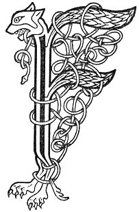

  
[Intangible Textual Heritage](../../../index) 
[Legends/Sagas](../../index)  [Celtic](../index)  [Carmina
Gadelica](../cg)  [Index](index)  [Previous](cg2002)  [Next](cg2004) 

------------------------------------------------------------------------

[Buy this Book at
Amazon.com](https://www.amazon.com/exec/obidos/ASIN/B0027P890O/internetsacredte)

------------------------------------------------------------------------

  
*Carmina Gadelica, Volume 2*, by Alexander Carmicheal, \[1900\], at
Intangible Textual Heritage

------------------------------------------------------------------------

 

<table data-border="0">
<colgroup>
<col style="width: 50%" />
<col style="width: 50%" />
</colgroup>
<tbody>
<tr class="odd">
<td data-valign="top" width="327">
p. 2
</td>
<td data-valign="top" width="327">
p. 3
</td>
</tr>
<tr class="even">
<td data-valign="top" width="327"><h3 id="eolas-na-ruaidh-122" data-align="center">EOLAS NA RUAIDH [122]</h3></td>
<td data-valign="top" width="327"><h3 id="charm-for-rose" data-align="center">CHARM FOR ROSE</h3></td>
</tr>
</tbody>
</table>

 

WHEN this charm is applied, the point of a knife or
a needle, or the tongue of a brooch or of some other sharp instrument,
is pointed threateningly at the part affected. The part is then spat
upon and crossed three times in the names p. 3
of the three Persons of the Trinity, whether it be the breast of a woman
or the udder of a cow. The legend says that Mary and Jesus were walking
together when Mary took rose (erysipelas) in her breast, and she said to
Jesus:--

 

<table data-border="0">
<colgroup>
<col style="width: 25%" />
<col style="width: 25%" />
<col style="width: 25%" />
<col style="width: 25%" />
</colgroup>
<tbody>
<tr class="odd">
<td data-valign="top">
 
</td>
<td data-valign="top">
p. 2
</td>
<td data-valign="top">
 
</td>
<td data-valign="top">
p. 3
</td>
</tr>
<tr class="even">
<td data-valign="top">
 
</td>
<td data-valign="top">
AIC, a Mhic ’s a Chriosda, 
Cioch do Mhathar air at; 
Thoir-sa fois dh’ an chich, 
Cuir-s’ an crion an t-at; 
     Thoir-sa fois dh’ an chich, 
     Cuir-s’ an crion an t-at.

Faic fein i, Righinn, 
’S tu a rug am Mac, 
Cuir-sa casgadh air a chich, 
Cuir-sa crionadh air an at; 
     Cuir-sa casgadh air a chich, 
     Cuir-sa crionadh air an at.

Faic thus i, Iosda, 
Is tu Righ nan dul; 
Cuir-sa casgadh air a chich, 
Cuir-sa crionadh air an uth; 
     Cuir-sa casgadh air a chich, 
     Cuir-sa crionadh air an uth.

Chithim, thubhairt Criosda, 
Is nithim mar is fiu, 
Bheirim fois dh’ an chich, 
’S bheirim sith dh’ an uth; 
     Bheirim fois dh’ an chich, 
     ’S bheirim sith dh’ an uth.
</td>
<td data-valign="top">
 
</td>
<td data-valign="top">
BEHOLD, Son and Christ, 
The breast of Thy Mother swollen; 
Give Thou peace to the breast, 
Subdue Thou the swelling; 
     Give Thou peace to the breast, 
     Subdue Thou the swelling.

Behold it thyself, Queen, 
Since of thee the Son was born, 
Appease thou the breast, 
Subdue thou the swelling; 
     Appease thou the breast, 
     Subdue thou the swelling.

See Thou it, Jesu, 
Since Thou art King of life; 
Appease Thou the breast, 
Subdue Thou the udder; 
     Appease Thou the breast, 
     Subdue Thou the udder.

I behold, said Christ, 
And I do as is meet, 
I give ease to the breast, 
And rest to the udder; 
     I give ease to the breast, 
     And rest to the udder.
</td>
</tr>
</tbody>
</table>

 

 

------------------------------------------------------------------------

[Next: 123. Charm For Rose. Eolas Na Ruaidh](cg2004)
