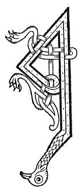

  
[Intangible Textual Heritage](../../../index) 
[Legends/Sagas](../../index)  [Celtic](../index)  [Carmina
Gadelica](../cg)  [Index](index)  [Previous](cg2003)  [Next](cg2005) 

------------------------------------------------------------------------

[Buy this Book at
Amazon.com](https://www.amazon.com/exec/obidos/ASIN/B0027P890O/internetsacredte)

------------------------------------------------------------------------

  
*Carmina Gadelica, Volume 2*, by Alexander Carmicheal, \[1900\], at
Intangible Textual Heritage

------------------------------------------------------------------------

 

<table data-border="0">
<colgroup>
<col style="width: 50%" />
<col style="width: 50%" />
</colgroup>
<tbody>
<tr class="odd">
<td data-valign="top" width="327">
p. 4
</td>
<td data-valign="top" width="327">
p. 5
</td>
</tr>
<tr class="even">
<td data-valign="top" width="327"><h3 id="eolas-na-ruaidh-123" data-align="center">EOLAS NA RUAIDH [123]</h3></td>
<td data-valign="top" width="327"><h3 id="charm-for-rose" data-align="center">CHARM FOR ROSE</h3></td>
</tr>
</tbody>
</table>

 

<table data-border="0">
<colgroup>
<col style="width: 25%" />
<col style="width: 25%" />
<col style="width: 25%" />
<col style="width: 25%" />
</colgroup>
<tbody>
<tr class="odd">
<td data-valign="top">
 
</td>
<td data-valign="top">
p. 4
</td>
<td data-valign="top">
 
</td>
<td data-valign="top">
p. 5
</td>
</tr>
<tr class="even">
<td data-valign="top">
 
</td>
<td data-valign="top">
A RUADH ghaothar, atar, aogail, 
Fag an taobh agus an tac sin, 
Sin an carr ’s an lar, 
     Agus fag a chioch.

Seall, a Chriosd, a bhean 
Agus a cioch air at, 
Seall fein i, Mhuire, 
     ’S tu rug am Mac.

A ruadh ghaothar, aogar, iota, 
Fag a chioch agus am bac, 
Agus sin a mach, 
     Slan gu robh dh’ an chich, 
          Crion gu robh dh’ an at.

Teich a bhradag ruadh, 
Teich gu luath a bhradag, 
At a bha ’s a chich, 
     Fag a charr ’s a chioch, 
          Agus sin a mach.
</td>
<td data-valign="top">
 
</td>
<td data-valign="top">
THOU rose windy, swelling, deadly, 
Leave that part and spot, 
There is the udder in the ground, 
     And leave the breast.

See, Christ, the woman 
And her breast swollen, 
See her thyself, Mary, 
     It was thou didst bear the Son.

Thou rose windy, deadly, thirsty, 
Leave the breast and the spot, 
And take thyself off; 
     Healed be the breast, 
          Withered be the swelling.

Flee thieving red one, 
Flee quickly thieving one, 
Swelling that was in the breast, 
     Leave the udder and the breast, 
          And flee hence.
</td>
</tr>
</tbody>
</table>

 

------------------------------------------------------------------------

[Next: 124. Charm For Rose. Eolas Na Ru](cg2005)
