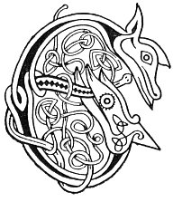

  
[Intangible Textual Heritage](../../../index.md) 
[Legends/Sagas](../../index)  [Celtic](../index.md)  [Carmina
Gadelica](../cg)  [Index](index)  [Previous](cg2005)  [Next](cg2007.md) 

------------------------------------------------------------------------

[Buy this Book at
Amazon.com](https://www.amazon.com/exec/obidos/ASIN/B0027P890O/internetsacredte.md)

------------------------------------------------------------------------

  
*Carmina Gadelica, Volume 2*, by Alexander Carmicheal, \[1900\], at
Intangible Textual Heritage

------------------------------------------------------------------------

 

<table data-border="0">
<colgroup>
<col style="width: 50%" />
<col style="width: 50%" />
</colgroup>
<tbody>
<tr class="odd">
<td data-valign="top" width="327">
p. 8
</td>
<td data-valign="top" width="327">
p. 9
</td>
</tr>
<tr class="even">
<td data-valign="top" width="327"><h3 id="eolas-at-cioch-125" data-align="center">EOLAS AT CIOCH [125]</h3></td>
<td data-valign="top" width="327"><h3 id="charm-for-swollen-breast" data-align="center">CHARM FOR SWOLLEN BREAST</h3></td>
</tr>
</tbody>
</table>

 

 

<table data-border="0">
<colgroup>
<col style="width: 25%" />
<col style="width: 25%" />
<col style="width: 25%" />
<col style="width: 25%" />
</colgroup>
<tbody>
<tr class="odd">
<td data-valign="top">
 
</td>
<td data-valign="top">
p. 8
</td>
<td data-valign="top">
 
</td>
<td data-valign="top">
p. 9
</td>
</tr>
<tr class="even">
<td data-valign="top">
 
</td>
<td data-valign="top">
EOLAS a rinn Gille-Caluim 
A dh’ aona bho na caillich, 
Air ruaidh, air chruaidh, air chradh, 
Air at, air pat, air mam, 
Air dhair, air chairr, air bhleoghan, 
Air tri corracha crith, 
Air tri corracha cnamh, 
Air tri corracha creothail, 
Na ob e do bhruid, 
Na diult e do mhne, 
Na tar e ’s an Domhnach. 
Eolas a rinn Fionn fial, 
Da dhearbh phiuthair, 
Air ruaidh, air chruaidh, 
Air at ciche.

 
</td>
<td data-valign="top">
 
</td>
<td data-valign="top">
THE charm made by Gillecaluim, 
On the one cow of the carlin, 
For rose, for hardness, for pain, 
For swelling, for lump, for growth, 
For uzzening, for udder, for milking, 
For the three 'corracha crith,' 
For the three 'corracha cnamh,' 
For the three 'corracha creothail,' 
Do not deny it to beast, 
Do not refuse it to wife, 
Do not withhold it on Sunday. 
The charm made of generous Fionn, 
To his very sister, 
For rose, for hardness, 
For swelling of breast.
</td>
</tr>
</tbody>
</table>

 

------------------------------------------------------------------------

[Next: 126. Toothache Charm. Eolas An Deididh](cg2007.md)
