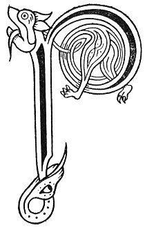

  
[Intangible Textual Heritage](../../../index) 
[Legends/Sagas](../../index)  [Celtic](../index)  [Carmina
Gadelica](../cg)  [Index](index)  [Previous](cg2009)  [Next](cg2011) 

------------------------------------------------------------------------

[Buy this Book at
Amazon.com](https://www.amazon.com/exec/obidos/ASIN/B0027P890O/internetsacredte)

------------------------------------------------------------------------

  
*Carmina Gadelica, Volume 2*, by Alexander Carmicheal, \[1900\], at
Intangible Textual Heritage

------------------------------------------------------------------------

 

<table data-border="0">
<colgroup>
<col style="width: 50%" />
<col style="width: 50%" />
</colgroup>
<tbody>
<tr class="odd">
<td data-valign="top" width="327">
p. 16
</td>
<td data-valign="top" width="327">
p. 17
</td>
</tr>
<tr class="even">
<td data-valign="top" width="327"><h3 id="eolas-sgocha-feith-129" data-align="center">EOLAS SGOCHA FEITH [129]</h3></td>
<td data-valign="top" width="327"><h3 id="charm-for-bursting-vein" data-align="center">CHARM FOR BURSTING VEIN</h3></td>
</tr>
</tbody>
</table>

 

<table data-border="0">
<colgroup>
<col style="width: 25%" />
<col style="width: 25%" />
<col style="width: 25%" />
<col style="width: 25%" />
</colgroup>
<tbody>
<tr class="odd">
<td data-valign="top">
 
</td>
<td data-valign="top">
p. 16
</td>
<td data-valign="top">
 
</td>
<td data-valign="top">
p. 17
</td>
</tr>
<tr class="even">
<td data-valign="top">
 
</td>
<td data-valign="top">
PAIDIR Moire a h-aon, 
Paidir Moire a dha, 
Paidir Moire a tri, 
Paidir Moire a ceithir, 
Paidir Moire a coig, 
Paidir Moire a sia, 
Paidir Moire a seachd, 
Seachd paidriche Moire gu brath 
Eadar cradh agus ceart, 
Eadar bonn agus braigh, 
Eadar slan agus feart.

Chaidh Criosd air as, 
Sgiuch a cas, 
Thainig e bhan 
Shlanuich e cas; 
Mar a shlanuich e sin 
Gun slanuich e seo, 
Agus na ’s mo na seo 
Ma ’s e thoil a dheanamh.
</td>
<td data-valign="top">
 
</td>
<td data-valign="top">
ROSARY of Mary, one, 
Rosary of Mary, two, 
Rosary of Mary, three, 
Rosary of Mary, four, 
Rosary of Mary, five, 
Rosary of Mary, six, 
Rosary of Mary, seven, 
Seven Rosaries of Mary ever 
Between pain and ease, 
Between sole and summit, 
Between health and grave

Christ went on an ass, 
She sprained her foot, 
He came down 
And healed her foot; 
As He healed that 
May He heal this, 
And greater than this, 
If it be His will to do.
</td>
</tr>
</tbody>
</table>

 

------------------------------------------------------------------------

[Next: 130. Charm of the Sprain. Eolas An T-Sniamh](cg2011)
