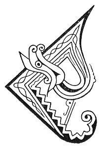

  
[Intangible Textual Heritage](../../../index.md) 
[Legends/Sagas](../../index)  [Celtic](../index.md)  [Carmina
Gadelica](../cg)  [Index](index)  [Previous](cg2010)  [Next](cg2012.md) 

------------------------------------------------------------------------

[Buy this Book at
Amazon.com](https://www.amazon.com/exec/obidos/ASIN/B0027P890O/internetsacredte.md)

------------------------------------------------------------------------

  
*Carmina Gadelica, Volume 2*, by Alexander Carmicheal, \[1900\], at
Intangible Textual Heritage

------------------------------------------------------------------------

 

<table data-border="0">
<colgroup>
<col style="width: 50%" />
<col style="width: 50%" />
</colgroup>
<tbody>
<tr class="odd">
<td data-valign="top" width="327">
p. 18
</td>
<td data-valign="top" width="327">
p. 19
</td>
</tr>
<tr class="even">
<td data-valign="top" width="327"><h3 id="eolas-an-t-sniamh-130" data-align="center">EOLAS AN T-SNIAMH [130]</h3></td>
<td data-valign="top" width="327"><h3 id="charm-of-the-sprain" data-align="center">CHARM OF THE SPRAIN</h3></td>
</tr>
</tbody>
</table>

 

<table data-border="0">
<colgroup>
<col style="width: 25%" />
<col style="width: 25%" />
<col style="width: 25%" />
<col style="width: 25%" />
</colgroup>
<tbody>
<tr class="odd">
<td data-valign="top">
 
</td>
<td data-valign="top">
p. 18
</td>
<td data-valign="top">
 
</td>
<td data-valign="top">
p. 19
</td>
</tr>
<tr class="even">
<td data-valign="top">
 
</td>
<td data-valign="top">
CHAR Bride mach 
Maduinn mhoch, 
Le caraid each; 
Bhris each a chas, 
Le uinich och, 
Bha sid mu seach, 
Chuir i cnamh ri cnamh, 
Chuir i feoil ri feoil, 
Chuir i feithe ri feithe, 
Chuir i cuisle ri cuisle; 
Mar a leighis ise sin 
Gun leighis mise seo.
</td>
<td data-valign="top">
 
</td>
<td data-valign="top">
BRIDE went out 
In the morning early, 
With a pair of horses; 
One broke his leg, 
With much ado, 
That was apart, 
She put bone to bone, 
She put flesh to flesh, 
She put sinew to sinew, 
She put vein to vein; 
As she healed that 
May I heal this.
</td>
</tr>
</tbody>
</table>

 

------------------------------------------------------------------------

[Next: 131. Charm For Sprain. Eolas An T-Sniamh](cg2012.md)
