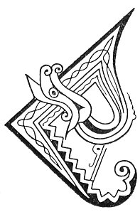

  
[Intangible Textual Heritage](../../../index) 
[Legends/Sagas](../../index)  [Celtic](../index)  [Carmina
Gadelica](../cg)  [Index](index)  [Previous](cg2016)  [Next](cg2018) 

------------------------------------------------------------------------

[Buy this Book at
Amazon.com](https://www.amazon.com/exec/obidos/ASIN/B0027P890O/internetsacredte)

------------------------------------------------------------------------

  
*Carmina Gadelica, Volume 2*, by Alexander Carmicheal, \[1900\], at
Intangible Textual Heritage

------------------------------------------------------------------------

 

<table data-border="0">
<colgroup>
<col style="width: 50%" />
<col style="width: 50%" />
</colgroup>
<tbody>
<tr class="odd">
<td data-valign="top" width="327">
p. 32
</td>
<td data-valign="top" width="327">
p. 33
</td>
</tr>
<tr class="even">
<td data-valign="top" width="327"><h3 id="sian-a-bheatha-bhuan-135" data-align="center">SIAN A BHEATHA BHUAN [135]</h3></td>
<td data-valign="top" width="327"><h3 id="the-charm-of-the-lasting-life" data-align="center">THE CHARM OF THE LASTING LIFE</h3></td>
</tr>
</tbody>
</table>

 

<table data-border="0">
<colgroup>
<col style="width: 25%" />
<col style="width: 25%" />
<col style="width: 25%" />
<col style="width: 25%" />
</colgroup>
<tbody>
<tr class="odd">
<td data-valign="top">
 
</td>
<td data-valign="top">
p. 32
</td>
<td data-valign="top">
 
</td>
<td data-valign="top">
p. 33
</td>
</tr>
<tr class="even">
<td data-valign="top">
 
</td>
<td data-valign="top">
CUIRIM sian a bheatha bhuan, 
Mu ’r crodh luath, leathann, lan, 
An creagan air an laigh an spreidh, 
     Gun eirich iad beo slan.

A nuas le buaidh ’s le beannachd, 
A suas le luaths ’s le leannachd, 
Gun ghnu, gun tnu, gun fharmad, 
Gun suil bhig, gun suil mhoir, 
     Gun suil choig an dearmaid.

Sughaidh mise seo, sughadh feith farmaid 
Air ceannard an tighe ’s air teaghlaich a bhaile, 
Gun eirich gach droch-bhuil, ’s gach droch-bhuaidh 
     Bu dhualta dhuibh-se dhaibh-san.

          Ma mhallaich teanga duibh, 
          Bheannaich cridhe duibh; 
          Ma ghonaich suil duibh, 
          Shonaich run duibh.

Tionndanam is teanndanam, 
Culionn cruaidh is creanndagaich 
Air an caoire boirionn ’s air an laoighe firionn, 
     Fad nan naodh ’s nan naodh fichead bliadhna.
</td>
<td data-valign="top">
 
</td>
<td data-valign="top">
I WILL place the charm of the lasting life, 
Upon your cattle active, broad, and full, 
The knoll upon which the herds shall lie down, 
     That they may rise from it whole and well.

Down with success, and with blessing, 
Up with activity and following, 
Without envy, without malice, without ill-will, 
Without small eye, without large eye, 
     Without the five eyes of neglect.

I will suck this, the sucking of envious vein 
On the head of the house, and the townland families, 
That every evil trait, and every evil tendency 
     Inherent in you shall cleave to them.

          If tongue cursed you, 
          A heart blessed you; 
          If eye blighted you, 
          A wish prospered you.

A hurly-burlying, a topsy-turvying, 
A hard hollying and a wan withering 
To their female sheep and to their male calves, 
     For the nine and the nine score years.
</td>
</tr>
</tbody>
</table>

 

------------------------------------------------------------------------

[Next: 136. St Bride's Charm. Sian Bride](cg2018)
