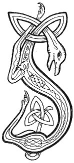

  
[Intangible Textual Heritage](../../../index.md) 
[Legends/Sagas](../../index)  [Celtic](../index.md)  [Carmina
Gadelica](../cg)  [Index](index)  [Previous](cg2017)  [Next](cg2019.md) 

------------------------------------------------------------------------

[Buy this Book at
Amazon.com](https://www.amazon.com/exec/obidos/ASIN/B0027P890O/internetsacredte.md)

------------------------------------------------------------------------

  
*Carmina Gadelica, Volume 2*, by Alexander Carmicheal, \[1900\], at
Intangible Textual Heritage

------------------------------------------------------------------------

 

<table data-border="0">
<colgroup>
<col style="width: 50%" />
<col style="width: 50%" />
</colgroup>
<tbody>
<tr class="odd">
<td data-valign="top" width="327">
p. 34
</td>
<td data-valign="top" width="327">
p. 35
</td>
</tr>
<tr class="even">
<td data-valign="top" width="327"><h3 id="sian-bride-136" data-align="center">SIAN BRIDE [136]</h3></td>
<td data-valign="top" width="327"><h3 id="st-brides-charm" data-align="center">ST BRIDE'S CHARM</h3></td>
</tr>
</tbody>
</table>

 

<table data-border="0">
<colgroup>
<col style="width: 25%" />
<col style="width: 25%" />
<col style="width: 25%" />
<col style="width: 25%" />
</colgroup>
<tbody>
<tr class="odd">
<td data-valign="top">
 
</td>
<td data-valign="top">
p. 34
</td>
<td data-valign="top">
 
</td>
<td data-valign="top">
p. 35
</td>
</tr>
<tr class="even">
<td data-valign="top">
 
</td>
<td data-valign="top">
SIAN a chuir Bride nam buadh, 
M’a mise, m’a cire, m’a buar, 
M’a capuill, m’a cathmhil, m’a cual, 
Moch is anamach dol dachaidh is uaith.

Gan cumail bho chreagan, bho chleitean, 
Bho ladhara ’s bho adhaircean a cheile, 
Bho iana na Creige Ruaidh, 
Is bho Luath na Feinne.

Bho lannaire liath Creag Duilionn, 
Bho iolaire riabhach Beinn-Ard, 
Bho sheobhag luth Torr-an-Duin, 
Is fitheach dur Creag-a-Bhaird.

Bho mhada-ruadh nan cuireid, 
Bho mhada-ulai a Mhaim, 
Bho thaghan tocaidh na tuide, 
’S bho mhaghan udail a mhais.

  *       *       *       *       * 
  *       *       *       *       * 
Bho gach ceithir-chasach spuireach, 
Agus guireach da sgiath.
</td>
<td data-valign="top">
 
</td>
<td data-valign="top">
THE charm put by Bride the beneficent, 
On her goats, on her sheep, on her kine, 
On her horses, on her chargers, on her herds, 
Early and late going home, and from home.

To keep them from rocks and ridges, 
From the heels and the horns of one another 
From the birds of the Red Rock, 
And from Luath of the Feinne.

From the blue peregrine hawk of Creag Duilion, 
From the brindled eagle of Ben-Ard, 
From the swift hawk of Tordun, 
From the surly raven of Bard's Creag.

From the fox of the wiles, 
From the wolf of the Mam, 
From the foul-smelling fumart, 
And from the restless great-hipped bear.

  *       *       *       *       * 
  *       *       *       *       * 
From every hoofed of four feet, 
And from every hatched of two wings.
</td>
</tr>
</tbody>
</table>

 

------------------------------------------------------------------------

[Next: 137. Sain. Sian](cg2019.md)
