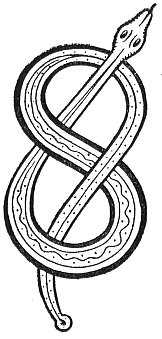

  
[Intangible Textual Heritage](../../../index.md) 
[Legends/Sagas](../../index)  [Celtic](../index.md)  [Carmina
Gadelica](../cg)  [Index](index)  [Previous](cg2018)  [Next](cg2020.md) 

------------------------------------------------------------------------

[Buy this Book at
Amazon.com](https://www.amazon.com/exec/obidos/ASIN/B0027P890O/internetsacredte.md)

------------------------------------------------------------------------

  
*Carmina Gadelica, Volume 2*, by Alexander Carmicheal, \[1900\], at
Intangible Textual Heritage

------------------------------------------------------------------------

 

<table data-border="0">
<colgroup>
<col style="width: 50%" />
<col style="width: 50%" />
</colgroup>
<tbody>
<tr class="odd">
<td data-valign="top" width="327">
p. 36
</td>
<td data-valign="top" width="327">
p. 37
</td>
</tr>
<tr class="even">
<td data-valign="top" width="327"><h3 id="sian-137" data-align="center">SIAN [137]</h3></td>
<td data-valign="top" width="327"><h3 id="sain" data-align="center">SAIN</h3></td>
</tr>
</tbody>
</table>

 

<table data-border="0">
<colgroup>
<col style="width: 25%" />
<col style="width: 25%" />
<col style="width: 25%" />
<col style="width: 25%" />
</colgroup>
<tbody>
<tr class="odd">
<td data-valign="top">
 
</td>
<td data-valign="top">
p. 36
</td>
<td data-valign="top">
 
</td>
<td data-valign="top">
p. 37
</td>
</tr>
<tr class="even">
<td data-valign="top">
 
</td>
<td data-valign="top">
            SIAN a chuir Moir air a Mac, 
            Sian romh mharbhadh, sian romh lot, 
            Sian eadar cioch agus glun, 
            Sian eadar glun agus lorc, 
            Sian nan tri sian, 
            Sian nan coig sian, 
            Sian nan seachd sian, 
            Eadar barr do chinn 
            Agus bonn do chos. 
            Sian nan seachd paidir, a h-aon, 
            Sian nan seachd paidir, a dha, 
            Sian nan seachd paidir, a tri, 
            Sian nan seachd paidir, a ceithir, 
            Sian nan seachd paidir, a coig, 
            Sian nan seachd paidir, a sia, 
            Sian nan seachd paidir, a seachd 
                 Ort a nis. 
            Bho chlaban do bhathas, 
            Gu dathas do bhonn, 
            Ga d’ chumail o d’ chul, 
            Ga d’ chumhn o t’ aghaidh.

Clogad slainne mu d’ cheann, 
Cearcul comhnant mu d’ bhraigh, 
Uchd-eididh an t-sagairt mu d’ bhrollach, 
Ga d’ dhion an cogadh ’s an comhrag nan namh.

Ma's ruaig dhuit, oig, o thaobh do chuil, 
Buaidh na h-Oigh ga do chomhnadh dluth, 
Sear no siar, siar no sear, 
Tuath no deas, deas no tuath.

 
</td>
<td data-valign="top">
 
</td>
<td data-valign="top">
            THE sain put by Mary on her Son, 
            Sain from death, sain from wound, 
            Sain from breast to knee, 
            Sain from knee to foot, 
            Sain of the three sains, 
            Sain of the five sains, 
            Sain of the seven sains, 
            From the crown of thy head 
            To the soles of thy feet. 
            Sain of the seven paters, one, 
            Sain of the seven paters, two, 
            Sain of the seven paters, three, 
            Sain of the seven paters, four, 
            Sain of the seven paters, five, 
            Sain of the seven paters, six, 
            Sain of the seven paters, seven 
                 Upon thee now. 
            From the edge of thy brow, 
            To thy coloured soles, 
            To preserve thee from behind, 
            To sustain thee in front.

Be the helmet of salvation about thine head, 
Be the corslet of the covenant about thy throat, 
Be the breastplate of the priest upon thy breast, 
To shield thee in the battle and combat of thine enemies.

If pursued, oh youth, from behind thy back, 
The power of the Virgin be close to succour thee, 
East or west, west or east, 
North or south, south or north.
</td>
</tr>
</tbody>
</table>

 

------------------------------------------------------------------------

[Next: 138. Love Charm. Eolas Gradhaich](cg2020.md)
