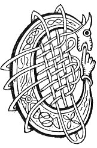

  
[Intangible Textual Heritage](../../../index) 
[Legends/Sagas](../../index)  [Celtic](../index)  [Carmina
Gadelica](../cg)  [Index](index)  [Previous](cg2019)  [Next](cg2021) 

------------------------------------------------------------------------

[Buy this Book at
Amazon.com](https://www.amazon.com/exec/obidos/ASIN/B0027P890O/internetsacredte)

------------------------------------------------------------------------

  
*Carmina Gadelica, Volume 2*, by Alexander Carmicheal, \[1900\], at
Intangible Textual Heritage

------------------------------------------------------------------------

 

<table data-border="0">
<colgroup>
<col style="width: 50%" />
<col style="width: 50%" />
</colgroup>
<tbody>
<tr class="odd">
<td data-valign="top" width="327">
p. 38
</td>
<td data-valign="top" width="327">
p. 39
</td>
</tr>
<tr class="even">
<td data-valign="top" width="327"><h3 id="eolas-gradhaich-138" data-align="center">EOLAS GRADHAICH [138]</h3></td>
<td data-valign="top" width="327"><h3 id="love-charm" data-align="center">LOVE CHARM</h3></td>
</tr>
</tbody>
</table>

 

THE people quote many proverbs relating to love and to love charms. 'Is
leth-aoin an caothach agus an gaol,'--Twins are lunacy and love. 'Is
ionann an galar gaoil agus an galar caothaich,'--Alike the complaint of
love and the complaint of madness. 'Duinidh gaol mile suil ach duisgidh
p. 39 cuig mile farmaid,'--Love will close a
thousand eyes but waken five thousand jealousies.

The lucky bones are the joint of the big toe of the right foot and the
nail-joints of the left foot of an old man. These are said to be the
first part of the human body to decay.

 

<table data-border="0">
<colgroup>
<col style="width: 25%" />
<col style="width: 25%" />
<col style="width: 25%" />
<col style="width: 25%" />
</colgroup>
<tbody>
<tr class="odd">
<td data-valign="top">
 
</td>
<td data-valign="top">
p. 38
</td>
<td data-valign="top">
 
</td>
<td data-valign="top">
p. 39
</td>
</tr>
<tr class="even">
<td data-valign="top">
 
</td>
<td data-valign="top">
CHAN eolas gradhach duit 
Uisge thraghadh tromh shop, 
Ach gradh an fhir [te] thig riut, 
Le bhlaths a tharsainn ort.

Eirich moth ’s an Domhnach, 
Gu leac comhnard pleatach 
Beir leat currachd sagart, 
Agus puball beannach.

Tog sid air do ghualainn 
Ann an sluasaid mhaide, 
Faigh naoi gasa roinnich 
Air an gearradh le tuaigh,

Tri cnamhan seann-duine, 
Air an tarruinn a uaigh, 
Loisg iad air teine crionaich, 
Is dean gu leir ’n an luath.

Crath an dearbh bhrollach do leannain, 
An aghaidh gath gaoth tuath, 
’S theid mis an rath, ’s am baran duit, 
Nach falbh am fear [bean] sin uat.
</td>
<td data-valign="top">
 
</td>
<td data-valign="top">
IT is not love knowledge to thee 
To draw water through a reed, 
But the love of him [her] thou choosest, 
With his warmth to draw to thee.

Arise thou early on the day of the Lord, 
To the broad flat flag 
Take with thee the biretta of a priest,   [fox-glove (?) 
And the pinnacled canopy.              [butter-bur (?)

Lift them on thy shoulder 
In a wooden shovel, 
Get thee nine stems of ferns 
Cut with an axe,

The three bones of an old man, 
That have been drawn from the grave, 
Burn them on a fire of faggots, 
And make them all into ashes.

Shake it in the very breast of thy lover, 
Against the sting of the north wind, 
And I will pledge, and warrant thee, 
That man [woman] will never leave thee.
</td>
</tr>
</tbody>
</table>

 

------------------------------------------------------------------------

[Next: 139. Love Charm. Eolas Gradhaidh](cg2021)
