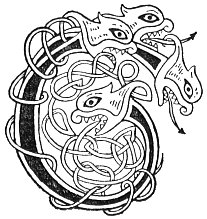

  
[Intangible Textual Heritage](../../../index.md) 
[Legends/Sagas](../../index)  [Celtic](../index.md)  [Carmina
Gadelica](../cg)  [Index](index)  [Previous](cg2023)  [Next](cg2025.md) 

------------------------------------------------------------------------

[Buy this Book at
Amazon.com](https://www.amazon.com/exec/obidos/ASIN/B0027P890O/internetsacredte.md)

------------------------------------------------------------------------

  
*Carmina Gadelica, Volume 2*, by Alexander Carmicheal, \[1900\], at
Intangible Textual Heritage

------------------------------------------------------------------------

 

<table data-border="0">
<colgroup>
<col style="width: 50%" />
<col style="width: 50%" />
</colgroup>
<tbody>
<tr class="odd">
<td data-valign="top" width="327">
p. 48
</td>
<td data-valign="top" width="327">
p. 49
</td>
</tr>
<tr class="even">
<td data-valign="top" width="327"><h3 id="cronachdain-suil-142" data-align="center">CRONACHDAIN SUIL [142]</h3></td>
<td data-valign="top" width="327"><h3 id="counteracting-the-evil-eye" data-align="center">COUNTERACTING THE EVIL EYE</h3></td>
</tr>
</tbody>
</table>

 

<table data-border="0">
<colgroup>
<col style="width: 25%" />
<col style="width: 25%" />
<col style="width: 25%" />
<col style="width: 25%" />
</colgroup>
<tbody>
<tr class="odd">
<td data-valign="top">
 
</td>
<td data-valign="top">
p. 48
</td>
<td data-valign="top">
 
</td>
<td data-valign="top">
p. 49
</td>
</tr>
<tr class="even">
<td data-valign="top">
 
</td>
<td data-valign="top">
CHURNAICH suil thu, 
Thurmaich bial thu, 
Runaich cridh thu, 
Smunaich miann thu.

Ceathrar a rinn du-sa trasd, 
Fear agus bean, 
Mac agus murn; 
Triuir cuiream riu ’g an casg, 
       Athair, 
       Mac, 
       Spiorad Numh.

Cuiream fianuis chon Moire, 
Mathair-chobhair an t-sluaigh, 
Cuiream fianuis chon Bride, 
Muime Chriosda nam buadh, 
Cuiream fianuis chon Chaluim, 
Ostal oirthir is chuain, 
’S cuiream fianuis chon flathas, 
Chon gach naoimh is gach aingil tha shuas.

Ma's e fear a rinn do lochd, 
Le droch shuil, 
Le droch run, 
Le droch ruam,
</td>
<td data-valign="top">
 
</td>
<td data-valign="top">
AN eye covered thee, 
A mouth spoke thee, 
A heart envied thee, 
A mind desired thee.

Four made thee thy cross,    [? have done thee harm 
Man and wife, 
Youth and maid; 
Three will I send to thwart them, 
       Father, 
       Son, 
       Spirit Holy.

I appeal to Mary, 
Aidful mother of men, 
I appeal to Bride, 
Foster-mother of Christ omnipotent, 
I appeal to Columba, 
Apostle of shore and sea, 
And I appeal to heaven, 
To all saints and angels that be above.

If it be a man that has done thee harm, 
With evil eye, 
With evil wish, 
With evil passion,
</td>
</tr>
<tr class="odd">
<td data-valign="top">
 
</td>
<td data-valign="top">
p. 50
</td>
<td data-valign="top">
 
</td>
<td data-valign="top">
p. 51
</td>
</tr>
<tr class="even">
<td data-valign="top">
 
</td>
<td data-valign="top">
Gun tilg thu dhiot gach olc, 
Gach mug, 
Gach gnug, 
Gach gruam, 
’S gum bi thu gu math gu brath, 
Ri linn an snathle seo 
Dhol a d’ dhail mu’n cuart, 
An onair De agus Ios, 
Agus Spioraid ioic bhi-bhuain.
</td>
<td data-valign="top">
 
</td>
<td data-valign="top">
Mayest thou cast off each ill, 
Every malignity, 
Every malice, 
Every harassment, 
And mayest thou be well for ever, 
While this thread 
Goes round thee, 
In honour of God and of Jesus, 
And of the Spirit of balm everlasting.
</td>
</tr>
</tbody>
</table>

 

------------------------------------------------------------------------

[Next: 143. Spell For Evil Eye. Uibe Ri Shul](cg2025.md)
