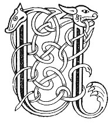

  
[Intangible Textual Heritage](../../../index.md) 
[Legends/Sagas](../../index)  [Celtic](../index.md)  [Carmina
Gadelica](../cg)  [Index](index)  [Previous](cg2024)  [Next](cg2026.md) 

------------------------------------------------------------------------

[Buy this Book at
Amazon.com](https://www.amazon.com/exec/obidos/ASIN/B0027P890O/internetsacredte.md)

------------------------------------------------------------------------

  
*Carmina Gadelica, Volume 2*, by Alexander Carmicheal, \[1900\], at
Intangible Textual Heritage

------------------------------------------------------------------------

 

<table data-border="0">
<colgroup>
<col style="width: 50%" />
<col style="width: 50%" />
</colgroup>
<tbody>
<tr class="odd">
<td data-valign="top" width="327">
p. 52
</td>
<td data-valign="top" width="327">
p. 53
</td>
</tr>
<tr class="even">
<td data-valign="top" width="327"><h3 id="uibe-ri-shul-143" data-align="center">UIBE RI SHUL [143]</h3></td>
<td data-valign="top" width="327"><h3 id="spell-for-evil-eye" data-align="center">SPELL FOR EVIL EYE</h3></td>
</tr>
</tbody>
</table>

 

<table data-border="0">
<colgroup>
<col style="width: 25%" />
<col style="width: 25%" />
<col style="width: 25%" />
<col style="width: 25%" />
</colgroup>
<tbody>
<tr class="odd">
<td data-valign="top">
 
</td>
<td data-valign="top">
p. 52
</td>
<td data-valign="top">
 
</td>
<td data-valign="top">
p. 53
</td>
</tr>
<tr class="even">
<td data-valign="top">
 
</td>
<td data-valign="top">
UIBE gheal chuir Muire mhin, 
A nail air allt, air muir, ’s air tir, 
Air bhrig, ’s air ghat fharmaid, 
Air mhac armaid, 
Air fiacaill coin-ghiorr, 
Air siadhadh coin-ghearr, 
Air tri chorracha-cri, 
Air tri chorracha cnamh, 
Air tri chorracha creothail, 
’S air lion leothair lair. [? leobhar

Ge be co rinn dut an t-suil, 
Gun laigh i air fein, 
Gun laigh i air a thur, 
Gun laigh i air a spreidh, 
Gun laigh i air a shult, 
Gun laigh i air a shaill, 
Gun laigh i air a chuid, 
Gun laigh i air a chlainn, 
Gun laigh i air a bhean, 
Gun laigh i air a loinn.

Clomhaidh mise an t-suil, 
Somhaidh mise an t-suil, 
Imirichidh mi ’n t-suil, 
A thri feithean feiche, 
’S teang eug an iomalain. 
Tri maighdeana beaga caomh, 
A rugadh ’s an aon oidhche ri Criosd, 
Ma's beo dh’an triuir sin air an oidhche nochd, 
Beo bhith d’ ire-sa, bheothaich bhochd.
</td>
<td data-valign="top">
 
</td>
<td data-valign="top">
THE fair spell that lovely Mary sent, 
Over stream, over sea, over land, 
Against incantations, against withering glance, 
Against inimical power, 
Against the teeth of wolf, 
Against the testicles of wolf, 
Against the three crooked cranes, 
Against the three crooked bones, 
Against the three crooked 'creothail,' 
And against lint 'leothair' of the ground. [? long lint

Whoso made to thee the eye,' 
May it lie upon himself, 
May it lie upon his house, 
May it lie upon his flocks, 
May it lie upon his substance, 
May it lie upon his fatness, 
May it lie upon his means, 
May it lie upon his children, 
May it lie upon his wife, 
May it lie upon his descendants.

I will subdue the eye, 
I will suppress the eye, 
And I will banish the eye, 
The three arteries inviting (?), 
And the tongue of death completely. 
Three lovely little maidens, 
Born the same night with Christ, 
If alive be these three to-night, 
Life be anear thee, poor beast.
</td>
</tr>
</tbody>
</table>

 

------------------------------------------------------------------------

[Next: 144. Charm For The Eye. Obi Ri Shuil](cg2026.md)
