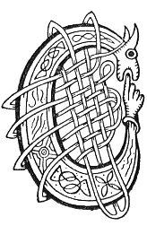

  
[Intangible Textual Heritage](../../../index) 
[Legends/Sagas](../../index)  [Celtic](../index)  [Carmina
Gadelica](../cg)  [Index](index)  [Previous](cg2025)  [Next](cg2027) 

------------------------------------------------------------------------

[Buy this Book at
Amazon.com](https://www.amazon.com/exec/obidos/ASIN/B0027P890O/internetsacredte)

------------------------------------------------------------------------

  
*Carmina Gadelica, Volume 2*, by Alexander Carmicheal, \[1900\], at
Intangible Textual Heritage

------------------------------------------------------------------------

 

<table data-border="0">
<colgroup>
<col style="width: 50%" />
<col style="width: 50%" />
</colgroup>
<tbody>
<tr class="odd">
<td data-valign="top" width="327">
p. 54
</td>
<td data-valign="top" width="327">
p. 55
</td>
</tr>
<tr class="even">
<td data-valign="top" width="327"><h3 id="obi-ri-shuil-144" data-align="center">OBI RI SHUIL [144]</h3></td>
<td data-valign="top" width="327"><h3 id="charm-for-the-eye" data-align="center">CHARM FOR THE EYE</h3></td>
</tr>
</tbody>
</table>

 

<table data-border="0">
<colgroup>
<col style="width: 25%" />
<col style="width: 25%" />
<col style="width: 25%" />
<col style="width: 25%" />
</colgroup>
<tbody>
<tr class="odd">
<td data-valign="top">
 
</td>
<td data-valign="top">
p. 54
</td>
<td data-valign="top">
 
</td>
<td data-valign="top">
p. 55
</td>
</tr>
<tr class="even">
<td data-valign="top">
 
</td>
<td data-valign="top">
CUIRIM an obi seo ri m’ shuil, 
Mar a dh’ orduich Ti nan dul, 
A uchd Pheadail, a uchd Phoil, 
An treas ob is fearr fo’n ghrein.

Sil, a Mhoire, sil, a Bhride, 
Sil, a Phadra, righ nan reachd, 
Sil, a Chalum-chille chaoimh, 
Sil, a Chiarain naoimh nam feart.

Air bhuadh larach, air chruadh lamha, 
An cath tearmaid, an cath farmaid, 
Air gach mac da math d’ an teid, 
Bidh Mac De leis an treuin armachd.

A uchd Athar, 
A uchd Mic, 
A uchd Spioraid Naoimh. 
                                 Amen.
</td>
<td data-valign="top">
 
</td>
<td data-valign="top">
I PLACE this charm to mine eye, 
As the King of life ordained, 
From the bosom of Peter and Paul, 
The third best amulet under the sun.

Pour Mary, pour Bride, 
Pour Patrick, king of laws, 
Pour Columba the kindly, 
Pour Ciaran, saint of power.

For victory in battle, for hardness of hand, 
In battle of defence, in battle of offence, 
On every son with whom it shall go well, 
The Son of God will be with him in full armour.

From the bosom of Father, 
From the bosom of Son, 
From the bosom of Holy Spirit. 
                                      Amen.
</td>
</tr>
</tbody>
</table>

 

------------------------------------------------------------------------

[Next: 145. Charm For The Evil Eye. Eoir Beum Sula](cg2027)
