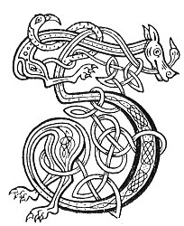

  
[Intangible Textual Heritage](../../../index.md) 
[Legends/Sagas](../../index)  [Celtic](../index.md)  [Carmina
Gadelica](../cg)  [Index](index)  [Previous](cg2026)  [Next](cg2028.md) 

------------------------------------------------------------------------

[Buy this Book at
Amazon.com](https://www.amazon.com/exec/obidos/ASIN/B0027P890O/internetsacredte.md)

------------------------------------------------------------------------

  
*Carmina Gadelica, Volume 2*, by Alexander Carmicheal, \[1900\], at
Intangible Textual Heritage

------------------------------------------------------------------------

 

<table data-border="0">
<colgroup>
<col style="width: 50%" />
<col style="width: 50%" />
</colgroup>
<tbody>
<tr class="odd">
<td data-valign="top" width="327">
p. 56
</td>
<td data-valign="top" width="327">
p. 57
</td>
</tr>
<tr class="even">
<td data-valign="top" width="327"><h3 id="eoir-beum-sula-145" data-align="center">EOIR BEUM SULA [145]</h3></td>
<td data-valign="top" width="327"><h3 id="charm-for-the-evil-eye" data-align="center">CHARM FOR THE EVIL EYE</h3></td>
</tr>
</tbody>
</table>

 

<table data-border="0">
<colgroup>
<col style="width: 25%" />
<col style="width: 25%" />
<col style="width: 25%" />
<col style="width: 25%" />
</colgroup>
<tbody>
<tr class="odd">
<td data-valign="top">
 
</td>
<td data-valign="top">
p. 56
</td>
<td data-valign="top">
 
</td>
<td data-valign="top">
p. 57
</td>
</tr>
<tr class="even">
<td data-valign="top">
 
</td>
<td data-valign="top">
GE be co rinn duit an t-suil, 
Gun curn i air fein, 
Gun curn i air a thur, 
Gun curn i air a spreidh, 
Air a chaillich mhungaich, 
Air a chaillaich mhiongaich, 
Air a chaillaich mhangaich, 
’S air a chaillich gheur-luirg, 
A dh’ eirich ’s a mhaduinn, 
’S a suil ’n a seilbh, 
’S a seilbh ’n a seoin, 
Nar a leatha a buaile fein, 
Nar a leatha leth a deoin, 
A chuid nach ith na fithich di, 
Gun ith na h-eoin.

Ceathrar a rinn duit an t-suil, 
Fear agus bean, mac agus mum; 
Triuir a thilgeas diot an tnu, 
Athair agus Mac, agus Spiorad Numh.

Mar a thog Criosd am meas, 
Thar bharra nam preas, 
Gun ann a thogas e dhiot-s’ a nis 
Gach cnid, gach tnu, gach farmad, 
O’n la’n diugh gu la deireannach do shaoghail.
</td>
<td data-valign="top">
 
</td>
<td data-valign="top">
WHOSO laid on thee the eye, 
May it lie upon himself, 
May it lie upon his house, 
May it lie upon his flocks, 
On the shuffling carlin, 
On the sour-faced carlin, 
On the bounding carlin, 
On the sharp-shanked carlin, 
Who arose in the morning, 
With her eye on her flocks, 
With her flocks in her 'seoin,' 
May she never own a fold, 
May she never have half her desires, 
The part of her which the ravens do not eat, 
May the birds devour.

Four made to thee the eye, 
Man and dame, youth and maid; 
Three who will cast off thee the envy, 
The Father, the Son, and the Holy Spirit.

As Christ lifted the fruit, 
From the branches of the bushes, 
May He now lift off thee 
Every ailment, every envy, every jealousy, 
From this day forth till the last day of thy life.
</td>
</tr>
</tbody>
</table>

 

------------------------------------------------------------------------

[Next: 146. Charm. Eolas](cg2028.md)
