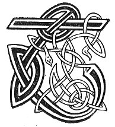

  
[Intangible Textual Heritage](../../../index.md) 
[Legends/Sagas](../../index)  [Celtic](../index.md)  [Carmina
Gadelica](../cg)  [Index](index)  [Previous](cg2028)  [Next](cg2030.md) 

------------------------------------------------------------------------

[Buy this Book at
Amazon.com](https://www.amazon.com/exec/obidos/ASIN/B0027P890O/internetsacredte.md)

------------------------------------------------------------------------

  
*Carmina Gadelica, Volume 2*, by Alexander Carmicheal, \[1900\], at
Intangible Textual Heritage

------------------------------------------------------------------------

 

<table data-border="0">
<colgroup>
<col style="width: 50%" />
<col style="width: 50%" />
</colgroup>
<tbody>
<tr class="odd">
<td data-valign="top" width="327">
p. 60
</td>
<td data-valign="top" width="327">
p. 61
</td>
</tr>
<tr class="even">
<td data-valign="top" width="327"><h3 id="mallachd-147" data-align="center">MALLACHD [147]</h3></td>
<td data-valign="top" width="327"><h3 id="a-malediction" data-align="center">A MALEDICTION</h3></td>
</tr>
</tbody>
</table>

 

<table data-border="0">
<colgroup>
<col style="width: 25%" />
<col style="width: 25%" />
<col style="width: 25%" />
<col style="width: 25%" />
</colgroup>
<tbody>
<tr class="odd">
<td data-valign="top">
 
</td>
<td data-valign="top">
p. 60
</td>
<td data-valign="top">
 
</td>
<td data-valign="top">
p. 61
</td>
</tr>
<tr class="even">
<td data-valign="top">
 
</td>
<td data-valign="top">
THAINIG dithis a mach 
A Cathrach Neobh, 
Fear agus bean, 
A dheanadh nan ōisnean.

Mallaich dha na beana bur-shuileach, 
Mallaich dha na feara fur-shuileach, 
Mallaich dha na ceithir saighde, guineach, guid, 
Dh’ fhaodadh a bhi ’n aorabh duine ’s bruid.
</td>
<td data-valign="top">
 
</td>
<td data-valign="top">
THERE came two out 
From the City of Heaven, 
A man and a woman, 
To make the 'ōisnean.'

Curses on the blear-eyed women, 
Curses on the sharp-eyed men, 
Curses on the four venomous arrows of disease, 
That may be in the constitution of man and beast.
</td>
</tr>
</tbody>
</table>

 

------------------------------------------------------------------------

[Next: 148. Spell Of The Evil Eye Eolas A Bheim Shuil](cg2030.md)
