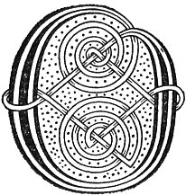

  
[Intangible Textual Heritage](../../../index) 
[Legends/Sagas](../../index)  [Celtic](../index)  [Carmina
Gadelica](../cg)  [Index](index)  [Previous](cg2030)  [Next](cg2032) 

------------------------------------------------------------------------

[Buy this Book at
Amazon.com](https://www.amazon.com/exec/obidos/ASIN/B0027P890O/internetsacredte)

------------------------------------------------------------------------

  
*Carmina Gadelica, Volume 2*, by Alexander Carmicheal, \[1900\], at
Intangible Textual Heritage

------------------------------------------------------------------------

<table data-border="0">
<colgroup>
<col style="width: 50%" />
<col style="width: 50%" />
</colgroup>
<tbody>
<tr class="odd">
<td data-valign="top" width="327">
p. 62
</td>
<td data-valign="top" width="327">
p. 63
</td>
</tr>
<tr class="even">
<td data-valign="top" width="327"><h3 id="obi-nan-sul-149" data-align="center">OBI NAN SUL [149]</h3></td>
<td data-valign="top" width="327"><h3 id="incantation-for-the-eye" data-align="center">INCANTATION FOR THE EYE</h3></td>
</tr>
</tbody>
</table>

 

<table data-border="0">
<colgroup>
<col style="width: 25%" />
<col style="width: 25%" />
<col style="width: 25%" />
<col style="width: 25%" />
</colgroup>
<tbody>
<tr class="odd">
<td data-valign="top">
 
</td>
<td data-valign="top">
p. 62
</td>
<td data-valign="top">
 
</td>
<td data-valign="top">
p. 63
</td>
</tr>
<tr class="even">
<td data-valign="top">
 
</td>
<td data-valign="top">
OBI nan geur shul, 
Obi nan reul-iul, 
Obi Re nan uile re, 
Obi Dhe nan dul, 
     Obi Re nan uile re, 
     Obi Dhe nan dul.

Obi Bhride nan ciabh oir, 
Obi Mhoire mhin-ghil Oigh, 
Obi Bheus nan uile bheus, 
Obi Dhe na gloir, 
     Obi Bheus nan uile bheus, 
     Obi Dhe na gloir.

Obi Pheadail agus Phail, 
Obi Airil ’s Eoin a ghraidh, 
Obi Dhe nan uile dhe, 
Obi Dhe nan gras, 
     Obi Dhe nan uile dhe, 
     Obi Dhe nan gras.

Feill Mhairi, Feill Dhe, 
Feill shagart agus chleir, 
Feill Chriosd, Righ nam feart, 
Dhiongaich anns a ghrein a neart, 
     Feill Chriosd, Righ nam feart, 
     Dhiongaich anns a ghrein a neart.
</td>
<td data-valign="top">
 
</td>
<td data-valign="top">
INCANTATION of the seeing eye, 
Incantation of the guiding star, 
Incantation of the King of all kings, 
Incantation of the God of life, 
     Incantation of the King of all kings, 
     Incantation of the God of life.

Incantation of Bride of the locks of gold, 
Incantation of the beauteous Mary Virgin, 
Incantation of the Virtue of all virtues, 
Incantation of the God of glory, 
     Incantation of the Virtue of all virtues, 
     Incantation of the God of glory.

Incantation of Peter and of Paul, 
Incantation of Ariel and John of love, 
Incantation of the God of all gods, 
Incantation of the God of grace, 
     Incantation of the God of all gods, 
     Incantation of the God of grace.

Feast of Mary, Feast of God, 
Feast of cleric and of priest, 
Feast of Christ, Prince of power, 
Who established the sun with strength, 
     Feast of Christ, Prince of power, 
     Who endowed the sun with strength.
</td>
</tr>
</tbody>
</table>

 

------------------------------------------------------------------------

[Next: 150. Spell of the Eye. Oba Ri Shul](cg2032)
