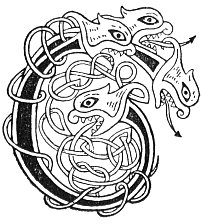

  
[Intangible Textual Heritage](../../../index) 
[Legends/Sagas](../../index)  [Celtic](../index)  [Carmina
Gadelica](../cg)  [Index](index)  [Previous](cg2031)  [Next](cg2033) 

------------------------------------------------------------------------

[Buy this Book at
Amazon.com](https://www.amazon.com/exec/obidos/ASIN/B0027P890O/internetsacredte)

------------------------------------------------------------------------

  
*Carmina Gadelica, Volume 2*, by Alexander Carmicheal, \[1900\], at
Intangible Textual Heritage

------------------------------------------------------------------------

 

<table data-border="0">
<colgroup>
<col style="width: 50%" />
<col style="width: 50%" />
</colgroup>
<tbody>
<tr class="odd">
<td data-valign="top" width="327">
p. 64
</td>
<td data-valign="top" width="327">
p. 65
</td>
</tr>
<tr class="even">
<td data-valign="top" width="327"><h3 id="oba-ri-shul-150" data-align="center">OBA RI SHUL [150]</h3></td>
<td data-valign="top" width="327"><h3 id="spell-of-the-eye" data-align="center">SPELL OF THE EYE</h3></td>
</tr>
</tbody>
</table>

 

<table data-border="0">
<colgroup>
<col style="width: 25%" />
<col style="width: 25%" />
<col style="width: 25%" />
<col style="width: 25%" />
</colgroup>
<tbody>
<tr class="odd">
<td data-valign="top">
 
</td>
<td data-valign="top">
p. 64
</td>
<td data-valign="top">
 
</td>
<td data-valign="top">
p. 65
</td>
</tr>
<tr class="even">
<td data-valign="top">
 
</td>
<td data-valign="top">
CUIRIM an oba seo ri m’ shuil, 
Mar a dh’ orduich Righ nan dul, 
Oba Pheadail, oba Phoil, 
Oba Sheumais, oba Eoin, 
Oba Chaluim-chille chaoimh, 
Oba Phadra sar gach naoimh, 
Oba Bhride bhith nam ba, 
Oba Mhoire mhin nan agh, 
Oba tromla, oba treuid, 
Oba lomra, oba spreidh, 
Oba nolla, oba ni, 
Oba sona, oba sith, 
Oba troga, oba treuin, 
An treas oba is fearr fo’n ghrein, 
Oba bhuadha nan Tri Bhuadh, 
     Athar, Mic, Spioraid buan.
</td>
<td data-valign="top">
 
</td>
<td data-valign="top">
I PLACE this spell to mine eye, 
As the Ring of life ordained, 
Spell of Peter, spell of Paul, 
Spell of James, spell of John, 
Spell of Columba benign, 
Spell of Patrick, chief of saints, 
Spell of Bride, tranquil of the kine, 
Spell of Mary, lovely of the joys, 
Spell of cows, spell of herds, 
Spell of sheep, spell of flocks, 
Spell of greatness, spell of means, 
Spell of joy, spell of peace, 
Spell of war, spell of the brave, 
The third best spell under the sun, 
The powerful spell of the Three Powers, 
     Father, Son, Spirit everlasting.
</td>
</tr>
</tbody>
</table>

 

------------------------------------------------------------------------

[Next: 151. Spell of the Eye. Oba Ri Sul](cg2033)
