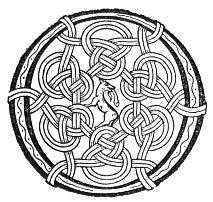

  
[Intangible Textual Heritage](../../../index) 
[Legends/Sagas](../../index)  [Celtic](../index)  [Carmina
Gadelica](../cg)  [Index](index)  [Previous](cg2033)  [Next](cg2035) 

------------------------------------------------------------------------

[Buy this Book at
Amazon.com](https://www.amazon.com/exec/obidos/ASIN/B0027P890O/internetsacredte)

------------------------------------------------------------------------

  
*Carmina Gadelica, Volume 2*, by Alexander Carmicheal, \[1900\], at
Intangible Textual Heritage

------------------------------------------------------------------------

 

<table data-border="0">
<colgroup>
<col style="width: 50%" />
<col style="width: 50%" />
</colgroup>
<tbody>
<tr class="odd">
<td data-valign="top" width="327">
p. 68
</td>
<td data-valign="top" width="327">
p. 69
</td>
</tr>
<tr class="even">
<td data-valign="top" width="327"><h3 id="ob-ri-shul-152" data-align="center">OB RI SHUL [152]</h3></td>
<td data-valign="top" width="327"><h3 id="spell-of-the-eye" data-align="center">SPELL OF THE EYE</h3></td>
</tr>
</tbody>
</table>

 

<table data-border="0">
<colgroup>
<col style="width: 25%" />
<col style="width: 25%" />
<col style="width: 25%" />
<col style="width: 25%" />
</colgroup>
<tbody>
<tr class="odd">
<td data-valign="top">
 
</td>
<td data-valign="top">
p. 68
</td>
<td data-valign="top">
 
</td>
<td data-valign="top">
p. 69
</td>
</tr>
<tr class="even">
<td data-valign="top">
 
</td>
<td data-valign="top">
OB a chuir Moire mhor-gheal 
Gu Bride mhin-gheal, 
Air muir, air tir, air li, ’s rachd fharmaid, 
Air fiacail coin-ghiorr, ’s air siadha coin-ghearr.

Ge be co leag ort an t-suil, 
Gum much i air fein, 
Gum much i air a thur, 
Gum much i air a spreidh.

Clomhadh mis an t-suil, 
Somhadh mis an t-suil, 
Tri teanga tur nan iomlan, 
Am feithean a chridhe, 
     An eibhlean imileig.

        A uchd Athar, 
        A uchd Mic, 
        A uchd Spioraid Naoimh.
</td>
<td data-valign="top">
 
</td>
<td data-valign="top">
THE spell the great white Mary sent 
To Bride the lovely fair, 
For sea, for land, for water, and for withering glance, 
For teeth of wolf, for testicle of wolf.

Whoso laid on thee the eye, 
May it oppress himself, 
May it oppress his house, 
May it oppress his flocks.

Let me subdue the eye, 
Let me avert the eye, 
The three complete tongues of fullness, 
In the arteries of the heart, 
     In the vitals of the navel.

        From the bosom of Father, 
        From the bosom of Son, 
        From the bosom of Holy Spirit.
</td>
</tr>
</tbody>
</table>

 

------------------------------------------------------------------------

[Next: 153. Spell of the Counteracting. Eolas A Chronachaidh](cg2035)
