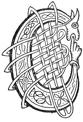

  
[Intangible Textual Heritage](../../../index.md) 
[Legends/Sagas](../../index)  [Celtic](../index.md)  [Carmina
Gadelica](../cg)  [Index](index)  [Previous](cg2035)  [Next](cg2037.md) 

------------------------------------------------------------------------

[Buy this Book at
Amazon.com](https://www.amazon.com/exec/obidos/ASIN/B0027P890O/internetsacredte.md)

------------------------------------------------------------------------

  
*Carmina Gadelica, Volume 2*, by Alexander Carmicheal, \[1900\], at
Intangible Textual Heritage

------------------------------------------------------------------------

 

<table data-border="0">
<colgroup>
<col style="width: 50%" />
<col style="width: 50%" />
</colgroup>
<tbody>
<tr class="odd">
<td data-valign="top" width="327">
p. 72
</td>
<td data-valign="top" width="327">
p. 73
</td>
</tr>
<tr class="even">
<td data-valign="top" width="327"><h3 id="cunntas-an-t-sleamhnain-154" data-align="center">CUNNTAS AN T-SLEAMHNAIN [154]</h3></td>
<td data-valign="top" width="327"><h3 id="the-counting-of-the-stye" data-align="center">THE COUNTING OF THE STYE</h3></td>
</tr>
</tbody>
</table>

 

THE exorcism of the stye is variously called 'Cunntas an
t-Sleamhnain'--Counting of the Stye, 'Bolas an t-Sleamhnain'--Exorcism
of the Stye, and 'Eoir an t-Sleamhnain'--Charm of the Stye.

When making the charm the exorcist holds some sharp-pointed instrument,
preferably a nail, or the tongue of a brooch or buckle, between the
thumb and forefinger of the right hand. With each question the operator
makes a feint with the instrument at the stye, going perilously near the
eye. The sensation caused by the thrusting is extremely painful to the
sufferer and even to the observer.

The reciter assured the writer that a cure immediately follows the
operation. Possibly the thrusting acts upon the nervous system of the
patient.

Ordinarily the exorcist omits mentioning the word 'sleamhnan' after the
first two times, abbreviating thus:--

 

<table data-border="0">
<colgroup>
<col style="width: 33%" />
<col style="width: 33%" />
<col style="width: 33%" />
</colgroup>
<tbody>
<tr class="odd">
<td data-valign="top">
'C’uim an tainig a dha an seo 
Gun a tri an seo?'
</td>
<td data-valign="top">
 
</td>
<td data-valign="top">
Why came the two here 
Without the three here?
</td>
</tr>
</tbody>
</table>

 

After the incantation the Lord's Prayer is intoned,
and the following is repeated:

 

<table data-border="0">
<colgroup>
<col style="width: 33%" />
<col style="width: 33%" />
<col style="width: 33%" />
</colgroup>
<tbody>
<tr class="odd">
<td data-valign="top">
'Paidir a h-aon, 
Paidir a dha, 
Paidir a tri, 
Paidir a ceithir, 
Paidir a coig, 
Paidir a sia, 
Paidir a seachd, 
Paidir a h-ochd, 
Paidir a naodh, 
Paidir a h-aon 
’S a h-ochd, 
Paidir Chriosda chaoimh 
Ort an oidhche nochd, 
Paidir Tri nan dul 
Air a shuil gun lochd.'
</td>
<td data-valign="top">
 
</td>
<td data-valign="top">
Pater one, 
Pater two, 
Pater three, 
Pater four, 
Pater five, 
Pater six, 
Pater seven, 
Pater eight, 
Pater nine, 
Pater one 
And eight, 
Pater of Christ the kindly 
Be upon thee to-night, 
Pater of the Three of life 
Upon thine eye without harm.
</td>
</tr>
</tbody>
</table>

This seems to indicate that the Lord's Prayer was
originally repeated nine times.

 

<table data-border="0">
<colgroup>
<col style="width: 25%" />
<col style="width: 25%" />
<col style="width: 25%" />
<col style="width: 25%" />
</colgroup>
<tbody>
<tr class="odd">
<td data-valign="top">
 
</td>
<td data-valign="top">
p. 72
</td>
<td data-valign="top">
 
</td>
<td data-valign="top">
p. 73
</td>
</tr>
<tr class="even">
<td data-valign="top">
 
</td>
<td data-valign="top">
C’UIM an tainig an aon sleamhnan, 
Gun an da shleamhnan an seo? 
C’uim an tainig an da shleamhnan, 
Gun na tri sleamhnain an seo? 
C’uim an tainig na tri sleamhnain, 
Gun na ceithir sleamhnain an seo? 
C’uim an tainig na ceithir sleamhnain, 
Gun na coig sleamhnain an seo? 
C’uim an tainig na coig sleamhnain, 
Gun na sia sleamhnain an seo? 
C’uim an tainig na sia sleamhnain, 
Gun na seachd sleamhnain an seo? 
C’uim an tainig na seachd sleamhnain, 
Gun na h-ochd sleamhnain an seo? 
C’uim an tainig na h-ochd sleamhnain, 
Gun na naodh sleamhnain an seo? 
C’uim an tainig a naodh, 
No aon idir an seo?
</td>
<td data-valign="top">
 
</td>
<td data-valign="top">
WHY came the one stye, 
Without the two styes here? 
Why came the two styes, 
Without the three styes here? 
Why came the three styes, 
Without the four styes here? 
Why came the four styes, 
Without the five styes here? 
Why came the five styes, 
Without the six styes here? 
Why came the six styes, 
Without the seven styes here? 
Why came the seven styes, 
Without the eight styes here? 
Why came the eight styes, 
Without the nine styes here? 
Why came the nine, 
Or one at all here?
</td>
</tr>
</tbody>
</table>

 

------------------------------------------------------------------------

[Next: 155. The 'Fionn-Faoilidh'. Am Fionn-Faoilidh](cg2037.md)
