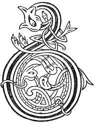

  
[Intangible Textual Heritage](../../../index.md) 
[Legends/Sagas](../../index)  [Celtic](../index.md)  [Carmina
Gadelica](../cg)  [Index](index)  [Previous](cg2041)  [Next](cg2043.md) 

------------------------------------------------------------------------

[Buy this Book at
Amazon.com](https://www.amazon.com/exec/obidos/ASIN/B0027P890O/internetsacredte.md)

------------------------------------------------------------------------

  
*Carmina Gadelica, Volume 2*, by Alexander Carmicheal, \[1900\], at
Intangible Textual Heritage

------------------------------------------------------------------------

 

<table data-border="0">
<colgroup>
<col style="width: 50%" />
<col style="width: 50%" />
</colgroup>
<tbody>
<tr class="odd">
<td data-valign="top" width="327">
p. 84
</td>
<td data-valign="top" width="327">
p. 85
</td>
</tr>
<tr class="even">
<td data-valign="top" width="327"><h3 id="eolas-an-torranain" data-align="center">EOLAS AN TORRANAIN</h3></td>
<td data-valign="top" width="327"><h3 id="the-charm-of-the-figwort" data-align="center">THE CHARM OF THE FIGWORT</h3></td>
</tr>
</tbody>
</table>

 

<table data-border="0">
<colgroup>
<col style="width: 25%" />
<col style="width: 25%" />
<col style="width: 25%" />
<col style="width: 25%" />
</colgroup>
<tbody>
<tr class="odd">
<td data-valign="top">
 
</td>
<td data-valign="top">
p. 84
</td>
<td data-valign="top">
 
</td>
<td data-valign="top">
p. 85
</td>
</tr>
<tr class="even">
<td data-valign="top">
 
</td>
<td data-valign="top">
BUAINIDH mi an torranan, 
Le toradh mara ’s tir, 
Lus nan agh ’s nan sonas e, 
Lus a bhainne mhi.

Mar a dh’ orduich Righ nan righ, 
Brigh a chur an cich ’s an carr, 
’S mar a dh’ orduich Ti nan dul, 
Sugh a chur an uth ’s an ar, 
Le bliochd, le blachd, le bladh, 
Le cobhan, le omhan, ’s le ais, 
Le laoigh bhoirionn, bhreac, 
Gun laoigh fhirionn ac, 
Le al, le agh, le toradh, 
Le gradh, le baigh, le sonadh,

Gun fear mi-run, 
Gun bhean mi-shul, 
Gun ghnu, gun tnu, gun toirinn, 
Gun mhaghan masach, 
Gun chu fasaich, 
Gun scan foirinn 
Dh’ fhaighinn greim air a chugain 
     Anns an teid seo, 
Torranan nan sionn, 
Toradh ga chur ann, 
Le al, le agh, le sonas.
</td>
<td data-valign="top">
 
</td>
<td data-valign="top">
I WILL pluck the figwort, 
With the fruitage of sea and land, 
The plant of joy and gladness, 
The plant of rich milk.

As the King of kings ordained, 
To put milk in pap and gland, 
As the Being of life ordained, 
To place substance in udder and kidney, 
With milk, with milkiness, with butter milk, 
With produce, with whisked whey, with milk-product, 
With speckled female calves, 
Without male calves, 
With progeny, with joy, with fruitage, 
With love, with charity, with bounty,

Without man of evil wish, 
Without woman of evil eye, 
Without malice, without envy, without 'toirinn,' 
Without hipped bear, 
Without wilderness dog, 
Without 'scan foirinn,' 
Obtaining hold of the rich dainty 
     Into which this shall go. 
Figwort of bright lights, 
Fruitage to place therein, 
With fruit, with grace, with joyance.
</td>
</tr>
</tbody>
</table>

 

------------------------------------------------------------------------

[Next: 160. The Figwort. An Torranan](cg2043.md)
